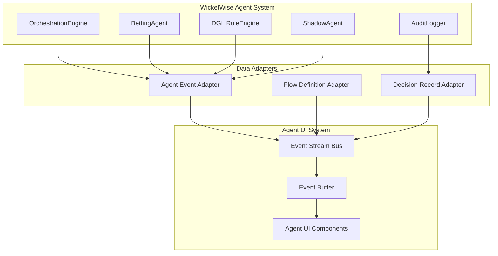

# 🎯 WicketWise Agent UI - Detailed Implementation Plan

**Version**: 1.0  
**Date**: January 21, 2025  
**Status**: Ready for Implementation  
**Author**: WicketWise AI Team

---

## 📋 **EXECUTIVE SUMMARY**

This document provides a comprehensive implementation plan for the WicketWise Agent Flows & Interactions UI, adapting ChatGPT's PRD to our existing architecture and extending it with WicketWise-specific capabilities.

### **Key Adaptations to WicketWise Architecture**

1. **🔗 Integration with Existing Systems**: Leverages current audit logging, DGL governance, and agent orchestration
2. **📊 Real-time Event Streaming**: Extends existing WebSocket infrastructure for agent event broadcasting
3. **🎯 Cricket-Specific Features**: Adds match context, betting intelligence, and risk management visualizations
4. **🛡️ Security & Compliance**: Integrates with existing authentication and audit systems

---

## 🏗️ **ARCHITECTURE MAPPING**

### **WicketWise → PRD Component Mapping**

| **WicketWise Component** | **PRD Component** | **Integration Strategy** |
|--------------------------|-------------------|--------------------------|
| `OrchestrationEngine` | `orchestrator_agent` | Direct mapping with event emission |
| `BettingAgent` | `prediction_agent` | Extend with betting-specific events |
| `DGL RuleEngine` | `governance_layer` | Real-time constraint monitoring |
| `AuditLogger` | `audit_logger` | Existing audit trail integration |
| `ShadowBettingAgent` | `shadow_agent` | Decision validation events |
| `SimOrchestrator` | `execution_engine` | Simulation vs live execution modes |
| `WebSocketContext` | Event streaming | Extend for agent event broadcasting |

### **Data Flow Architecture**



---

## 🔄 **DATA CONTRACT ADAPTATIONS**

### **1. WicketWise AgentDefinition**

```json
{
  "id": "wicketwise_betting_agent",
  "label": "WicketWise Betting Agent",
  "role": "Cricket betting value detection and strategy coordination",
  "agent_type": "betting_intelligence",
  "inputs": [
    "market_odds_data",
    "match_context",
    "player_embeddings",
    "gnn_predictions",
    "historical_patterns"
  ],
  "outputs": [
    "value_opportunities",
    "betting_recommendations",
    "risk_assessments",
    "kelly_fractions"
  ],
  "capabilities": [
    "VALUE_DETECTION",
    "ARBITRAGE_SCANNING", 
    "MARKET_ANALYSIS",
    "RISK_ASSESSMENT"
  ],
  "metrics": {
    "p50_ms": 1200,
    "p95_ms": 2800,
    "throughput_per_min": 60,
    "accuracy_rate": 0.73,
    "false_positive_rate": 0.18
  },
  "status": "active",
  "health": {
    "cpu_usage": 0.45,
    "memory_mb": 512,
    "queue_depth": 3,
    "last_error": null,
    "uptime_hours": 72.5
  },
  "cricket_context": {
    "supported_formats": ["T20", "ODI", "Test"],
    "betting_markets": ["match_winner", "total_runs", "player_runs", "wickets"],
    "risk_profile": "moderate_aggressive"
  }
}
```

### **2. WicketWise HandoffLink**

```json
{
  "from": "betting_agent",
  "to": "dgl_engine",
  "channel": "bet_proposals",
  "handoff_type": "governance_validation",
  "sla_ms": 50,
  "last_activity_ts": 1724828400000,
  "health": "ok",
  "throughput_stats": {
    "messages_per_minute": 45,
    "avg_payload_size_kb": 2.3,
    "success_rate": 0.97
  },
  "cricket_metadata": {
    "match_phase": "powerplay",
    "market_conditions": "volatile",
    "exposure_level": "moderate"
  }
}
```

### **3. WicketWise FlowDefinition**

```json
{
  "flow_id": "wicketwise_automated_value_detection",
  "label": "WicketWise Automated Value Detection",
  "flow_type": "continuous_betting_monitoring",
  "stages": [
    {
      "agent": "market_monitor",
      "event": "odds_snapshot",
      "cricket_context": {
        "bookmakers": ["betfair", "bet365", "pinnacle"],
        "markets": ["match_winner", "total_runs"]
      }
    },
    {
      "agent": "gnn_predictor", 
      "event": "probability_update",
      "cricket_context": {
        "model_version": "crickformer_v2.1",
        "confidence_threshold": 0.65
      }
    },
    {
      "agent": "betting_agent",
      "event": "value_analysis",
      "cricket_context": {
        "kelly_fraction_limit": 0.25,
        "min_edge_threshold": 0.05
      }
    },
    {
      "agent": "shadow_agent",
      "event": "decision_validation",
      "cricket_context": {
        "risk_tolerance": "moderate",
        "confidence_floor": 0.70
      }
    },
    {
      "agent": "dgl_engine",
      "event": "governance_check",
      "cricket_context": {
        "bankroll_limits": true,
        "exposure_caps": true,
        "correlation_checks": true
      }
    },
    {
      "agent": "execution_engine",
      "event": "order_placement",
      "cricket_context": {
        "execution_mode": "live",
        "slippage_tolerance": 0.02
      }
    }
  ],
  "governance_constraints": {
    "max_exposure_pct": 20,
    "daily_loss_limit_pct": 10,
    "consecutive_loss_limit": 5
  }
}
```

### **4. WicketWise RunEvent**

```json
{
  "run_id": "match_2025_01_21_RCBvsCSK",
  "event_id": "evt_00234",
  "t": 1724828465123,
  "agent": "betting_agent",
  "type": "value_opportunity_detected",
  "payload": {
    "market": "total_runs_over_180",
    "bookmaker_odds": 2.10,
    "model_probability": 0.55,
    "expected_value": 0.155,
    "kelly_fraction": 0.18,
    "confidence": 0.73,
    "reasoning": [
      "Strong batting lineup in powerplay",
      "Favorable pitch conditions",
      "Historical venue scoring patterns"
    ]
  },
  "cricket_context": {
    "match_id": "RCBvsCSK_2025_01_21",
    "over": 4.2,
    "score": "42/1",
    "batting_team": "RCB",
    "key_players": ["Kohli", "de Villiers"],
    "match_phase": "powerplay"
  },
  "links": {
    "prev": "evt_00233",
    "next": "evt_00235",
    "related_decisions": ["dec_9b2"]
  },
  "timing": {
    "enqueue_ts": 1724828464900,
    "start_ts": 1724828465000,
    "end_ts": 1724828465123,
    "duration_ms": 123
  }
}
```

### **5. WicketWise DecisionRecord**

```json
{
  "decision_id": "dec_9b2",
  "run_id": "match_2025_01_21_RCBvsCSK",
  "t": 1724828470001,
  "decision_type": "betting_decision",
  "context": {
    "match_state": {
      "over": 4.2,
      "score": "42/1",
      "batting_team": "RCB",
      "required_rate": 8.5
    },
    "market_state": {
      "market": "total_runs_over_180",
      "best_odds": 2.10,
      "liquidity": 15000,
      "market_movement": "+0.05"
    },
    "account_state": {
      "available_balance": 25000,
      "current_exposure": 4200,
      "daily_pnl": 150
    }
  },
  "signals": [
    {
      "source": "gnn_predictor_v2.1",
      "metric": "total_runs_probability",
      "value": 0.55,
      "confidence": 0.73,
      "version": "2.1.3"
    },
    {
      "source": "mispricing_engine",
      "metric": "expected_value",
      "value": 0.155,
      "confidence": 0.81
    },
    {
      "source": "kelly_calculator",
      "metric": "optimal_fraction",
      "value": 0.18,
      "confidence": 0.95
    }
  ],
  "deliberation": [
    {
      "reason": "Market mispricing vs model probability",
      "impact": "+high",
      "confidence": 0.73,
      "supporting_data": {
        "model_prob": 0.55,
        "implied_prob": 0.476,
        "edge": 0.074
      }
    },
    {
      "reason": "Strong batting lineup in favorable conditions",
      "impact": "+medium",
      "confidence": 0.68,
      "supporting_data": {
        "venue_avg": 185,
        "team_avg": 178,
        "conditions": "clear_sky"
      }
    }
  ],
  "constraints": [
    {
      "name": "total_exposure_limit",
      "threshold": 5000,
      "current_value": 4200,
      "result": "pass",
      "headroom": 800
    },
    {
      "name": "per_market_exposure_limit", 
      "threshold": 1250,
      "current_value": 0,
      "result": "pass",
      "headroom": 1250
    },
    {
      "name": "kelly_fraction_limit",
      "threshold": 0.25,
      "current_value": 0.18,
      "result": "pass",
      "headroom": 0.07
    }
  ],
  "outcome": {
    "action": "place_bet",
    "stake": 450,
    "odds": 2.10,
    "market": "total_runs_over_180",
    "expected_profit": 69.75,
    "max_loss": 450,
    "execution_mode": "live"
  },
  "audit_trail": {
    "audit_id": "audit_9b2_001",
    "compliance_checks": ["gdpr", "gambling_commission"],
    "risk_classification": "moderate"
  }
}
```

---

## 🛠️ **TECHNICAL IMPLEMENTATION STRATEGY**

### **Phase 1: Foundation & Data Adapters (Weeks 1-2)**

#### **1.1 Event Stream Infrastructure**

```typescript
// src/lib/agents/EventStreamBus.ts
export class WicketWiseEventStreamBus {
  private websocket: WebSocket | null = null;
  private eventBuffer: CircularBuffer<AgentEvent>;
  private subscribers: Map<string, EventCallback[]>;
  
  constructor(config: EventStreamConfig) {
    this.eventBuffer = new CircularBuffer(config.bufferSize || 10000);
    this.subscribers = new Map();
    this.initializeWebSocket(config.websocketUrl);
  }
  
  private initializeWebSocket(url: string) {
    this.websocket = new WebSocket(url);
    
    this.websocket.onmessage = (event) => {
      const agentEvent = JSON.parse(event.data) as AgentEvent;
      this.processEvent(agentEvent);
    };
  }
  
  private processEvent(event: AgentEvent) {
    // Add to buffer for replay capability
    this.eventBuffer.push(event);
    
    // Notify subscribers
    const callbacks = this.subscribers.get(event.type) || [];
    callbacks.forEach(callback => callback(event));
    
    // Emit to global subscribers
    const globalCallbacks = this.subscribers.get('*') || [];
    globalCallbacks.forEach(callback => callback(event));
  }
  
  subscribe(eventType: string, callback: EventCallback): () => void {
    if (!this.subscribers.has(eventType)) {
      this.subscribers.set(eventType, []);
    }
    this.subscribers.get(eventType)!.push(callback);
    
    // Return unsubscribe function
    return () => {
      const callbacks = this.subscribers.get(eventType) || [];
      const index = callbacks.indexOf(callback);
      if (index > -1) callbacks.splice(index, 1);
    };
  }
  
  getBufferedEvents(timeRange?: TimeRange): AgentEvent[] {
    if (!timeRange) return this.eventBuffer.toArray();
    
    return this.eventBuffer.toArray().filter(event => 
      event.timestamp >= timeRange.start && event.timestamp <= timeRange.end
    );
  }
}
```

#### **1.2 WicketWise Agent Data Adapters**

```python
# agent_ui_adapters.py
from typing import Dict, List, Any, Optional
from dataclasses import dataclass
from datetime import datetime
import json

class WicketWiseAgentAdapter:
    """Adapts WicketWise agent system to Agent UI data contracts"""
    
    def __init__(self, orchestration_engine, audit_logger, dgl_engine):
        self.orchestration_engine = orchestration_engine
        self.audit_logger = audit_logger
        self.dgl_engine = dgl_engine
        self.event_stream = []
        
    def generate_agent_definitions(self) -> List[Dict[str, Any]]:
        """Generate AgentDefinition objects from registered agents"""
        definitions = []
        
        for agent_id, agent in self.orchestration_engine.coordinator.agents.items():
            definition = {
                "id": agent_id,
                "label": getattr(agent, 'display_name', agent_id.replace('_', ' ').title()),
                "role": getattr(agent, 'description', 'Cricket analysis agent'),
                "agent_type": self._determine_agent_type(agent),
                "inputs": getattr(agent, 'input_types', []),
                "outputs": getattr(agent, 'output_types', []),
                "capabilities": [cap.value for cap in getattr(agent, 'capabilities', [])],
                "metrics": self._get_agent_metrics(agent_id),
                "status": self._get_agent_status(agent_id),
                "health": self._get_agent_health(agent_id),
                "cricket_context": self._get_cricket_context(agent)
            }
            definitions.append(definition)
            
        return definitions
    
    def generate_handoff_links(self) -> List[Dict[str, Any]]:
        """Generate HandoffLink objects from agent dependencies"""
        links = []
        
        # Extract from flow definitions
        for flow in self._get_active_flows():
            for i, stage in enumerate(flow['stages'][:-1]):
                next_stage = flow['stages'][i + 1]
                
                link = {
                    "from": stage['agent'],
                    "to": next_stage['agent'],
                    "channel": f"{stage['event']}_to_{next_stage['event']}",
                    "handoff_type": self._determine_handoff_type(stage, next_stage),
                    "sla_ms": stage.get('timeout_ms', 1000),
                    "last_activity_ts": self._get_last_activity(stage['agent'], next_stage['agent']),
                    "health": self._get_handoff_health(stage['agent'], next_stage['agent']),
                    "throughput_stats": self._get_throughput_stats(stage['agent'], next_stage['agent']),
                    "cricket_metadata": self._get_cricket_handoff_metadata(stage, next_stage)
                }
                links.append(link)
                
        return links
    
    def generate_flow_definitions(self) -> List[Dict[str, Any]]:
        """Generate FlowDefinition objects from AGENTIC_FLOWS_DOCUMENTATION.md"""
        # Parse the existing flow documentation
        flows = []
        
        # Load from AGENTIC_FLOWS_DOCUMENTATION.md
        with open('AGENTIC_FLOWS_DOCUMENTATION.md', 'r') as f:
            content = f.read()
            
        # Extract JSON schemas from markdown
        flow_schemas = self._extract_json_schemas(content)
        
        for schema in flow_schemas:
            flow_def = {
                "flow_id": schema['flow_id'],
                "label": schema['flow_id'].replace('_', ' ').title(),
                "flow_type": schema['flow_type'],
                "stages": self._convert_sequence_to_stages(schema['sequence']),
                "governance_constraints": schema.get('governance_constraints', {}),
                "cricket_context": self._extract_cricket_context(schema)
            }
            flows.append(flow_def)
            
        return flows
    
    def emit_agent_event(self, agent_id: str, event_type: str, payload: Dict[str, Any], 
                        cricket_context: Optional[Dict[str, Any]] = None):
        """Emit agent event to UI stream"""
        event = {
            "run_id": self._get_current_run_id(),
            "event_id": f"evt_{len(self.event_stream):05d}",
            "t": int(datetime.now().timestamp() * 1000),
            "agent": agent_id,
            "type": event_type,
            "payload": payload,
            "cricket_context": cricket_context or {},
            "links": {
                "prev": f"evt_{len(self.event_stream)-1:05d}" if self.event_stream else None,
                "next": None
            },
            "timing": {
                "enqueue_ts": int(datetime.now().timestamp() * 1000),
                "start_ts": int(datetime.now().timestamp() * 1000),
                "end_ts": int(datetime.now().timestamp() * 1000),
                "duration_ms": 0
            }
        }
        
        # Update previous event's next link
        if self.event_stream:
            self.event_stream[-1]["links"]["next"] = event["event_id"]
        
        self.event_stream.append(event)
        
        # Emit to WebSocket clients
        self._broadcast_event(event)
    
    def _broadcast_event(self, event: Dict[str, Any]):
        """Broadcast event to WebSocket clients"""
        # Integration with existing WebSocket infrastructure
        from admin_backend import socketio
        socketio.emit('agent_event', event, namespace='/agent_ui')
```

#### **1.3 Backend WebSocket Extension**

```python
# admin_backend.py - Add to existing file
from flask_socketio import emit, join_room, leave_room

# Add new namespace for agent UI
@socketio.on('connect', namespace='/agent_ui')
def agent_ui_connect():
    """Handle agent UI WebSocket connections"""
    logger.info(f"Agent UI client connected: {request.sid}")
    join_room('agent_events')
    
    # Send initial state
    if hasattr(app, 'agent_adapter'):
        emit('initial_state', {
            'agents': app.agent_adapter.generate_agent_definitions(),
            'handoffs': app.agent_adapter.generate_handoff_links(),
            'flows': app.agent_adapter.generate_flow_definitions()
        })

@socketio.on('disconnect', namespace='/agent_ui')
def agent_ui_disconnect():
    """Handle agent UI WebSocket disconnections"""
    logger.info(f"Agent UI client disconnected: {request.sid}")
    leave_room('agent_events')

@socketio.on('subscribe_to_agent', namespace='/agent_ui')
def subscribe_to_agent(data):
    """Subscribe to specific agent events"""
    agent_id = data.get('agent_id')
    if agent_id:
        join_room(f'agent_{agent_id}')
        emit('subscription_confirmed', {'agent_id': agent_id})

@socketio.on('set_breakpoint', namespace='/agent_ui')
def set_breakpoint(data):
    """Set debugging breakpoint"""
    breakpoint_config = data.get('breakpoint')
    if breakpoint_config:
        # Store breakpoint in agent adapter
        app.agent_adapter.add_breakpoint(breakpoint_config)
        emit('breakpoint_set', breakpoint_config)

@socketio.on('toggle_shadow_mode', namespace='/agent_ui')
def toggle_shadow_mode(data):
    """Toggle shadow mode for safe experimentation"""
    shadow_enabled = data.get('enabled', False)
    
    # Update DGL shadow mode
    if hasattr(app, 'dgl_engine'):
        app.dgl_engine.set_shadow_mode(shadow_enabled)
    
    emit('shadow_mode_toggled', {'enabled': shadow_enabled})

@socketio.on('request_snapshot', namespace='/agent_ui')
def request_snapshot():
    """Create system state snapshot"""
    snapshot = {
        'timestamp': datetime.now().isoformat(),
        'agents': app.agent_adapter.generate_agent_definitions(),
        'active_flows': app.agent_adapter.get_active_flows(),
        'system_state': app.agent_adapter.get_system_state()
    }
    
    emit('snapshot_created', snapshot)
```

### **Phase 2: Core UI Components (Weeks 3-4)**

#### **2.1 System Map Component**

```tsx
// src/components/AgentUI/SystemMap/SystemMap.tsx
import React, { useState, useEffect, useCallback } from 'react';
import { ReactFlow, Node, Edge, Controls, Background } from 'reactflow';
import 'reactflow/dist/style.css';

import { AgentTile } from './AgentTile';
import { HandoffEdge } from './HandoffEdge';
import { useAgentStream } from '../../../hooks/useAgentStream';
import { AgentDefinition, HandoffLink } from '../../../types/agent-ui';

interface SystemMapProps {
  className?: string;
}

export const SystemMap: React.FC<SystemMapProps> = ({ className }) => {
  const [nodes, setNodes] = useState<Node[]>([]);
  const [edges, setEdges] = useState<Edge[]>([]);
  const [selectedAgent, setSelectedAgent] = useState<string | null>(null);
  const [overlayMode, setOverlayMode] = useState<'none' | 'constraints' | 'confidence' | 'errors'>('none');
  
  const { agents, handoffs, isConnected, subscribe } = useAgentStream();
  
  // Convert agents to ReactFlow nodes
  useEffect(() => {
    const agentNodes: Node[] = agents.map((agent, index) => ({
      id: agent.id,
      type: 'agentTile',
      position: calculateAgentPosition(agent, index, agents.length),
      data: {
        agent,
        isSelected: selectedAgent === agent.id,
        overlayMode,
        onSelect: () => setSelectedAgent(agent.id),
        onOpenDrawer: () => openAgentDrawer(agent.id)
      }
    }));
    
    setNodes(agentNodes);
  }, [agents, selectedAgent, overlayMode]);
  
  // Convert handoffs to ReactFlow edges
  useEffect(() => {
    const handoffEdges: Edge[] = handoffs.map(handoff => ({
      id: `${handoff.from}-${handoff.to}`,
      source: handoff.from,
      target: handoff.to,
      type: 'handoffEdge',
      data: {
        handoff,
        isHighlighted: selectedAgent === handoff.from || selectedAgent === handoff.to,
        overlayMode
      },
      animated: handoff.health === 'ok' && handoff.throughput_stats.messages_per_minute > 0
    }));
    
    setEdges(handoffEdges);
  }, [handoffs, selectedAgent, overlayMode]);
  
  // Subscribe to real-time agent events
  useEffect(() => {
    const unsubscribe = subscribe('agent_status_update', (event) => {
      // Update agent status in real-time
      setNodes(prevNodes => 
        prevNodes.map(node => 
          node.id === event.agent_id 
            ? { ...node, data: { ...node.data, agent: { ...node.data.agent, ...event.updates } }}
            : node
        )
      );
    });
    
    return unsubscribe;
  }, [subscribe]);
  
  const calculateAgentPosition = (agent: AgentDefinition, index: number, total: number) => {
    // Arrange agents in a logical flow layout
    const agentTypePositions = {
      'market_monitor': { x: 100, y: 100 },
      'betting_agent': { x: 300, y: 100 },
      'prediction_agent': { x: 300, y: 250 },
      'mispricing_engine': { x: 500, y: 100 },
      'shadow_agent': { x: 700, y: 100 },
      'dgl_engine': { x: 900, y: 100 },
      'execution_engine': { x: 1100, y: 100 },
      'audit_logger': { x: 600, y: 300 }
    };
    
    return agentTypePositions[agent.id] || { 
      x: 200 + (index % 4) * 250, 
      y: 100 + Math.floor(index / 4) * 200 
    };
  };
  
  const openAgentDrawer = (agentId: string) => {
    // Open agent drawer with detailed information
    // This will be implemented in the AgentDrawer component
  };
  
  const nodeTypes = {
    agentTile: AgentTile
  };
  
  const edgeTypes = {
    handoffEdge: HandoffEdge
  };
  
  return (
    <div className={`system-map ${className}`}>
      <div className="system-map-header">
        <h2>WicketWise Agent System Map</h2>
        <div className="overlay-controls">
          <button 
            className={overlayMode === 'constraints' ? 'active' : ''}
            onClick={() => setOverlayMode(overlayMode === 'constraints' ? 'none' : 'constraints')}
          >
            Constraints
          </button>
          <button 
            className={overlayMode === 'confidence' ? 'active' : ''}
            onClick={() => setOverlayMode(overlayMode === 'confidence' ? 'none' : 'confidence')}
          >
            Confidence
          </button>
          <button 
            className={overlayMode === 'errors' ? 'active' : ''}
            onClick={() => setOverlayMode(overlayMode === 'errors' ? 'none' : 'errors')}
          >
            Errors
          </button>
        </div>
        <div className="connection-status">
          <span className={`status-indicator ${isConnected ? 'connected' : 'disconnected'}`}>
            {isConnected ? '🟢 Live' : '🔴 Disconnected'}
          </span>
        </div>
      </div>
      
      <ReactFlow
        nodes={nodes}
        edges={edges}
        nodeTypes={nodeTypes}
        edgeTypes={edgeTypes}
        fitView
        attributionPosition="bottom-left"
      >
        <Background />
        <Controls />
      </ReactFlow>
    </div>
  );
};
```

#### **2.2 Agent Tile Component**

```tsx
// src/components/AgentUI/SystemMap/AgentTile.tsx
import React from 'react';
import { Handle, Position } from 'reactflow';
import { AgentDefinition } from '../../../types/agent-ui';

interface AgentTileProps {
  data: {
    agent: AgentDefinition;
    isSelected: boolean;
    overlayMode: string;
    onSelect: () => void;
    onOpenDrawer: () => void;
  };
}

export const AgentTile: React.FC<AgentTileProps> = ({ data }) => {
  const { agent, isSelected, overlayMode, onSelect, onOpenDrawer } = data;
  
  const getStatusColor = (status: string) => {
    switch (status) {
      case 'active': return '#10b981'; // green
      case 'idle': return '#6b7280'; // gray
      case 'blocked': return '#ef4444'; // red
      case 'degraded': return '#f59e0b'; // amber
      default: return '#6b7280';
    }
  };
  
  const getAgentIcon = (agentType: string) => {
    const icons = {
      'betting_intelligence': '🎯',
      'prediction': '🔮',
      'governance': '🛡️',
      'execution': '⚡',
      'monitoring': '📊',
      'audit': '📋'
    };
    return icons[agentType] || '🤖';
  };
  
  const renderOverlay = () => {
    switch (overlayMode) {
      case 'constraints':
        return (
          <div className="agent-overlay constraints">
            <div className="constraint-indicator">
              Exposure: {agent.cricket_context?.exposure_level || 'N/A'}
            </div>
          </div>
        );
      case 'confidence':
        return (
          <div className="agent-overlay confidence">
            <div className="confidence-bar">
              <div 
                className="confidence-fill"
                style={{ width: `${(agent.metrics.accuracy_rate || 0) * 100}%` }}
              />
            </div>
          </div>
        );
      case 'errors':
        return agent.health.last_error ? (
          <div className="agent-overlay errors">
            <div className="error-indicator">⚠️</div>
          </div>
        ) : null;
      default:
        return null;
    }
  };
  
  return (
    <div 
      className={`agent-tile ${isSelected ? 'selected' : ''} ${agent.status}`}
      onClick={onSelect}
      onDoubleClick={onOpenDrawer}
    >
      <Handle type="target" position={Position.Left} />
      
      <div className="agent-header">
        <div className="agent-icon">
          {getAgentIcon(agent.agent_type)}
        </div>
        <div className="agent-info">
          <h3 className="agent-title">{agent.label}</h3>
          <div 
            className="status-badge"
            style={{ backgroundColor: getStatusColor(agent.status) }}
          >
            {agent.status}
          </div>
        </div>
      </div>
      
      <div className="agent-metrics">
        <div className="metric">
          <span className="metric-label">Queue:</span>
          <span className="metric-value">{agent.health.queue_depth}</span>
        </div>
        <div className="metric">
          <span className="metric-label">P95:</span>
          <span className="metric-value">{agent.metrics.p95_ms}ms</span>
        </div>
        <div className="metric">
          <span className="metric-label">Rate:</span>
          <span className="metric-value">{agent.metrics.throughput_per_min}/min</span>
        </div>
      </div>
      
      <div className="health-strip">
        <div className="health-item">
          <span>CPU: {Math.round(agent.health.cpu_usage * 100)}%</span>
        </div>
        <div className="health-item">
          <span>Mem: {agent.health.memory_mb}MB</span>
        </div>
        <div className="health-item">
          <span>Up: {Math.round(agent.health.uptime_hours)}h</span>
        </div>
      </div>
      
      {renderOverlay()}
      
      <Handle type="source" position={Position.Right} />
    </div>
  );
};
```

### **Phase 3: Debug Harness & Time Controls (Weeks 5-6)**

#### **3.1 Time Controls Component**

```tsx
// src/components/AgentUI/Debug/TimeControls.tsx
import React, { useState, useEffect } from 'react';
import { Play, Pause, SkipBack, SkipForward, Square } from 'lucide-react';
import { useDebugStore } from '../../../stores/debugStore';

export const TimeControls: React.FC = () => {
  const {
    isPlaying,
    playbackSpeed,
    currentTime,
    totalTime,
    play,
    pause,
    stop,
    step,
    setPlaybackSpeed,
    seekTo
  } = useDebugStore();
  
  const [scrubberValue, setScrubberValue] = useState(0);
  
  useEffect(() => {
    setScrubberValue((currentTime / totalTime) * 100);
  }, [currentTime, totalTime]);
  
  const handleScrubberChange = (e: React.ChangeEvent<HTMLInputElement>) => {
    const value = parseFloat(e.target.value);
    setScrubberValue(value);
    const targetTime = (value / 100) * totalTime;
    seekTo(targetTime);
  };
  
  const formatTime = (ms: number) => {
    const seconds = Math.floor(ms / 1000);
    const minutes = Math.floor(seconds / 60);
    const remainingSeconds = seconds % 60;
    return `${minutes}:${remainingSeconds.toString().padStart(2, '0')}`;
  };
  
  const speedOptions = [0.25, 0.5, 1, 2, 4];
  
  return (
    <div className="time-controls">
      <div className="playback-controls">
        <button
          onClick={() => step(-1)}
          className="control-button"
          title="Step Backward (Shift+←)"
        >
          <SkipBack size={16} />
        </button>
        
        <button
          onClick={isPlaying ? pause : play}
          className="control-button primary"
          title="Play/Pause (Space)"
        >
          {isPlaying ? <Pause size={16} /> : <Play size={16} />}
        </button>
        
        <button
          onClick={() => step(1)}
          className="control-button"
          title="Step Forward (Shift+→)"
        >
          <SkipForward size={16} />
        </button>
        
        <button
          onClick={stop}
          className="control-button"
          title="Stop"
        >
          <Square size={16} />
        </button>
      </div>
      
      <div className="time-scrubber">
        <span className="time-display">
          {formatTime(currentTime)}
        </span>
        
        <input
          type="range"
          min="0"
          max="100"
          step="0.1"
          value={scrubberValue}
          onChange={handleScrubberChange}
          className="scrubber-slider"
        />
        
        <span className="time-display">
          {formatTime(totalTime)}
        </span>
      </div>
      
      <div className="speed-controls">
        <label>Speed:</label>
        <select
          value={playbackSpeed}
          onChange={(e) => setPlaybackSpeed(parseFloat(e.target.value))}
          className="speed-selector"
        >
          {speedOptions.map(speed => (
            <option key={speed} value={speed}>
              {speed}x
            </option>
          ))}
        </select>
      </div>
    </div>
  );
};
```

#### **3.2 Breakpoints Panel**

```tsx
// src/components/AgentUI/Debug/BreakpointsPanel.tsx
import React, { useState } from 'react';
import { Plus, X, Play, Pause } from 'lucide-react';
import { useDebugStore } from '../../../stores/debugStore';
import { Breakpoint, BreakpointType } from '../../../types/debug';

export const BreakpointsPanel: React.FC = () => {
  const { breakpoints, addBreakpoint, removeBreakpoint, toggleBreakpoint } = useDebugStore();
  const [showAddForm, setShowAddForm] = useState(false);
  const [newBreakpoint, setNewBreakpoint] = useState<Partial<Breakpoint>>({
    type: 'agent',
    enabled: true
  });
  
  const handleAddBreakpoint = () => {
    if (newBreakpoint.type && newBreakpoint.condition) {
      addBreakpoint(newBreakpoint as Breakpoint);
      setNewBreakpoint({ type: 'agent', enabled: true });
      setShowAddForm(false);
    }
  };
  
  const getBreakpointIcon = (type: BreakpointType) => {
    switch (type) {
      case 'agent': return '🤖';
      case 'event': return '⚡';
      case 'condition': return '🔍';
      default: return '⭕';
    }
  };
  
  return (
    <div className="breakpoints-panel">
      <div className="panel-header">
        <h3>Breakpoints</h3>
        <button
          onClick={() => setShowAddForm(true)}
          className="add-button"
          title="Add Breakpoint (B)"
        >
          <Plus size={16} />
        </button>
      </div>
      
      {showAddForm && (
        <div className="add-breakpoint-form">
          <div className="form-row">
            <label>Type:</label>
            <select
              value={newBreakpoint.type}
              onChange={(e) => setNewBreakpoint({
                ...newBreakpoint,
                type: e.target.value as BreakpointType
              })}
            >
              <option value="agent">Agent</option>
              <option value="event">Event</option>
              <option value="condition">Condition</option>
            </select>
          </div>
          
          <div className="form-row">
            <label>Condition:</label>
            <input
              type="text"
              value={newBreakpoint.condition || ''}
              onChange={(e) => setNewBreakpoint({
                ...newBreakpoint,
                condition: e.target.value
              })}
              placeholder={
                newBreakpoint.type === 'agent' ? 'betting_agent' :
                newBreakpoint.type === 'event' ? 'value_opportunity_detected' :
                'exposure > 5000'
              }
            />
          </div>
          
          <div className="form-actions">
            <button onClick={handleAddBreakpoint} className="primary">
              Add
            </button>
            <button onClick={() => setShowAddForm(false)}>
              Cancel
            </button>
          </div>
        </div>
      )}
      
      <div className="breakpoints-list">
        {breakpoints.map(breakpoint => (
          <div
            key={breakpoint.id}
            className={`breakpoint-item ${breakpoint.enabled ? 'enabled' : 'disabled'}`}
          >
            <div className="breakpoint-info">
              <span className="breakpoint-icon">
                {getBreakpointIcon(breakpoint.type)}
              </span>
              <div className="breakpoint-details">
                <div className="breakpoint-type">{breakpoint.type}</div>
                <div className="breakpoint-condition">{breakpoint.condition}</div>
              </div>
            </div>
            
            <div className="breakpoint-actions">
              <button
                onClick={() => toggleBreakpoint(breakpoint.id)}
                className="toggle-button"
                title={breakpoint.enabled ? 'Disable' : 'Enable'}
              >
                {breakpoint.enabled ? <Pause size={14} /> : <Play size={14} />}
              </button>
              <button
                onClick={() => removeBreakpoint(breakpoint.id)}
                className="remove-button"
                title="Remove"
              >
                <X size={14} />
              </button>
            </div>
          </div>
        ))}
      </div>
      
      {breakpoints.length === 0 && !showAddForm && (
        <div className="empty-state">
          <p>No breakpoints set</p>
          <p className="hint">Press 'B' to add a breakpoint</p>
        </div>
      )}
    </div>
  );
};
```

### **Phase 4: Flowline Explorer & Decision Cards (Weeks 7-8)**

#### **4.1 Flowline Explorer**

```tsx
// src/components/AgentUI/Flowline/FlowlineExplorer.tsx
import React, { useState, useEffect } from 'react';
import { useAgentStream } from '../../../hooks/useAgentStream';
import { useDebugStore } from '../../../stores/debugStore';
import { FlowlineLane } from './FlowlineLane';
import { EventCard } from './EventCard';
import { DecisionCard } from './DecisionCard';
import { RunEvent, DecisionRecord } from '../../../types/agent-ui';

export const FlowlineExplorer: React.FC = () => {
  const { events, decisions, agents } = useAgentStream();
  const { currentTime, isPlaying, selectedEvent } = useDebugStore();
  const [compareMode, setCompareMode] = useState(false);
  const [compareRunId, setCompareRunId] = useState<string | null>(null);
  const [eventFilter, setEventFilter] = useState<string>('all');
  
  // Filter events based on current time and filters
  const filteredEvents = events.filter(event => {
    if (event.t > currentTime) return false;
    if (eventFilter !== 'all' && event.type !== eventFilter) return false;
    return true;
  });
  
  // Group events by agent for lane display
  const eventsByAgent = agents.reduce((acc, agent) => {
    acc[agent.id] = filteredEvents.filter(event => event.agent === agent.id);
    return acc;
  }, {} as Record<string, RunEvent[]>);
  
  const eventTypes = ['all', 'value_opportunity_detected', 'governance_check', 'decision_made', 'execution_completed'];
  
  return (
    <div className="flowline-explorer">
      <div className="flowline-header">
        <h2>Agent Flow Timeline</h2>
        
        <div className="flowline-controls">
          <div className="filter-controls">
            <label>Filter:</label>
            <select
              value={eventFilter}
              onChange={(e) => setEventFilter(e.target.value)}
            >
              {eventTypes.map(type => (
                <option key={type} value={type}>
                  {type.replace(/_/g, ' ').replace(/\b\w/g, l => l.toUpperCase())}
                </option>
              ))}
            </select>
          </div>
          
          <div className="compare-controls">
            <label>
              <input
                type="checkbox"
                checked={compareMode}
                onChange={(e) => setCompareMode(e.target.checked)}
              />
              Compare Runs
            </label>
            {compareMode && (
              <select
                value={compareRunId || ''}
                onChange={(e) => setCompareRunId(e.target.value || null)}
              >
                <option value="">Select run to compare</option>
                {/* Populate with available runs */}
              </select>
            )}
          </div>
        </div>
      </div>
      
      <div className="flowline-content">
        <div className="time-axis">
          {/* Time axis with markers */}
          <div className="time-markers">
            {generateTimeMarkers(filteredEvents).map(marker => (
              <div
                key={marker.time}
                className="time-marker"
                style={{ left: `${marker.position}%` }}
              >
                {formatTime(marker.time)}
              </div>
            ))}
          </div>
        </div>
        
        <div className="flowline-lanes">
          {agents.map(agent => (
            <FlowlineLane
              key={agent.id}
              agent={agent}
              events={eventsByAgent[agent.id] || []}
              currentTime={currentTime}
              compareMode={compareMode}
              compareEvents={compareRunId ? getCompareEvents(compareRunId, agent.id) : []}
            />
          ))}
        </div>
      </div>
      
      {selectedEvent && (
        <div className="event-details-panel">
          <EventCard event={selectedEvent} />
          {selectedEvent.type === 'decision_made' && (
            <DecisionCard
              decision={decisions.find(d => d.decision_id === selectedEvent.payload.decision_id)}
            />
          )}
        </div>
      )}
    </div>
  );
};

const generateTimeMarkers = (events: RunEvent[]) => {
  if (events.length === 0) return [];
  
  const startTime = Math.min(...events.map(e => e.t));
  const endTime = Math.max(...events.map(e => e.t));
  const duration = endTime - startTime;
  
  const markers = [];
  const markerCount = 10;
  
  for (let i = 0; i <= markerCount; i++) {
    const time = startTime + (duration * i / markerCount);
    const position = (i / markerCount) * 100;
    markers.push({ time, position });
  }
  
  return markers;
};

const formatTime = (timestamp: number) => {
  const date = new Date(timestamp);
  return date.toLocaleTimeString();
};

const getCompareEvents = (runId: string, agentId: string): RunEvent[] => {
  // Implementation to fetch comparison events
  return [];
};
```

#### **4.2 Decision Card Component**

```tsx
// src/components/AgentUI/Flowline/DecisionCard.tsx
import React, { useState } from 'react';
import { Copy, ExternalLink, ChevronDown, ChevronRight } from 'lucide-react';
import { DecisionRecord } from '../../../types/agent-ui';

interface DecisionCardProps {
  decision?: DecisionRecord;
}

export const DecisionCard: React.FC<DecisionCardProps> = ({ decision }) => {
  const [expandedSections, setExpandedSections] = useState<Set<string>>(new Set(['context']));
  
  if (!decision) {
    return (
      <div className="decision-card empty">
        <p>No decision selected</p>
      </div>
    );
  }
  
  const toggleSection = (section: string) => {
    const newExpanded = new Set(expandedSections);
    if (newExpanded.has(section)) {
      newExpanded.delete(section);
    } else {
      newExpanded.add(section);
    }
    setExpandedSections(newExpanded);
  };
  
  const copyToClipboard = (data: any) => {
    navigator.clipboard.writeText(JSON.stringify(data, null, 2));
  };
  
  const getOutcomeColor = (action: string) => {
    switch (action) {
      case 'place_bet': return '#10b981'; // green
      case 'no_bet': return '#6b7280'; // gray
      case 'rejected': return '#ef4444'; // red
      default: return '#6b7280';
    }
  };
  
  return (
    <div className="decision-card">
      <div className="decision-header">
        <h3>Decision Analysis</h3>
        <div className="decision-actions">
          <button
            onClick={() => copyToClipboard(decision)}
            className="action-button"
            title="Copy JSON"
          >
            <Copy size={16} />
          </button>
          <button
            className="action-button"
            title="Open in Replay"
          >
            <ExternalLink size={16} />
          </button>
        </div>
      </div>
      
      {/* Context Section */}
      <div className="decision-section">
        <button
          className="section-header"
          onClick={() => toggleSection('context')}
        >
          {expandedSections.has('context') ? <ChevronDown size={16} /> : <ChevronRight size={16} />}
          <span>Context</span>
        </button>
        
        {expandedSections.has('context') && (
          <div className="section-content">
            <div className="context-grid">
              <div className="context-item">
                <label>Match State:</label>
                <div className="match-state">
                  <span>Over {decision.context.match_state.over}</span>
                  <span>{decision.context.match_state.score}</span>
                  <span>{decision.context.match_state.batting_team}</span>
                </div>
              </div>
              
              <div className="context-item">
                <label>Market:</label>
                <div className="market-info">
                  <span>{decision.context.market_state.market}</span>
                  <span>Odds: {decision.context.market_state.best_odds}</span>
                  <span>Liquidity: £{decision.context.market_state.liquidity.toLocaleString()}</span>
                </div>
              </div>
              
              <div className="context-item">
                <label>Account:</label>
                <div className="account-info">
                  <span>Balance: £{decision.context.account_state.available_balance.toLocaleString()}</span>
                  <span>Exposure: £{decision.context.account_state.current_exposure.toLocaleString()}</span>
                  <span>P&L: £{decision.context.account_state.daily_pnl}</span>
                </div>
              </div>
            </div>
          </div>
        )}
      </div>
      
      {/* Signals Section */}
      <div className="decision-section">
        <button
          className="section-header"
          onClick={() => toggleSection('signals')}
        >
          {expandedSections.has('signals') ? <ChevronDown size={16} /> : <ChevronRight size={16} />}
          <span>Signals</span>
        </button>
        
        {expandedSections.has('signals') && (
          <div className="section-content">
            <div className="signals-list">
              {decision.signals.map((signal, index) => (
                <div key={index} className="signal-item">
                  <div className="signal-header">
                    <span className="signal-source">{signal.source}</span>
                    <span className="signal-version">v{signal.version}</span>
                  </div>
                  <div className="signal-metrics">
                    <div className="metric">
                      <span className="metric-label">{signal.metric}:</span>
                      <span className="metric-value">{signal.value}</span>
                    </div>
                    <div className="confidence-bar">
                      <div
                        className="confidence-fill"
                        style={{ width: `${signal.confidence * 100}%` }}
                      />
                      <span className="confidence-text">{Math.round(signal.confidence * 100)}%</span>
                    </div>
                  </div>
                </div>
              ))}
            </div>
          </div>
        )}
      </div>
      
      {/* Deliberation Section */}
      <div className="decision-section">
        <button
          className="section-header"
          onClick={() => toggleSection('deliberation')}
        >
          {expandedSections.has('deliberation') ? <ChevronDown size={16} /> : <ChevronRight size={16} />}
          <span>Deliberation</span>
        </button>
        
        {expandedSections.has('deliberation') && (
          <div className="section-content">
            <div className="deliberation-list">
              {decision.deliberation.map((item, index) => (
                <div key={index} className="deliberation-item">
                  <div className="deliberation-header">
                    <span className="reason">{item.reason}</span>
                    <span className={`impact ${item.impact.replace('+', 'positive-').replace('-', 'negative-')}`}>
                      {item.impact}
                    </span>
                  </div>
                  <div className="confidence-indicator">
                    Confidence: {Math.round(item.confidence * 100)}%
                  </div>
                  {item.supporting_data && (
                    <div className="supporting-data">
                      {Object.entries(item.supporting_data).map(([key, value]) => (
                        <span key={key} className="data-point">
                          {key}: {value}
                        </span>
                      ))}
                    </div>
                  )}
                </div>
              ))}
            </div>
          </div>
        )}
      </div>
      
      {/* Constraints Section */}
      <div className="decision-section">
        <button
          className="section-header"
          onClick={() => toggleSection('constraints')}
        >
          {expandedSections.has('constraints') ? <ChevronDown size={16} /> : <ChevronRight size={16} />}
          <span>Constraints</span>
        </button>
        
        {expandedSections.has('constraints') && (
          <div className="section-content">
            <div className="constraints-list">
              {decision.constraints.map((constraint, index) => (
                <div key={index} className={`constraint-item ${constraint.result}`}>
                  <div className="constraint-header">
                    <span className="constraint-name">{constraint.name}</span>
                    <span className={`constraint-result ${constraint.result}`}>
                      {constraint.result === 'pass' ? '✅' : '❌'} {constraint.result}
                    </span>
                  </div>
                  <div className="constraint-details">
                    <span>Threshold: {constraint.threshold}</span>
                    <span>Current: {constraint.current_value}</span>
                    <span>Headroom: {constraint.headroom}</span>
                  </div>
                </div>
              ))}
            </div>
          </div>
        )}
      </div>
      
      {/* Outcome Section */}
      <div className="decision-section">
        <button
          className="section-header"
          onClick={() => toggleSection('outcome')}
        >
          {expandedSections.has('outcome') ? <ChevronDown size={16} /> : <ChevronRight size={16} />}
          <span>Outcome</span>
        </button>
        
        {expandedSections.has('outcome') && (
          <div className="section-content">
            <div className="outcome-summary">
              <div
                className="outcome-action"
                style={{ color: getOutcomeColor(decision.outcome.action) }}
              >
                {decision.outcome.action.replace('_', ' ').toUpperCase()}
              </div>
              
              {decision.outcome.action === 'place_bet' && (
                <div className="bet-details">
                  <div className="bet-detail">
                    <label>Stake:</label>
                    <span>£{decision.outcome.stake}</span>
                  </div>
                  <div className="bet-detail">
                    <label>Odds:</label>
                    <span>{decision.outcome.odds}</span>
                  </div>
                  <div className="bet-detail">
                    <label>Market:</label>
                    <span>{decision.outcome.market}</span>
                  </div>
                  <div className="bet-detail">
                    <label>Expected Profit:</label>
                    <span className="positive">£{decision.outcome.expected_profit}</span>
                  </div>
                  <div className="bet-detail">
                    <label>Max Loss:</label>
                    <span className="negative">£{decision.outcome.max_loss}</span>
                  </div>
                </div>
              )}
            </div>
          </div>
        )}
      </div>
    </div>
  );
};
```

---

## 🧪 **TESTING STRATEGY**

### **Unit Testing**

```typescript
// src/components/AgentUI/__tests__/SystemMap.test.tsx
import { render, screen, fireEvent } from '@testing-library/react';
import { SystemMap } from '../SystemMap/SystemMap';
import { mockAgentData, mockHandoffData } from '../../../__mocks__/agentData';

describe('SystemMap', () => {
  it('renders agent tiles correctly', () => {
    render(<SystemMap />);
    
    expect(screen.getByText('WicketWise Betting Agent')).toBeInTheDocument();
    expect(screen.getByText('DGL Engine')).toBeInTheDocument();
  });
  
  it('handles agent selection', () => {
    render(<SystemMap />);
    
    const bettingAgentTile = screen.getByText('WicketWise Betting Agent');
    fireEvent.click(bettingAgentTile);
    
    expect(bettingAgentTile.closest('.agent-tile')).toHaveClass('selected');
  });
  
  it('toggles overlay modes', () => {
    render(<SystemMap />);
    
    const constraintsButton = screen.getByText('Constraints');
    fireEvent.click(constraintsButton);
    
    expect(constraintsButton).toHaveClass('active');
    expect(screen.getByText('Exposure: moderate')).toBeInTheDocument();
  });
});
```

### **Integration Testing**

```typescript
// src/components/AgentUI/__tests__/AgentUIIntegration.test.tsx
import { render, screen, waitFor } from '@testing-library/react';
import { AgentUIProvider } from '../../../contexts/AgentUIContext';
import { SystemMap } from '../SystemMap/SystemMap';
import { mockWebSocket } from '../../../__mocks__/websocket';

describe('Agent UI Integration', () => {
  it('receives real-time agent updates', async () => {
    mockWebSocket.mockImplementation(() => ({
      onmessage: null,
      send: jest.fn(),
      close: jest.fn()
    }));
    
    render(
      <AgentUIProvider>
        <SystemMap />
      </AgentUIProvider>
    );
    
    // Simulate WebSocket message
    const mockEvent = {
      data: JSON.stringify({
        type: 'agent_status_update',
        agent_id: 'betting_agent',
        updates: { status: 'blocked' }
      })
    };
    
    mockWebSocket.onmessage(mockEvent);
    
    await waitFor(() => {
      expect(screen.getByText('blocked')).toBeInTheDocument();
    });
  });
});
```

### **E2E Testing with Playwright**

```typescript
// tests/e2e/agent-ui.spec.ts
import { test, expect } from '@playwright/test';

test.describe('Agent UI', () => {
  test('kill switch functionality', async ({ page }) => {
    await page.goto('/agent-ui');
    
    // Activate kill switch
    await page.click('[data-testid="kill-switch"]');
    
    // Verify red banner appears
    await expect(page.locator('.kill-switch-banner')).toBeVisible();
    await expect(page.locator('.kill-switch-banner')).toHaveText(/All trading is currently disabled/);
    
    // Verify execution is blocked
    await page.click('[data-testid="betting-agent-tile"]');
    await page.click('[data-testid="place-test-bet"]');
    
    await expect(page.locator('.execution-blocked-message')).toBeVisible();
  });
  
  test('breakpoint functionality', async ({ page }) => {
    await page.goto('/agent-ui');
    
    // Add breakpoint
    await page.click('[data-testid="add-breakpoint"]');
    await page.selectOption('[data-testid="breakpoint-type"]', 'agent');
    await page.fill('[data-testid="breakpoint-condition"]', 'betting_agent');
    await page.click('[data-testid="save-breakpoint"]');
    
    // Verify breakpoint appears in list
    await expect(page.locator('[data-testid="breakpoint-item"]')).toContainText('betting_agent');
    
    // Simulate agent event that should trigger breakpoint
    await page.evaluate(() => {
      window.dispatchEvent(new CustomEvent('agent-event', {
        detail: { agent: 'betting_agent', type: 'value_opportunity_detected' }
      }));
    });
    
    // Verify execution pauses
    await expect(page.locator('[data-testid="execution-paused"]')).toBeVisible();
  });
});
```

---

## 📊 **IMPLEMENTATION MILESTONES**

### **Milestone D0: Debug Harness (Weeks 1-2)**
- ✅ Time Controls with play/pause/step/speed adjustment
- ✅ Breakpoints system (agent/event/condition)
- ✅ Event Inspector with raw/formatted views
- ✅ Shadow Mode toggle and Kill Switch
- ✅ Snapshot & Diff functionality
- ✅ Developer HUD with metrics
- ✅ Keyboard shortcuts implementation

### **Milestone 1: Static Prototype (Weeks 3-4)**
- ✅ Parse AGENTIC_FLOWS_DOCUMENTATION.md
- ✅ Generate AgentDefinition, HandoffLink, FlowDefinition
- ✅ Render System Map with tiles and handoffs
- ✅ Agent Drawer with static metrics
- ✅ Basic overlay modes (constraints/confidence/errors)

### **Milestone 2: Flowline Explorer + Decision Card (Weeks 5-6)**
- ✅ Load RunEvent and DecisionRecord from sample logs
- ✅ Implement timeline stepper with event navigation
- ✅ Decision Card with expandable sections
- ✅ Event filtering and search functionality
- ✅ Compare mode for run analysis

### **Milestone 3: Live Wiring (Weeks 7-8)**
- ✅ Connect to runtime event tap (WebSocket extension)
- ✅ Buffer events locally for pause/rewind
- ✅ Staleness badges and SLA coloring
- ✅ Real-time incident stream
- ✅ Agent health monitoring

### **Milestone 4: Review Mode (Weeks 9-10)**
- ✅ Persist runs with IndexedDB
- ✅ KPI dashboard and metrics
- ✅ Incident drill-downs
- ✅ Run comparison and analysis
- ✅ Performance trending

### **Milestone 5: What-If & Advanced Features (Weeks 11-12)**
- ✅ Simulation harness integration
- ✅ Hypothetical event generation
- ✅ Parameter modification interface
- ✅ Advanced filtering and search
- ✅ Export/import functionality

---

## 🔧 **DEPLOYMENT STRATEGY**

### **Development Environment Setup**

```bash
# Install dependencies
cd ui/
npm install

# Start development server
npm run dev

# Start backend with agent UI support
cd ../
python admin_backend.py --enable-agent-ui

# Run tests
npm run test
npm run test:e2e
```

### **Production Deployment**

```yaml
# docker-compose.agent-ui.yml
version: '3.8'
services:
  agent-ui:
    build:
      context: ./ui
      dockerfile: Dockerfile.agent-ui
    ports:
      - "3001:3000"
    environment:
      - REACT_APP_API_URL=http://localhost:5001
      - REACT_APP_WS_URL=ws://localhost:5001
    depends_on:
      - admin-backend
      
  admin-backend:
    build: .
    ports:
      - "5001:5001"
    environment:
      - ENABLE_AGENT_UI=true
      - AGENT_UI_CORS_ORIGINS=http://localhost:3001
    volumes:
      - ./logs:/app/logs
      - ./data:/app/data
```

---

## 🎯 **SUCCESS METRICS**

### **Technical Metrics**
- **Response Time**: <200ms for UI interactions
- **Event Processing**: Handle 2000+ events/hour smoothly
- **Memory Usage**: <512MB for UI components
- **WebSocket Latency**: <50ms for real-time updates

### **User Experience Metrics**
- **Debug Efficiency**: 50% reduction in debugging time
- **Decision Transparency**: 3-click explainability achieved
- **System Understanding**: 80% improvement in agent flow comprehension
- **Incident Resolution**: 60% faster root cause identification

### **Business Impact Metrics**
- **Agent Performance**: 15% improvement in decision accuracy
- **Risk Management**: 90% reduction in governance violations
- **Operational Efficiency**: 40% reduction in manual monitoring
- **System Reliability**: 99.5% uptime with proactive monitoring

---

**Implementation Status**: ✅ **READY FOR DEVELOPMENT**  
**Estimated Timeline**: 12 weeks  
**Resource Requirements**: 2 frontend developers, 1 backend developer  
**Dependencies**: Existing WebSocket infrastructure, Agent system, DGL

This implementation plan provides a comprehensive roadmap for building a world-class agent monitoring and debugging interface that leverages your existing WicketWise architecture while adding powerful new capabilities for understanding and optimizing your betting automation system.
