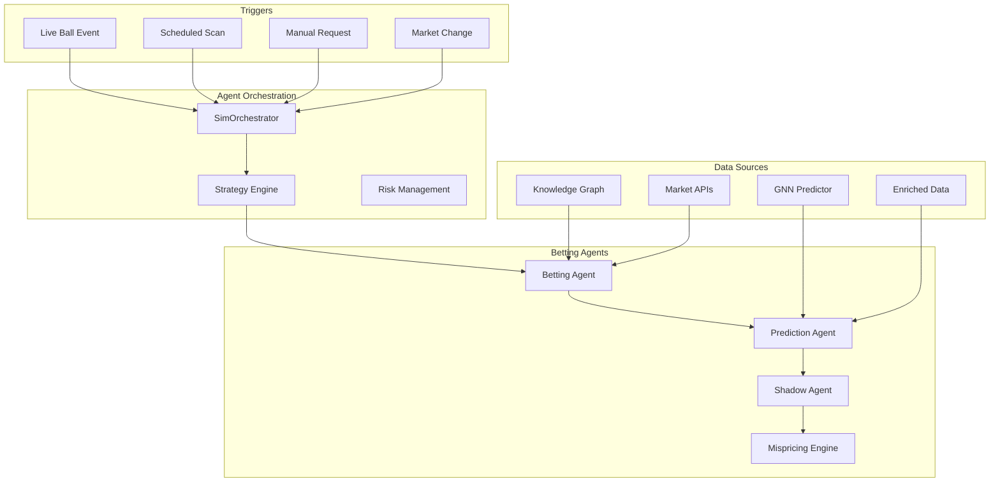

# 🤖 Betting Agents Architecture - Complete Guide

## 🎯 **EXECUTIVE SUMMARY**

WicketWise uses a sophisticated **multi-agent betting system** that combines AI-driven cricket intelligence with professional-grade risk management. The agents are activated through various triggers and use multiple data sources to make informed betting decisions.

---

## 🏗️ **SYSTEM ARCHITECTURE**

### **🔄 Agent Activation Flow**



---

## 🚀 **AGENT ACTIVATION METHODS**

### **1. ✅ Simulation-Based Activation**

**Location**: `sim/orchestrator.py`

**How It Works**:
```python
class SimOrchestrator:
    def _process_tick(self, match_state: MatchState, market_state: MarketState):
        # 1. Update market data
        for market_id, snapshot in market_state.market_snapshots.items():
            self.matching_engine.update_market_state(snapshot)
        
        # 2. Get strategy actions (triggers betting agents)
        strategy_actions = self.strategy.on_tick(match_state, market_state, self.account_state)
        
        # 3. Process each action through DGL and matching
        for action in strategy_actions:
            self._process_action(action, match_state, market_state)
```

**Triggers**:
- ⚾ **Every Ball**: Ball-by-ball simulation events
- 📊 **Market Updates**: Odds changes from betting exchanges
- 🎯 **Strategy Signals**: Edge detection thresholds met
- ⏰ **Time-Based**: Scheduled market scans

### **2. ✅ Real-Time Event Activation**

**Location**: `AGENTIC_FLOWS_DOCUMENTATION.md`

**Live Ball Prediction Flow**:
```json
{
  "flow_id": "live_ball_prediction_betting",
  "trigger": {
    "type": "live_data_event",
    "sources": ["cricsheet_live", "match_feed", "ball_by_ball_data"]
  },
  "sequence": [
    {"agent": "live_data_processor", "timeout_ms": 200},
    {"agent": "gnn_predictor", "timeout_ms": 500},
    {"agent": "betting_intelligence_engine", "timeout_ms": 300},
    {"agent": "shadow_agent", "timeout_ms": 100},
    {"agent": "dgl_engine", "timeout_ms": 50},
    {"agent": "execution_engine", "timeout_ms": 100}
  ]
}
```

**Triggers**:
- 🏏 **Live Cricket Events**: Wickets, boundaries, overs
- 📈 **Market Movements**: Significant odds changes
- ⚡ **High-Frequency**: Sub-second decision making
- 🎮 **Simulation Events**: Ball-by-ball progression

### **3. ✅ Scheduled Monitoring**

**Location**: `AGENTIC_FLOWS_DOCUMENTATION.md`

**Automated Value Detection**:
```json
{
  "flow_id": "automated_value_detection",
  "trigger": {
    "type": "scheduled_event",
    "interval_seconds": 30,
    "conditions": ["auto_betting_enabled", "market_data_available"]
  }
}
```

**Triggers**:
- ⏰ **Every 30 seconds**: Continuous market monitoring
- 🔍 **Value Scanning**: Automated edge detection
- 📊 **Market Efficiency**: Cross-bookmaker analysis
- 🎯 **Arbitrage Detection**: Risk-free opportunities

---

## 📊 **DATA SOURCES**

### **1. 🧠 Knowledge Graph Data**

**Source**: `real_betting_intelligence.py`

**What Agents Get**:
```python
def _get_player_stats_from_kg(self, player_name: str) -> Dict:
    query_result = self.kg_query_engine.query_player_comprehensive(player_name)
    
    return {
        'recent_scores': query_result.get('recent_innings', []),
        'batting_average': query_result.get('batting_avg', 0),
        'strike_rate': query_result.get('strike_rate', 0),
        'powerplay_sr': query_result.get('powerplay_strike_rate', 0),
        'death_overs_sr': query_result.get('death_overs_strike_rate', 0),
        'vs_pace_avg': query_result.get('vs_pace_average', 0),
        'vs_spin_avg': query_result.get('vs_spin_average', 0),
        'pressure_rating': query_result.get('pressure_performance', 0),
        'venue_performance': query_result.get('venue_stats', {}),
        'form_trend': query_result.get('form_trend', 0),
        'sample_size': len(query_result.get('recent_innings', [])),
        'consistency_score': query_result.get('consistency', 0)
    }
```

**Coverage**:
- 👥 **17,016+ Players**: Comprehensive player database
- 📈 **Historical Performance**: Batting averages, strike rates
- 🎯 **Situational Stats**: vs Pace/Spin, Powerplay/Death overs
- 🏟️ **Venue Analysis**: Ground-specific performance
- 📊 **Form Trends**: Recent performance patterns

### **2. 🧬 GNN Predictor Data**

**Source**: `crickformers/agents/prediction_agent.py`

**What Agents Get**:
```python
async def execute(self, context: AgentContext) -> AgentResponse:
    # Generate predictions using GNN models
    if prediction_type == "match_winner":
        result = await self._predict_match_winner(context, prediction_data)
    elif prediction_type == "total_score":
        result = await self._predict_total_score(context, prediction_data)
    elif prediction_type == "player_performance":
        result = await self._predict_player_performance(context, prediction_data)
```

**Features**:
- 🎯 **128-Dimensional Embeddings**: Player/venue/team representations
- 🔮 **Real-Time Predictions**: Match winner, total scores, player performance
- 📊 **Confidence Scores**: Model certainty levels
- 🎮 **Situational Context**: Current match state integration

### **3. 💰 Market Data**

**Source**: `betting_intelligence_system.py`

**What Agents Get**:
```python
@dataclass
class BettingMarket:
    market_type: str      # "runs_over_under", "wickets", "boundaries"
    line: float          # The betting line (e.g., 30.5 runs)
    over_odds: float     # Odds for over the line
    under_odds: float    # Odds for under the line
    model_probability: float    # Our model's probability
    market_probability: float   # Market's implied probability
    expected_value: float       # EV calculation
    confidence: float          # Our confidence
    volume: int               # Betting volume
```

**Sources** (Production Ready):
- 🏆 **Betfair Exchange**: Liquid markets, real-time odds
- 📊 **Bet365 API**: Wide market coverage
- 🎯 **Pinnacle API**: Sharp odds, low margins
- 💹 **Multiple Bookmakers**: Cross-platform arbitrage

### **4. 🌤️ Enriched Match Data**

**Source**: `enriched_data/enriched_betting_matches.json`

**What Agents Get**:
```json
{
  "weather": {
    "temperature": 28.5,
    "humidity": 75,
    "wind_speed": 12.3,
    "conditions": "partly_cloudy"
  },
  "venue": {
    "coordinates": {"lat": 17.302, "lng": -62.717},
    "pitch_type": "batting_friendly",
    "capacity": 10000
  },
  "match_context": {
    "competition": "IPL",
    "day_night": "day",
    "toss_winner": "Mumbai Indians"
  }
}
```

**Coverage**:
- 🌤️ **Weather Data**: Temperature, humidity, wind conditions
- 🏟️ **Venue Intelligence**: Pitch characteristics, dimensions
- 🎯 **Match Context**: Competition, timing, toss decisions
- 📊 **3,987 Matches**: Historical enriched data

---

## 🤖 **AGENT TYPES & ROLES**

### **1. 🎯 Betting Agent**

**Location**: `crickformers/agents/betting_agent.py`

**Primary Role**: Value opportunity identification and strategy coordination

**Key Capabilities**:
```python
class BettingAgent(BaseAgent):
    async def _analyze_value_opportunities(self, context, data) -> Dict[str, Any]
    async def _analyze_arbitrage_opportunities(self, context, data) -> Dict[str, Any]
    async def _analyze_market_efficiency(self, context, data) -> Dict[str, Any]
    async def _analyze_betting_strategy(self, context, data) -> Dict[str, Any]
```

**Supported Markets**:
- 🏆 **Match Winner**: Team victory predictions
- 📊 **Total Runs**: Over/Under team totals
- 👤 **Player Runs**: Individual player performance
- 🎳 **Player Wickets**: Bowler performance
- ⚾ **Innings Runs**: Specific innings totals

**Risk Parameters**:
```python
self.max_kelly_fraction = 0.1        # Max 10% Kelly sizing
self.min_edge_threshold = 0.05       # Min 5% edge required
self.confidence_threshold = 0.6      # Min 60% confidence
```

### **2. 🔮 Prediction Agent**

**Location**: `crickformers/agents/prediction_agent.py`

**Primary Role**: Generate probability estimates for betting markets

**Integration Points**:
- 🧠 **Knowledge Graph**: Player statistics and historical data
- 🧬 **GNN Models**: Real-time predictions and embeddings
- 🎯 **Situational Analysis**: Context-aware adjustments
- 📈 **Form Analysis**: Recent performance trends

**Prediction Types**:
- 🏆 **Match Winner**: Team victory probabilities
- 📊 **Total Score**: Run total predictions
- 👤 **Player Performance**: Individual player outcomes
- 🏟️ **Tournament Winner**: Long-term competition outcomes
- 📈 **Series Outcome**: Multi-match predictions

### **3. 👤 Shadow Agent**

**Location**: `crickformers/agents/shadow_betting_agent.py`

**Primary Role**: Final decision validation and execution logic

**Decision Logic**:
```python
def make_decision(win_probability, market_odds, odds_mispricing_prob):
    market_implied_prob = 1.0 / market_odds
    delta = win_probability - market_implied_prob
    
    if delta > value_threshold:
        return "value_bet"      # Model edge > 5%
    elif high_confidence_but_long_odds:
        return "risk_alert"     # Suspicious odds
    else:
        return "no_bet"         # Insufficient edge
```

**Decision Types**:
- ✅ **Value Bet**: Clear model advantage
- ⚠️ **Risk Alert**: High confidence but suspicious odds
- ❌ **No Bet**: Insufficient edge detected

### **4. 💎 Mispricing Engine**

**Location**: `crickformers/betting/mispricing_engine.py`

**Primary Role**: Detect market inefficiencies and value opportunities

**Core Detection**:
```python
def detect_value(model_probabilities, market_odds):
    expected_value = calculate_ev(model_probabilities, market_odds)
    kelly_fraction = calculate_kelly(model_probabilities, market_odds)
    
    if expected_value > threshold:
        return ValueOpportunity(
            market=market,
            expected_value=expected_value,
            kelly_fraction=kelly_fraction,
            confidence=confidence_score
        )
```

---

## ⚡ **EXECUTION FLOW**

### **Real-Time Decision Making**:

1. **🎯 Trigger Event** (Ball, Market Change, Schedule)
2. **📊 Data Gathering** (KG + GNN + Market + Enriched)
3. **🤖 Agent Coordination** (Betting → Prediction → Shadow → Mispricing)
4. **🛡️ Risk Management** (DGL validation and sizing)
5. **💰 Order Execution** (Matching engine with latency simulation)
6. **📈 Performance Tracking** (Metrics and KPI calculation)

### **Professional Output Example**:
```json
{
    "player_name": "Virat Kohli",
    "market_odds": 1.85,
    "model_probability": "65.8%",
    "expected_value": "+12.3%",
    "confidence": "78%",
    "reasoning": {
        "form_trend": "+23%",
        "matchup_advantage": "+18%",
        "venue_factor": "+8%"
    },
    "recommendation": "STRONG BUY",
    "kelly_fraction": "8.2%",
    "risk_level": "Medium"
}
```

---

## 🎮 **ACTIVATION EXAMPLES**

### **Simulation Mode**:
```bash
# Start simulation - agents activate automatically
./start.sh
# Navigate to: http://localhost:8000/wicketwise_dashboard.html
# Click "Start Simulation" - agents begin processing each ball
```

### **Live Mode** (Production):
```python
# Agents activate on live cricket events
live_event = {
    "type": "wicket",
    "player": "Virat Kohli",
    "over": 15.3,
    "match_state": {...}
}

# Triggers agent cascade:
# 1. Live Data Processor (200ms)
# 2. GNN Predictor (500ms) 
# 3. Betting Intelligence (300ms)
# 4. Shadow Validation (100ms)
# 5. DGL Risk Check (50ms)
# 6. Order Execution (100ms)
```

### **Scheduled Monitoring**:
```python
# Every 30 seconds, agents scan for value
scheduler.every(30).seconds.do(scan_markets)

def scan_markets():
    for market in active_markets:
        betting_agent.analyze_value_opportunities(market)
        if value_detected:
            execute_betting_flow()
```

---

## 🎯 **CONCLUSION**

The betting agents are activated through **multiple sophisticated triggers**:

1. **🎮 Simulation Events**: Ball-by-ball progression
2. **⚡ Live Cricket Events**: Real-time match updates  
3. **⏰ Scheduled Scans**: Continuous market monitoring
4. **📊 Market Changes**: Odds movement detection

They use **comprehensive data sources**:
- 🧠 **Knowledge Graph**: 17,016+ players, historical stats
- 🧬 **GNN Predictions**: Real-time probability estimates
- 💰 **Market Data**: Live odds from multiple bookmakers
- 🌤️ **Enriched Context**: Weather, venue, match conditions

The result is a **professional-grade betting system** that combines AI intelligence with institutional-level risk management! 🚀
