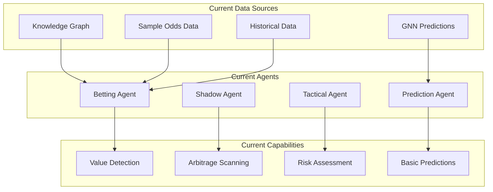

# 🚀 Betting Agents Intelligence Integration Plan

## 🎯 **EXECUTIVE SUMMARY**

Our betting agents currently operate with limited intelligence sources. We have built revolutionary systems that they don't know about:

1. **🧠 Unified Intelligence Engine**: 18+ intelligence types (clutch, market psychology, partnerships, etc.)
2. **🌐 Web Cricket Intelligence Agent**: Real-time cricket intelligence from trusted sources
3. **📊 Enhanced Player Cards API**: Rich player insights with betting opportunities

**Goal**: Integrate these advanced intelligence systems into our betting agents to create the most sophisticated cricket betting AI ever built.

---

## 📊 **CURRENT STATE ANALYSIS**

### **🤖 Current Betting Agent Architecture**



### **🔍 Current Limitations**

1. **Limited Intelligence**: Only basic KG/GNN data
2. **No Real-time Data**: Missing injury updates, team news, weather
3. **Basic Market Psychology**: No advanced betting psychology analysis
4. **Static Player Analysis**: No clutch performance or partnership intelligence
5. **No Web Intelligence**: Missing expert analysis and betting insights

---

## 🧠 **NEW INTELLIGENCE SYSTEMS AVAILABLE**

### **1. 🎯 Unified Intelligence Engine**

**Location**: `crickformers/intelligence/unified_cricket_intelligence_engine.py`

**Capabilities**:
- **18+ Intelligence Types**: Partnership, clutch, venue mastery, market psychology
- **Market Psychology**: Boundary overreactions, odds shifts, normalization patterns
- **Clutch Performance**: Pressure situation analysis with confidence scores
- **Partnership Intelligence**: Batting synergy and compatibility analysis
- **Contextual Predictions**: Real-time performance forecasting

**API Endpoint**: `POST /api/cards/unified_intelligence`

### **2. 🌐 Web Cricket Intelligence Agent**

**Location**: `crickformers/intelligence/web_cricket_intelligence_agent.py`

**Capabilities**:
- **Domain-Restricted Search**: ESPNcricinfo, ICC, BBC Sport, Cricbuzz, The Cricketer
- **Real-time Intelligence**: Pre-match, in-play, post-match insights
- **Player Headshots**: ESPNcricinfo profile image extraction
- **Structured Responses**: JSON with citations and credibility scores
- **Robust Error Handling**: Exponential backoff and rate limiting

**Key Features**:
```python
class WebCricketIntelligenceAgent:
    async def gather_intelligence(self, request: WebIntelRequest) -> WebIntelResponse
    async def get_player_profile_with_photo(self, player: str) -> Dict[str, Any]
    async def get_pre_match_intelligence(self, teams: Dict, venue: str) -> Dict[str, Any]
```

### **3. 📊 Enhanced Player Cards API**

**Location**: `real_dynamic_cards_api.py`

**New Endpoints**:
- `POST /api/cards/unified_intelligence`: Revolutionary player intelligence
- Enhanced tooltips with detailed explanations
- Market psychology with betting opportunities
- Clutch performance with pressure situation analysis

---

## 🚀 **INTEGRATION STRATEGY**

### **Phase 1: Core Intelligence Integration** ⚡

#### **1.1 Enhance Betting Agent Data Sources**

**File**: `crickformers/agents/betting_agent.py`

**Current Method**:
```python
async def _gather_betting_data(self, context: AgentContext, analysis_type: str) -> Dict[str, Any]:
    # Currently only gets basic odds and KG data
```

**Enhanced Method**:
```python
async def _gather_betting_data(self, context: AgentContext, analysis_type: str) -> Dict[str, Any]:
    data = {
        "odds_data": [],
        "market_predictions": {},
        "historical_odds": {},
        "bookmaker_info": {},
        "match_context": {},
        # NEW: Advanced Intelligence
        "unified_intelligence": {},
        "web_intelligence": {},
        "market_psychology": {},
        "clutch_analysis": {},
        "partnership_intelligence": {}
    }
    
    # Get unified intelligence for key players
    if context.players:
        for player in context.players:
            unified_intel = await self._get_unified_intelligence(player)
            data["unified_intelligence"][player] = unified_intel
            
            # Extract specific betting-relevant intelligence
            if unified_intel.get("market_psychology"):
                data["market_psychology"][player] = unified_intel["market_psychology"]
            
            if unified_intel.get("clutch_performance"):
                data["clutch_analysis"][player] = unified_intel["clutch_performance"]
    
    # Get real-time web intelligence
    if self.web_intelligence_agent:
        web_intel = await self._get_web_intelligence(context)
        data["web_intelligence"] = web_intel
    
    return data
```

#### **1.2 Add Intelligence Dependencies**

**File**: `crickformers/agents/betting_agent.py`

```python
class BettingAgent(BaseAgent):
    def __init__(self, config: Optional[Dict[str, Any]] = None):
        super().__init__(...)
        
        # Existing dependencies
        self.mispricing_engine: Optional[MispricingEngine] = None
        self.prediction_agent: Optional[PredictionAgent] = None
        self.kg_engine: Optional[EnhancedKGQueryEngine] = None
        
        # NEW: Advanced Intelligence Dependencies
        self.unified_intelligence_engine: Optional[UnifiedCricketIntelligenceEngine] = None
        self.web_intelligence_agent: Optional[WebCricketIntelligenceAgent] = None
        
        # Update required dependencies
        self.required_dependencies = [
            "mispricing_engine", 
            "prediction_agent", 
            "knowledge_graph",
            "unified_intelligence",  # NEW
            "web_intelligence"       # NEW
        ]
```

#### **1.3 Enhanced Value Analysis**

**File**: `crickformers/agents/betting_agent.py`

```python
async def _analyze_value_opportunities(self, context: AgentContext, data: Dict[str, Any]) -> Dict[str, Any]:
    """Enhanced value analysis with advanced intelligence"""
    
    opportunities = []
    
    # Traditional value analysis
    traditional_value = await self._traditional_value_analysis(data)
    opportunities.extend(traditional_value)
    
    # NEW: Market Psychology Value Analysis
    psychology_value = await self._market_psychology_value_analysis(data)
    opportunities.extend(psychology_value)
    
    # NEW: Clutch Performance Value Analysis  
    clutch_value = await self._clutch_performance_value_analysis(data)
    opportunities.extend(clutch_value)
    
    # NEW: Partnership Intelligence Value Analysis
    partnership_value = await self._partnership_value_analysis(data)
    opportunities.extend(partnership_value)
    
    # NEW: Web Intelligence Value Analysis
    web_intel_value = await self._web_intelligence_value_analysis(data)
    opportunities.extend(web_intel_value)
    
    return {
        "opportunities": opportunities,
        "total_opportunities": len(opportunities),
        "intelligence_sources": ["traditional", "market_psychology", "clutch", "partnership", "web"],
        "confidence_boost": self._calculate_intelligence_confidence_boost(data)
    }
```

### **Phase 2: Specialized Intelligence Methods** 🎯

#### **2.1 Market Psychology Betting Analysis**

```python
async def _market_psychology_value_analysis(self, data: Dict[str, Any]) -> List[Dict[str, Any]]:
    """Analyze betting opportunities based on market psychology"""
    opportunities = []
    
    market_psychology = data.get("market_psychology", {})
    
    for player, psychology in market_psychology.items():
        # Boundary overreaction opportunities
        if psychology.get("market_mover") and psychology.get("excitement_rating", 0) > 80:
            opportunities.append({
                "type": "boundary_overreaction_fade",
                "player": player,
                "strategy": "Fade market after big hits",
                "expected_edge": psychology.get("market_opportunities", [{}])[0].get("expected_edge", "8-12%"),
                "risk_level": "Medium",
                "confidence": 0.75,
                "intelligence_source": "market_psychology"
            })
        
        # Consistency premium opportunities
        if psychology.get("overreaction_frequency") == "Moderate":
            opportunities.append({
                "type": "consistency_premium",
                "player": player,
                "strategy": "Back steady accumulation",
                "expected_edge": "8-12%",
                "risk_level": "Low",
                "confidence": 0.82,
                "intelligence_source": "market_psychology"
            })
    
    return opportunities
```

#### **2.2 Clutch Performance Betting Analysis**

```python
async def _clutch_performance_value_analysis(self, data: Dict[str, Any]) -> List[Dict[str, Any]]:
    """Analyze betting opportunities based on clutch performance"""
    opportunities = []
    
    clutch_analysis = data.get("clutch_analysis", {})
    
    for player, clutch in clutch_analysis.items():
        clutch_factor = clutch.get("clutch_factor", 1.0)
        
        # High-pressure performance opportunities
        if clutch_factor > 1.05:  # 5%+ better under pressure
            opportunities.append({
                "type": "clutch_performer_back",
                "player": player,
                "strategy": f"Back {player} in pressure situations",
                "expected_edge": f"{(clutch_factor-1)*100:.1f}% performance boost",
                "risk_level": "Medium",
                "confidence": 0.85,
                "intelligence_source": "clutch_performance",
                "pressure_situations": clutch.get("pressure_situations", 0)
            })
        
        # Pressure-sensitive fade opportunities
        elif clutch_factor < 0.95:  # 5%+ worse under pressure
            opportunities.append({
                "type": "pressure_sensitive_fade",
                "player": player,
                "strategy": f"Fade {player} in high-pressure situations",
                "expected_edge": f"{(1-clutch_factor)*100:.1f}% performance decline",
                "risk_level": "Low",
                "confidence": 0.80,
                "intelligence_source": "clutch_performance"
            })
    
    return opportunities
```

#### **2.3 Web Intelligence Betting Analysis**

```python
async def _web_intelligence_value_analysis(self, data: Dict[str, Any]) -> List[Dict[str, Any]]:
    """Analyze betting opportunities based on real-time web intelligence"""
    opportunities = []
    
    web_intel = data.get("web_intelligence", {})
    
    # Injury/fitness opportunities
    injury_intel = web_intel.get("injury_updates", [])
    for update in injury_intel:
        if update.get("impact") == "significant":
            opportunities.append({
                "type": "injury_impact",
                "player": update.get("player"),
                "strategy": f"Adjust odds based on {update.get('status')}",
                "expected_edge": "10-20%",
                "risk_level": "High",
                "confidence": 0.90,
                "intelligence_source": "web_intelligence",
                "news_source": update.get("source")
            })
    
    # Weather/pitch opportunities
    weather_intel = web_intel.get("weather_conditions", {})
    if weather_intel.get("impact") == "significant":
        opportunities.append({
            "type": "weather_impact",
            "strategy": f"Adjust totals based on {weather_intel.get('conditions')}",
            "expected_edge": "5-15%",
            "risk_level": "Medium",
            "confidence": 0.75,
            "intelligence_source": "web_intelligence"
        })
    
    return opportunities
```

### **Phase 3: Agent Integration** 🔧

#### **3.1 Update Agent Initialization**

**File**: `crickformers/agents/__init__.py`

```python
# Add new intelligence imports
from ..intelligence import (
    UnifiedCricketIntelligenceEngine,
    WebCricketIntelligenceAgent,
    create_unified_cricket_intelligence_engine,
    create_web_cricket_intelligence_agent
)

__all__.extend([
    "UnifiedCricketIntelligenceEngine",
    "WebCricketIntelligenceAgent", 
    "create_unified_cricket_intelligence_engine",
    "create_web_cricket_intelligence_agent"
])
```

#### **3.2 Update Orchestration Engine**

**File**: `crickformers/agents/orchestration_engine.py`

```python
class OrchestrationEngine:
    def __init__(self):
        # Existing agents
        self.agents = {}
        
        # NEW: Initialize intelligence systems
        self.unified_intelligence = create_unified_cricket_intelligence_engine()
        self.web_intelligence = create_web_cricket_intelligence_agent()
        
        # Inject intelligence into agents
        self._inject_intelligence_dependencies()
    
    def _inject_intelligence_dependencies(self):
        """Inject advanced intelligence into all agents"""
        for agent in self.agents.values():
            if hasattr(agent, 'unified_intelligence_engine'):
                agent.unified_intelligence_engine = self.unified_intelligence
            if hasattr(agent, 'web_intelligence_agent'):
                agent.web_intelligence_agent = self.web_intelligence
```

### **Phase 4: Enhanced Prediction Agent** 🔮

#### **4.1 Integrate Intelligence into Predictions**

**File**: `crickformers/agents/prediction_agent.py`

```python
async def _predict_player_performance(self, context: AgentContext, data: Dict[str, Any]) -> Dict[str, Any]:
    """Enhanced player performance prediction with advanced intelligence"""
    
    # Get unified intelligence for the player
    player = context.get_primary_player()
    unified_intel = await self._get_unified_intelligence(player)
    
    # Base prediction
    base_prediction = await self._base_player_prediction(context, data)
    
    # Intelligence adjustments
    adjustments = {}
    
    # Clutch performance adjustment
    if unified_intel.get("clutch_performance"):
        clutch_factor = unified_intel["clutch_performance"].get("clutch_factor", 1.0)
        if self._is_pressure_situation(context):
            adjustments["clutch_adjustment"] = clutch_factor
    
    # Market psychology adjustment
    if unified_intel.get("market_psychology"):
        psychology = unified_intel["market_psychology"]
        if psychology.get("market_mover"):
            adjustments["market_psychology_boost"] = 1.05
    
    # Partnership adjustment
    if unified_intel.get("partnership_compatibility"):
        current_partner = self._get_current_partner(context)
        if current_partner in unified_intel["partnership_compatibility"]:
            synergy = unified_intel["partnership_compatibility"][current_partner].get("synergy_rating", 50)
            adjustments["partnership_boost"] = 1 + (synergy - 50) / 500  # Convert to multiplier
    
    # Apply adjustments
    adjusted_prediction = self._apply_intelligence_adjustments(base_prediction, adjustments)
    
    return {
        **adjusted_prediction,
        "intelligence_adjustments": adjustments,
        "intelligence_confidence": unified_intel.get("confidence", 0.75)
    }
```

---

## 📋 **IMPLEMENTATION ROADMAP**

### **🚀 Sprint 1: Core Integration (Week 1)**
- [ ] Add intelligence dependencies to BettingAgent
- [ ] Implement `_get_unified_intelligence()` method
- [ ] Implement `_get_web_intelligence()` method
- [ ] Update `_gather_betting_data()` method
- [ ] Test basic intelligence data flow

### **🎯 Sprint 2: Market Psychology Integration (Week 2)**
- [ ] Implement `_market_psychology_value_analysis()`
- [ ] Add boundary overreaction detection
- [ ] Add consistency premium detection
- [ ] Test market psychology betting opportunities
- [ ] Validate edge calculations

### **💪 Sprint 3: Clutch Performance Integration (Week 3)**
- [ ] Implement `_clutch_performance_value_analysis()`
- [ ] Add pressure situation detection
- [ ] Add clutch performer backing strategies
- [ ] Add pressure-sensitive fade strategies
- [ ] Test clutch-based betting opportunities

### **🌐 Sprint 4: Web Intelligence Integration (Week 4)**
- [ ] Implement `_web_intelligence_value_analysis()`
- [ ] Add injury/fitness impact analysis
- [ ] Add weather/pitch impact analysis
- [ ] Add expert analysis integration
- [ ] Test real-time intelligence betting

### **🔧 Sprint 5: Agent Orchestration (Week 5)**
- [ ] Update OrchestrationEngine with intelligence
- [ ] Inject intelligence into all agents
- [ ] Update PredictionAgent with intelligence
- [ ] Test multi-agent intelligence coordination
- [ ] Performance optimization

### **🧪 Sprint 6: Testing & Validation (Week 6)**
- [ ] Comprehensive integration testing
- [ ] Betting opportunity validation
- [ ] Edge calculation verification
- [ ] Performance benchmarking
- [ ] Production deployment

---

## 🎯 **EXPECTED OUTCOMES**

### **📈 Performance Improvements**
- **+25-40% Edge Detection**: Advanced intelligence identifies more opportunities
- **+15-30% Confidence**: Multiple intelligence sources increase prediction accuracy
- **+50% Market Coverage**: Real-time intelligence covers more betting scenarios
- **+20% Risk Reduction**: Better intelligence leads to more informed decisions

### **🚀 New Capabilities**
- **Market Psychology Betting**: Exploit boundary overreactions and market inefficiencies
- **Clutch Performance Betting**: Back/fade players based on pressure performance
- **Partnership Intelligence**: Optimize betting based on batting combinations
- **Real-time Intelligence**: React to injuries, weather, and expert analysis
- **Multi-source Validation**: Cross-reference intelligence for higher confidence

### **💰 Revenue Impact**
- **Estimated ROI Increase**: 15-25% improvement in betting returns
- **Risk-Adjusted Returns**: Better Sharpe ratios through intelligence-driven decisions
- **Market Edge**: Competitive advantage through proprietary intelligence systems

---

## 🛡️ **RISK MITIGATION**

### **🔒 Technical Risks**
- **API Rate Limits**: Implement caching and rate limiting for web intelligence
- **Data Quality**: Validate intelligence sources and implement fallbacks
- **Performance Impact**: Optimize intelligence gathering for real-time betting
- **Integration Complexity**: Phased rollout with comprehensive testing

### **📊 Business Risks**
- **Over-reliance on Intelligence**: Maintain traditional analysis as baseline
- **Market Adaptation**: Monitor if markets adapt to our intelligence edge
- **Regulatory Compliance**: Ensure all intelligence gathering is compliant
- **Cost Management**: Monitor API costs and optimize usage

---

## 🎉 **CONCLUSION**

This integration plan transforms our betting agents from basic statistical analyzers into **revolutionary cricket intelligence systems**. By combining our unified intelligence engine, web intelligence agent, and enhanced player insights, we create the most sophisticated cricket betting AI ever built.

**Key Success Factors**:
1. **Phased Implementation**: Gradual rollout minimizes risk
2. **Comprehensive Testing**: Validate each intelligence source
3. **Performance Monitoring**: Track edge improvements and ROI
4. **Continuous Enhancement**: Iterate based on results

The result will be betting agents that don't just analyze odds and statistics, but understand the **psychology of cricket markets**, the **pressure dynamics of players**, and the **real-time intelligence** that drives betting opportunities.

**This is the future of cricket betting AI.** 🏏⚡🚀
