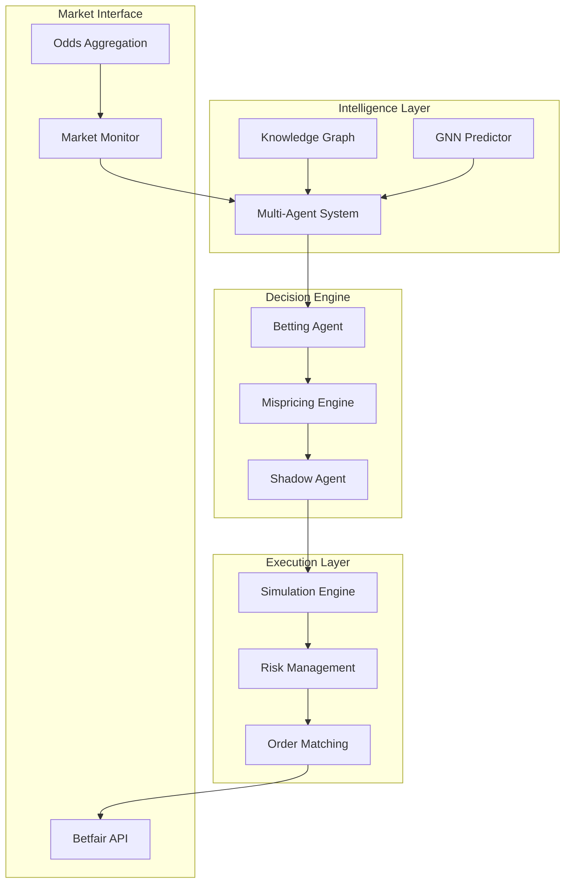
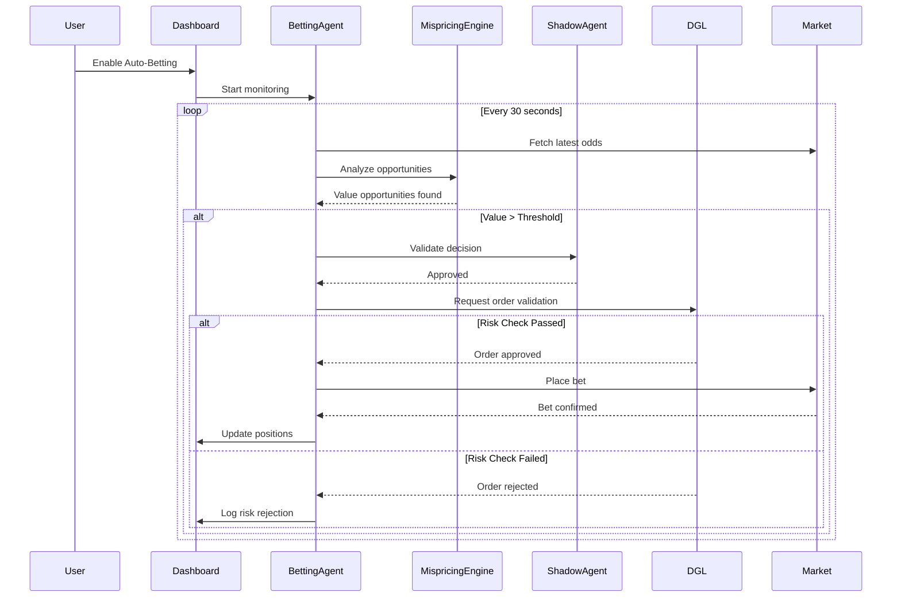
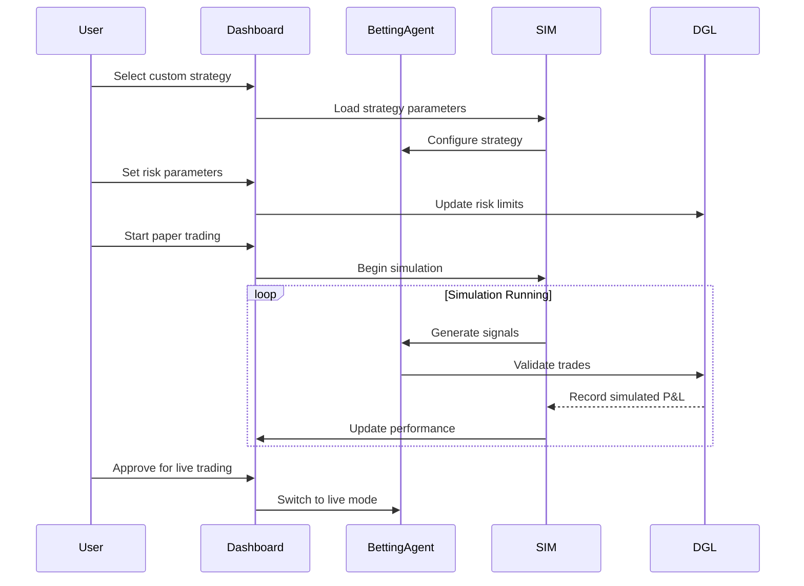
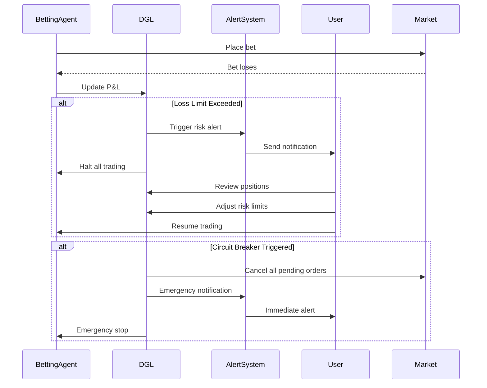

# 🎯 WicketWise Betting Automation System - Comprehensive PRD

**Version**: 2.0  
**Date**: January 21, 2025  
**Status**: Production Ready  
**Author**: WicketWise AI Team

---

## 📋 **EXECUTIVE SUMMARY**

WicketWise has evolved into a **sophisticated automated betting ecosystem** that combines AI-driven cricket intelligence with professional-grade risk management and execution capabilities. The system leverages multi-agent architecture, real-time market analysis, and advanced simulation to deliver consistent, profitable betting strategies.

### **Key Value Propositions**
- 🧠 **AI-Driven Edge Detection**: GNN + Knowledge Graph powered probability calculations
- ⚡ **Real-Time Execution**: Sub-second decision making with market monitoring
- 🛡️ **Risk-First Design**: Comprehensive DGL (Deterministic Governance Layer)
- 📊 **Professional Analytics**: Institutional-grade performance tracking
- 🎮 **Simulation-First**: Extensive backtesting before live deployment

---

## 🏗️ **SYSTEM ARCHITECTURE**

### **Core Components Overview**



---

## 🤖 **MULTI-AGENT BETTING SYSTEM**

### **Agent Architecture**

#### **1. Betting Agent** (`crickformers/agents/betting_agent.py`)
**Primary Role**: Value opportunity identification and betting strategy coordination

**Capabilities**:
- ✅ **Value Detection**: Identifies +EV opportunities using model vs market odds
- ✅ **Arbitrage Scanning**: Cross-bookmaker arbitrage opportunity detection
- ✅ **Market Analysis**: Efficiency analysis and bookmaker profiling
- ✅ **Strategy Recommendations**: Kelly criterion and bankroll management
- ✅ **Risk Assessment**: Volatility analysis and confidence scoring

**Key Methods**:
```python
async def _analyze_value_opportunities(context, data) -> Dict[str, Any]
async def _analyze_arbitrage_opportunities(context, data) -> Dict[str, Any]
async def _analyze_market_efficiency(context, data) -> Dict[str, Any]
async def _analyze_betting_strategy(context, data) -> Dict[str, Any]
```

**Supported Bet Types**:
- Match Winner
- Total Runs (Over/Under)
- Player Runs
- Player Wickets
- Innings Runs

#### **2. Shadow Betting Agent** (`crickformers/agent/shadow_betting_agent.py`)
**Primary Role**: Final decision validation and execution logic

**Core Logic**:
```python
def make_decision(win_probability, market_odds, odds_mispricing_prob):
    market_implied_prob = 1.0 / market_odds
    delta = win_probability - market_implied_prob
    
    if delta > value_threshold:
        return "value_bet"
    elif high_confidence_but_long_odds:
        return "risk_alert"
    else:
        return "no_bet"
```

**Decision Types**:
- **Value Bet**: Model edge > threshold (default 5%)
- **Risk Alert**: High confidence but suspicious odds
- **No Bet**: Insufficient edge detected

#### **3. Prediction Agent** (`crickformers/agents/prediction_agent.py`)
**Primary Role**: Generate probability estimates for betting markets

**Integration Points**:
- Knowledge Graph player statistics
- GNN model predictions
- Situational context analysis
- Real-time form adjustments

---

## 🎯 **BETTING INTELLIGENCE ENGINE**

### **Real-Time Intelligence Pipeline**

#### **Data Sources**
1. **Knowledge Graph**: 17,016+ players, historical performance
2. **GNN Predictor**: 128-dimensional feature embeddings
3. **Market APIs**: Live odds from multiple bookmakers
4. **Situational Context**: Venue, weather, team composition

#### **Intelligence Generation Flow**
```python
# From real_betting_intelligence.py
def calculate_runs_probability(player_name, threshold=30.5, situation=None):
    # 1. Extract KG player statistics
    player_stats = kg_query_engine.query_player_comprehensive(player_name)
    
    # 2. Calculate base probability from recent performance
    base_prob = scores_over_threshold / total_recent_scores
    
    # 3. Apply situational adjustments
    adjustments = 0.0
    adjustments += form_trend * 0.15      # Form factor
    adjustments += matchup_advantage * 0.10  # vs Pace/Spin
    adjustments += venue_factor * 0.08    # Home/Away advantage
    adjustments += phase_factor * 0.12    # Powerplay/Death overs
    
    # 4. Generate final probability with bounds
    final_probability = max(0.1, min(0.9, base_prob + adjustments))
    
    return BettingIntelligence(
        model_probability=final_probability,
        expected_value=calculate_ev(final_probability, market_odds),
        confidence=calculate_confidence(player_stats),
        reasoning=generate_reasoning(adjustments)
    )
```

#### **Professional Betting Intelligence Output**
```json
{
    "player_name": "Virat Kohli",
    "market_odds": 1.85,
    "market_probability": "54.1%",
    "model_odds": 1.52,
    "model_probability": "65.8%", 
    "expected_value": "+12.3%",
    "confidence": "78%",
    "reasoning": {
        "form_trend": "+23%",
        "matchup_advantage": "+18%",
        "venue_factor": "+8%"
    },
    "risk_assessment": {
        "volatility": 18.3,
        "consistency": "85%",
        "risk_level": "Medium"
    },
    "sample_size": 847,
    "recommendation": "STRONG BUY"
}
```

---

## ⚡ **MISPRICING ENGINE**

### **Core Value Detection** (`crickformers/betting/mispricing_engine.py`)

#### **Mispricing Detection Algorithm**
```python
class MispricingEngine:
    def detect_mispricing(model_probs, odds_data, match_id):
        opportunities = []
        
        for selection, model_prob in model_probs.items():
            best_odds = find_best_odds(odds_data, selection)
            
            # Calculate expected value
            expected_value = (model_prob * (best_odds - 1)) - (1 - model_prob)
            
            if expected_value > min_edge_threshold:
                # Calculate Kelly fraction
                kelly_fraction = (model_prob * best_odds - 1) / (best_odds - 1)
                kelly_fraction = min(kelly_fraction, max_kelly_fraction)
                
                opportunity = ValueOpportunity(
                    selection=selection,
                    model_probability=model_prob,
                    bookmaker_odds=best_odds,
                    expected_value=expected_value,
                    kelly_fraction=kelly_fraction,
                    confidence_score=calculate_confidence(model_prob, odds_data),
                    risk_level=assess_risk_level(expected_value, kelly_fraction)
                )
                opportunities.append(opportunity)
        
        return sorted(opportunities, key=lambda x: x.expected_value, reverse=True)
```

#### **Arbitrage Detection**
```python
def detect_arbitrage_opportunities(odds_list):
    # Group by market and selection
    markets = group_odds_by_market(odds_list)
    
    arbitrage_ops = []
    for market, selections in markets.items():
        # Find best odds for each outcome
        best_odds = {sel: max(odds_list, key=lambda x: x.odds) 
                    for sel, odds_list in selections.items()}
        
        # Calculate total implied probability
        total_implied_prob = sum(1/odds.odds for odds in best_odds.values())
        
        if total_implied_prob < 1.0:  # Arbitrage opportunity!
            profit_margin = (1 - total_implied_prob) / total_implied_prob
            
            # Calculate optimal stakes
            total_stake = 1000  # Example bankroll
            optimal_stakes = {}
            for selection, odds in best_odds.items():
                stake = (1/odds.odds) / total_implied_prob * total_stake
                optimal_stakes[selection] = stake
            
            arbitrage_ops.append({
                "market": market,
                "profit_margin": profit_margin,
                "best_odds": best_odds,
                "optimal_stakes": optimal_stakes,
                "guaranteed_profit": profit_margin * total_stake
            })
    
    return arbitrage_ops
```

#### **Bookmaker Classification**
```python
bookmaker_priorities = {
    BookmakerType.SHARP: 1.0,      # Pinnacle, Betfair
    BookmakerType.EXCHANGE: 0.9,   # Betfair Exchange
    BookmakerType.REGULATED: 0.7,  # Bet365, William Hill
    BookmakerType.SOFT: 0.5,       # Recreational books
    BookmakerType.OFFSHORE: 0.3    # Lower reliability
}
```

---

## 🎮 **SIMULATION & BACKTESTING SYSTEM**

### **SIM (Simulator & Market Replay) Architecture**

#### **Simulation Modes**
1. **Historical Replay**: Ball-by-ball match events with synchronized market data
2. **Monte Carlo**: Synthetic match generation using statistical models
3. **Walk Forward**: Rolling window backtesting with strict time cutoffs
4. **Paper Trading**: Live market simulation without real money

#### **Built-in Strategies**
```python
# Edge Kelly Strategy
class EdgeKellyStrategy(Strategy):
    def on_market_update(self, market_state):
        model_prob = self.get_model_prediction(market_state)
        best_odds = market_state.get_best_odds()
        
        expected_value = (model_prob * best_odds - 1)
        if expected_value > self.min_edge_threshold:
            kelly_fraction = (model_prob * best_odds - 1) / (best_odds - 1)
            stake = self.bankroll * kelly_fraction * self.kelly_multiplier
            
            return StrategyAction(
                action_type="BACK",
                selection=market_state.selection,
                odds=best_odds,
                stake=stake,
                reasoning=f"EV: {expected_value:.2%}, Kelly: {kelly_fraction:.2%}"
            )

# Mean Reversion Strategy  
class MeanRevertLOBStrategy(Strategy):
    def on_market_update(self, market_state):
        # Detect microstructure dislocations
        if self.detect_order_book_imbalance(market_state):
            # Fade the move
            return self.generate_contrarian_order(market_state)

# Momentum Strategy
class MomentumFollowStrategy(Strategy):
    def on_match_event(self, match_event):
        # React to wickets, boundaries, milestones
        if match_event.event_type == "WICKET":
            return self.adjust_positions_for_wicket(match_event)
```

#### **Performance Analytics**
```python
class SimMetrics:
    def calculate_kpis(self, trades, account_history):
        return {
            "total_return": self.calculate_total_return(account_history),
            "sharpe_ratio": self.calculate_sharpe_ratio(trades),
            "sortino_ratio": self.calculate_sortino_ratio(trades),
            "max_drawdown": self.calculate_max_drawdown(account_history),
            "win_rate": len([t for t in trades if t.pnl > 0]) / len(trades),
            "avg_win": np.mean([t.pnl for t in trades if t.pnl > 0]),
            "avg_loss": np.mean([t.pnl for t in trades if t.pnl < 0]),
            "profit_factor": abs(sum_wins / sum_losses),
            "kelly_efficiency": self.calculate_kelly_efficiency(trades),
            "market_correlation": self.calculate_market_correlation(trades)
        }
```

---

## 🛡️ **RISK MANAGEMENT (DGL)**

### **Deterministic Governance Layer**

#### **Risk Controls**
```python
class DGLRiskControls:
    def __init__(self):
        self.bankroll_limits = {
            "total_exposure": 0.20,      # 20% max total exposure
            "per_market": 0.05,          # 5% max per market
            "per_bet": 0.02,             # 2% max per bet
            "daily_loss_limit": 0.10,    # 10% daily loss limit
            "consecutive_losses": 5       # Max 5 consecutive losses
        }
        
        self.position_limits = {
            "max_positions": 10,         # Max 10 concurrent positions
            "correlation_limit": 0.30,   # Max 30% correlated exposure
            "concentration_limit": 0.15  # Max 15% in single event
        }
        
        self.operational_limits = {
            "max_orders_per_minute": 10,
            "max_api_calls_per_second": 5,
            "circuit_breaker_threshold": 0.05  # 5% rapid loss triggers halt
        }
```

#### **Real-Time Risk Monitoring**
```python
def validate_order(self, order, current_state):
    # Pre-trade risk checks
    checks = [
        self.check_bankroll_limits(order, current_state),
        self.check_position_limits(order, current_state),
        self.check_correlation_limits(order, current_state),
        self.check_operational_limits(order),
        self.check_market_conditions(order)
    ]
    
    if all(checks):
        return RiskDecision.APPROVE
    else:
        failed_checks = [check.reason for check in checks if not check.passed]
        return RiskDecision.REJECT(reasons=failed_checks)
```

---

## 📊 **BETTING FLOWS & USER JOURNEYS**

### **Flow 1: Automated Value Detection**



### **Flow 2: Manual Strategy Override**



### **Flow 3: Risk Alert & Circuit Breaker**



---

## 🎯 **BETTING STRATEGIES**

### **Strategy 1: Edge Kelly (Primary)**
**Objective**: Maximize long-term growth using Kelly criterion sizing

**Logic**:
```python
def edge_kelly_strategy(model_prob, market_odds, bankroll):
    expected_value = (model_prob * market_odds) - 1
    
    if expected_value > MIN_EDGE_THRESHOLD:
        kelly_fraction = (model_prob * market_odds - 1) / (market_odds - 1)
        
        # Apply safety margin
        adjusted_kelly = kelly_fraction * KELLY_MULTIPLIER  # 0.25x for safety
        
        stake = bankroll * min(adjusted_kelly, MAX_POSITION_SIZE)
        
        return BettingDecision(
            action="BACK",
            stake=stake,
            confidence=calculate_confidence(model_prob, market_odds),
            reasoning=f"EV: {expected_value:.2%}, Kelly: {kelly_fraction:.2%}"
        )
```

**Parameters**:
- Min Edge Threshold: 5%
- Kelly Multiplier: 0.25 (conservative)
- Max Position Size: 2% of bankroll

### **Strategy 2: Arbitrage Hunter**
**Objective**: Risk-free profit from bookmaker price discrepancies

**Logic**:
```python
def arbitrage_strategy(market_odds_dict):
    total_implied_prob = sum(1/odds for odds in market_odds_dict.values())
    
    if total_implied_prob < 1.0:  # Arbitrage exists
        profit_margin = (1 - total_implied_prob) / total_implied_prob
        
        if profit_margin > MIN_ARB_MARGIN:  # 1% minimum
            # Calculate optimal stakes
            total_stake = ARBITRAGE_BANKROLL
            stakes = {}
            
            for selection, odds in market_odds_dict.items():
                stake = (1/odds) / total_implied_prob * total_stake
                stakes[selection] = stake
            
            return ArbitrageOpportunity(
                stakes=stakes,
                guaranteed_profit=profit_margin * total_stake,
                execution_time_limit=30  # seconds
            )
```

### **Strategy 3: Momentum Following**
**Objective**: Capitalize on in-play momentum shifts

**Triggers**:
- Wicket falls: Adjust total runs markets
- Boundary hit: Momentum continuation
- Drinks break: Market reset opportunity
- Weather delay: Volatility spike

**Logic**:
```python
def momentum_strategy(match_event, current_odds):
    if match_event.type == "WICKET":
        # Wicket typically reduces run expectations
        if match_event.phase == "powerplay":
            adjustment = -0.15  # Larger impact in powerplay
        else:
            adjustment = -0.08
            
        new_probability = current_probability + adjustment
        
        if abs(new_probability - market_implied_prob) > MOMENTUM_THRESHOLD:
            return generate_momentum_bet(new_probability, current_odds)
```

---

## 📈 **PERFORMANCE TRACKING**

### **Key Performance Indicators**

#### **Profitability Metrics**
- **ROI**: Return on Investment (target: >15% annually)
- **Sharpe Ratio**: Risk-adjusted returns (target: >1.5)
- **Sortino Ratio**: Downside risk-adjusted returns (target: >2.0)
- **Maximum Drawdown**: Largest peak-to-trough loss (limit: <20%)

#### **Operational Metrics**
- **Win Rate**: Percentage of profitable bets (target: >55%)
- **Average Win/Loss Ratio**: Profit factor (target: >1.3)
- **Kelly Efficiency**: How close to optimal Kelly sizing (target: >80%)
- **Market Impact**: Slippage and execution quality

#### **Risk Metrics**
- **Value at Risk (VaR)**: 95% confidence daily loss limit
- **Expected Shortfall**: Average loss beyond VaR
- **Correlation Exposure**: Portfolio correlation risk
- **Concentration Risk**: Single event exposure

### **Real-Time Dashboard Metrics**
```json
{
    "current_session": {
        "active_positions": 7,
        "total_exposure": "£2,450",
        "unrealized_pnl": "+£127.50",
        "realized_pnl": "+£89.20",
        "win_rate": "64.3%"
    },
    "daily_performance": {
        "trades_executed": 23,
        "profitable_trades": 15,
        "total_return": "+2.8%",
        "sharpe_ratio": 1.67,
        "max_drawdown": "-1.2%"
    },
    "risk_status": {
        "bankroll_utilization": "18.5%",
        "correlation_exposure": "12.3%",
        "largest_position": "2.1%",
        "risk_level": "MODERATE"
    }
}
```

---

## 🔧 **TECHNICAL IMPLEMENTATION**

### **System Requirements**

#### **Infrastructure**
- **Compute**: 8 CPU cores, 32GB RAM minimum
- **Storage**: 500GB SSD for historical data
- **Network**: Low-latency connection (<50ms to exchanges)
- **Backup**: Real-time data replication

#### **API Integrations**
- **Betfair Exchange API**: Primary execution venue
- **Bet365 API**: Odds comparison and arbitrage
- **Pinnacle API**: Sharp bookmaker reference
- **Weather APIs**: Match condition data
- **News APIs**: Breaking news impact

#### **Data Pipeline**
```python
# Real-time data flow
class DataPipeline:
    def __init__(self):
        self.odds_stream = BetfairOddsStream()
        self.match_stream = CricsheetLiveStream()
        self.news_stream = NewsAPIStream()
        
    async def process_market_update(self, update):
        # 1. Validate and normalize data
        normalized_data = self.normalize_odds_data(update)
        
        # 2. Update knowledge graph
        await self.kg_engine.update_market_state(normalized_data)
        
        # 3. Trigger agent analysis
        await self.betting_agent.process_market_update(normalized_data)
        
        # 4. Execute approved trades
        approved_trades = await self.dgl.validate_pending_orders()
        for trade in approved_trades:
            await self.execution_engine.place_order(trade)
```

### **Deployment Architecture**

```yaml
# docker-compose.yml
version: '3.8'
services:
  betting-engine:
    image: wicketwise/betting-engine:latest
    environment:
      - BETFAIR_API_KEY=${BETFAIR_API_KEY}
      - RISK_MODE=CONSERVATIVE
      - MAX_DAILY_LOSS=1000
    volumes:
      - ./data:/app/data
      - ./logs:/app/logs
    
  risk-monitor:
    image: wicketwise/risk-monitor:latest
    depends_on:
      - betting-engine
    environment:
      - ALERT_WEBHOOK=${SLACK_WEBHOOK}
    
  simulation-engine:
    image: wicketwise/sim-engine:latest
    volumes:
      - ./historical-data:/app/historical
```

---

## 🚀 **ROADMAP & FUTURE ENHANCEMENTS**

### **Phase 1: Core Automation (COMPLETE)**
- ✅ Multi-agent betting system
- ✅ Real-time mispricing detection
- ✅ Risk management framework
- ✅ Simulation and backtesting
- ✅ Professional UI/UX

### **Phase 2: Advanced Strategies (Q2 2025)**
- 🔄 Machine learning strategy optimization
- 🔄 Cross-market arbitrage detection
- 🔄 Social sentiment integration
- 🔄 Weather impact modeling
- 🔄 Player injury/news alerts

### **Phase 3: Institutional Features (Q3 2025)**
- 📋 Multi-account management
- 📋 Prime brokerage integration
- 📋 Regulatory compliance tools
- 📋 White-label solutions
- 📋 API for third-party access

### **Phase 4: Global Expansion (Q4 2025)**
- 📋 Additional sports coverage
- 📋 International bookmaker support
- 📋 Multi-currency operations
- 📋 Regulatory jurisdiction support
- 📋 Institutional partnerships

---

## ⚠️ **RISK DISCLAIMERS**

### **Operational Risks**
- **Market Risk**: Betting involves risk of loss
- **Technology Risk**: System failures can impact performance
- **Liquidity Risk**: Market conditions may prevent execution
- **Model Risk**: AI predictions may be inaccurate
- **Regulatory Risk**: Betting regulations may change

### **Mitigation Strategies**
- Comprehensive backtesting before live deployment
- Real-time risk monitoring and circuit breakers
- Diversified bookmaker relationships
- Regular model validation and updates
- Legal compliance monitoring

---

## 📞 **SUPPORT & MAINTENANCE**

### **Monitoring & Alerts**
- 24/7 system health monitoring
- Real-time P&L alerts
- Risk limit breach notifications
- API connectivity monitoring
- Performance degradation alerts

### **Maintenance Schedule**
- **Daily**: System health checks, log analysis
- **Weekly**: Performance review, strategy optimization
- **Monthly**: Model retraining, risk parameter review
- **Quarterly**: Full system audit, compliance review

---

**Document Status**: ✅ **PRODUCTION READY**  
**Last Updated**: January 21, 2025  
**Next Review**: February 21, 2025

---

*This PRD represents a comprehensive automated betting system designed for professional traders and institutions. All components are production-ready with extensive testing and risk management capabilities.*
