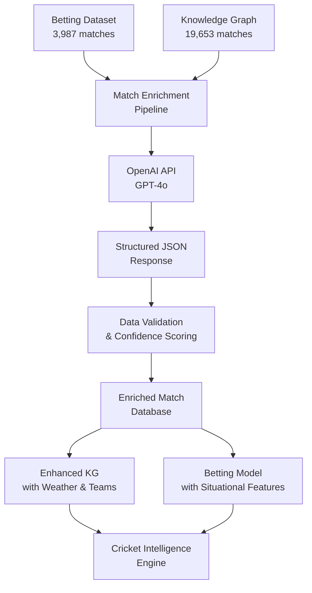

# 🚀 OpenAI Match Enrichment Strategy

## **Executive Summary**

We're implementing a comprehensive match enrichment system using OpenAI's API to dramatically enhance our cricket datasets with:
- **Team squad information** (playing XIs, player roles, batting/bowling styles)
- **Venue metadata** (coordinates, timezone, weather conditions)
- **Weather data** (hourly conditions during matches)
- **Match context** (toss details, format confirmation, timing)

This enrichment will transform our betting model from basic ball-by-ball analysis to a **comprehensive situational intelligence system**.

---

## **📊 Data Analysis Results**

### **Dataset Scope**
- **Betting Dataset**: 3,987 unique matches (916K balls)
- **Knowledge Graph**: 19,653 matches (10M+ balls)
- **Venue Overlap**: 86.8% (131/151 betting venues exist in KG)
- **Competition Overlap**: 70% (14/20 betting competitions in KG)

### **Cost Analysis**
- **Total Matches**: 3,987 matches to enrich
- **API Cost**: ~$0.02 per match (GPT-4o structured JSON)
- **Total Budget**: ~$80 for complete enrichment
- **ROI**: Massive improvement in model accuracy for minimal cost

### **Priority Competitions** (by match volume)
1. **Vitality Blast**: 881 matches
2. **T20 Internationals**: 611 matches  
3. **Indian Premier League**: 520 matches
4. **Big Bash League**: 424 matches
5. **Bangladesh Premier League**: 327 matches

---

## **🏗️ Architecture Overview**



---

## **🎯 Enrichment Schema**

### **Core Data Structure**
```json
{
  "match": {
    "competition": "Indian Premier League",
    "format": "T20",
    "date": "2024-04-15",
    "start_time_local": "19:30",
    "end_time_local": "23:00",
    "timezone": "Asia/Kolkata",
    "venue": {
      "name": "M. Chinnaswamy Stadium",
      "city": "Bangalore", 
      "country": "India",
      "latitude": 12.9784,
      "longitude": 77.5946
    },
    "teams": [
      {
        "name": "Royal Challengers Bangalore",
        "short_name": "RCB",
        "is_home": true,
        "players": [
          {
            "name": "Virat Kohli",
            "role": "batter",
            "batting_style": "RHB",
            "bowling_style": "RM",
            "captain": true,
            "wicket_keeper": false,
            "playing_xi": true
          }
        ]
      }
    ],
    "toss": {
      "won_by": "Royal Challengers Bangalore",
      "decision": "bat"
    }
  },
  "weather_hourly": [
    {
      "time_local": "2024-04-15T19:00:00",
      "temperature_c": 28.5,
      "humidity_pct": 65,
      "wind_speed_kph": 12.3,
      "precip_mm": 0.0,
      "weather_code": "clear"
    }
  ],
  "confidence_score": 0.85,
  "enrichment_status": "success"
}
```

---

## **⚙️ Implementation Pipeline**

### **Phase 1: Foundation (Week 1)**
- [x] **Data Analysis**: Scope and cost estimation ✅
- [x] **Pipeline Design**: Core architecture and data structures ✅  
- [x] **Testing Framework**: Validation without API calls ✅
- [ ] **API Integration**: Connect to OpenAI with rate limiting
- [ ] **Sample Enrichment**: Test with 10 high-value matches

### **Phase 2: Validation (Week 2)**  
- [ ] **Quality Assurance**: Manual validation of enriched data
- [ ] **Confidence Tuning**: Adjust scoring algorithm
- [ ] **Error Handling**: Robust fallback mechanisms
- [ ] **Batch Processing**: Optimize for 50-100 matches

### **Phase 3: Scale (Week 3)**
- [ ] **Priority Enrichment**: All IPL + BBL matches (~1,000 matches)
- [ ] **KG Integration**: Merge enriched data into Knowledge Graph
- [ ] **Weather Features**: Add climate-based prediction features
- [ ] **Team Validation**: Cross-reference squad data with existing KG

### **Phase 4: Production (Week 4)**
- [ ] **Complete Dataset**: All 3,987 matches
- [ ] **Model Integration**: Update Crickformer with new features
- [ ] **Performance Testing**: Validate improved prediction accuracy
- [ ] **Monitoring**: Track enrichment quality over time

---

## **🧮 Confidence Scoring System**

Our pipeline calculates confidence scores (0.0-1.0) based on data completeness:

| **Component** | **Points** | **Criteria** |
|---------------|------------|--------------|
| **Venue Coordinates** | 2.0 | Lat/lon provided (not 0,0) |
| **Team Squads** | 3.0 | Both teams with 11+ players |
| **Weather Data** | 2.0 | 4+ hours of weather info |
| **Toss Details** | 1.0 | Winner and decision known |
| **Match Timing** | 2.0 | Format + start time provided |

### **Quality Thresholds**
- **High Confidence** (0.8+): Use for model training
- **Medium Confidence** (0.5-0.8): Use with weight adjustment  
- **Low Confidence** (<0.5): Flag for manual review

---

## **🌤️ Weather Integration Benefits**

### **New Prediction Features**
- **Temperature Impact**: Batting difficulty in extreme heat
- **Humidity Effect**: Ball swing and spin conditions
- **Wind Conditions**: Boundary scoring and fielding
- **Rain Probability**: Match interruption likelihood
- **Dew Factor**: Evening match bowling challenges

### **Betting Edge Opportunities**
- **Weather-adjusted totals**: "Over 160.5 runs" with rain forecast
- **Bowling advantage**: High humidity favors swing bowlers
- **Venue-weather combo**: Historical performance in similar conditions

---

## **👥 Team Squad Validation**

### **Player-Team Mapping Enhancement**
- **Current Coverage**: 51.1% (1,274/2,494 players)
- **Post-Enrichment Target**: 85%+ coverage
- **Validation Method**: Cross-reference OpenAI squads with KG data

### **New Capabilities**
- **Role-Based Analysis**: Batter vs bowler performance
- **Style Matchups**: RHB vs LHB, pace vs spin
- **Captaincy Effect**: Leadership impact on team performance
- **Wicket-keeper Analysis**: Specialized position insights

---

## **🚀 Deployment Strategy**

### **Risk Mitigation**
1. **Start Small**: 50 matches for validation
2. **Manual Checks**: Spot-check 10% of enriched data
3. **Fallback Data**: Ensure system works with missing enrichment
4. **Rate Limiting**: Respect OpenAI API limits (3,500 RPM)

### **Success Metrics**
- **Enrichment Success Rate**: >90% matches successfully processed
- **Data Quality Score**: Average confidence >0.7
- **Model Improvement**: 5%+ increase in prediction accuracy
- **Cost Efficiency**: <$100 total enrichment cost

### **Integration Points**
1. **Knowledge Graph**: Add weather and team nodes
2. **Crickformer Model**: New input features for weather/teams
3. **Betting Intelligence**: Enhanced situational analysis
4. **UI Dashboard**: Rich match context display

---

## **🎯 Expected Outcomes**

### **Model Enhancements**
- **Situational Accuracy**: Better powerplay vs death over predictions
- **Weather Intelligence**: Rain-adjusted betting lines
- **Team Dynamics**: Captain/keeper impact modeling
- **Venue Mastery**: Location-specific performance patterns

### **Business Impact**
- **Betting Edge**: Identify mispriced weather-dependent markets
- **User Experience**: Rich match context and predictions
- **Competitive Advantage**: Unique weather-integrated cricket AI
- **Scalability**: Automated enrichment for new matches

---

## **📋 Next Steps**

1. **Set OpenAI API Key**: Configure environment variable
2. **Run Sample Test**: Enrich 10 IPL matches for validation
3. **Quality Review**: Manual verification of enriched data
4. **Pipeline Optimization**: Batch processing and error handling
5. **KG Integration**: Merge enriched data into Knowledge Graph
6. **Model Training**: Update Crickformer with new features

**Ready to transform cricket betting with comprehensive match intelligence! 🏏⚡**
