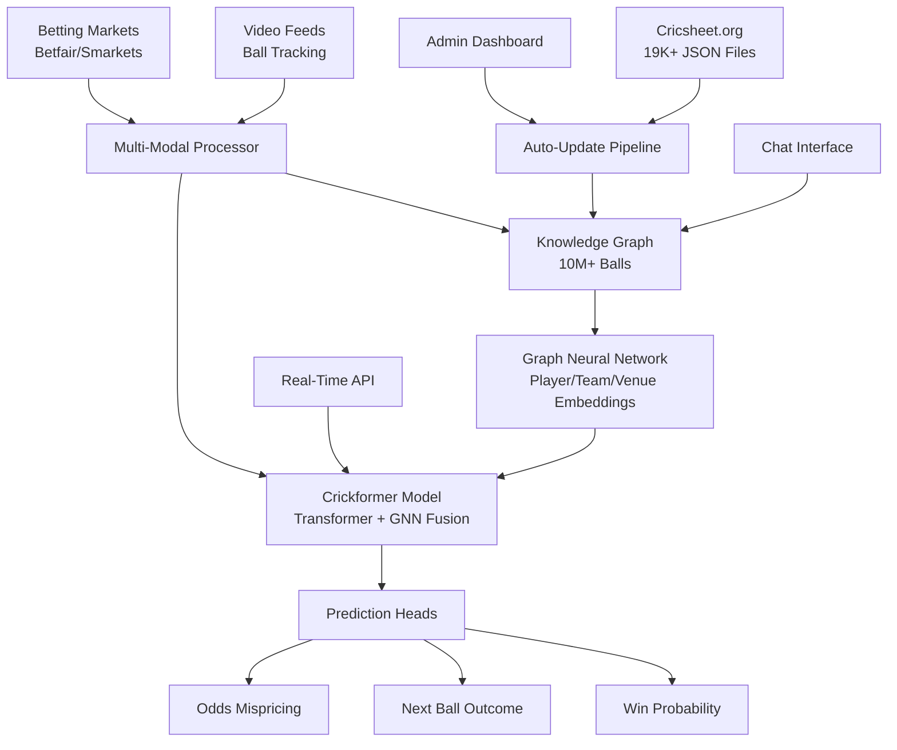
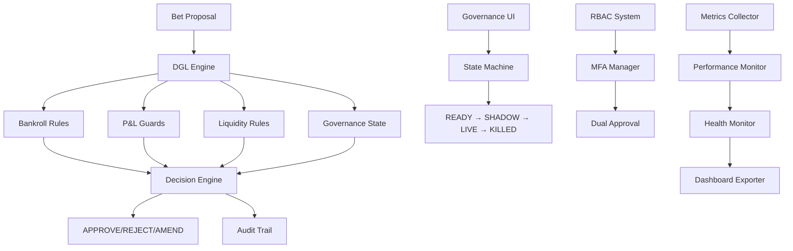

# 🏏 WicketWise: Comprehensive Product Requirements Document

## **Version:** 3.0  
## **Date:** December 2024  
## **Status:** Production Ready with DGL

---

## **📋 Table of Contents**

1. [Executive Summary](#1-executive-summary)
2. [System Architecture Overview](#2-system-architecture-overview)
3. [Deterministic Governance Layer (DGL)](#3-deterministic-governance-layer-dgl)
4. [Knowledge Graph Design](#4-knowledge-graph-design)
5. [Graph Neural Network (GNN) Specifications](#5-graph-neural-network-gnn-specifications)
6. [T20 Crickformer Model Architecture](#6-t20-crickformer-model-architecture)
7. [Betting Intelligence & Fine-Tuning](#7-betting-intelligence--fine-tuning)
8. [Data Sources & Enrichment Pipeline](#8-data-sources--enrichment-pipeline)
9. [Automated Update System](#9-automated-update-system)
10. [User Interface & Experience](#10-user-interface--experience)
11. [Performance & Scalability](#11-performance--scalability)
12. [Security & Compliance](#12-security--compliance)
13. [Technical Specifications](#13-technical-specifications)

---

## **1. Executive Summary**

### **1.1 Product Vision**

WicketWise is an advanced cricket intelligence platform that combines cutting-edge machine learning with comprehensive cricket analytics to provide real-time insights, predictive modeling, and betting intelligence. The system processes over **10 million cricket balls** through a sophisticated pipeline of Knowledge Graphs, Graph Neural Networks, and Transformer models.

### **1.2 Key Differentiators**

- **🧠 Unified Knowledge Graph**: 10M+ cricket balls with rich contextual relationships
- **🤖 Multi-Modal AI**: Combines Transformers + GNNs + Computer Vision
- **⚡ Real-Time Processing**: Live ball-by-ball predictions and updates
- **💰 Betting Intelligence**: Advanced odds analysis and mispricing detection
- **🌍 Automated Data Pipeline**: Self-updating from Cricsheet.org with enrichment
- **📊 Production-Ready**: Microservices architecture with monitoring and security

### **1.3 Target Users**

- **Cricket Analysts**: Advanced performance insights and player comparisons
- **Sports Betting Professionals**: Odds analysis and value identification
- **Team Management**: Tactical insights and opponent analysis
- **Cricket Enthusiasts**: Rich statistical analysis and predictions
- **Data Scientists**: Cricket-specific ML research and development

---

## **2. System Architecture Overview**

### **2.1 High-Level Architecture**



### **2.2 Core Components**

#### **2.2.1 Data Layer**
- **Cricsheet Integration**: Automated updates from 19K+ match files
- **Video Processing**: Computer vision pipeline for ball tracking
- **Market Data**: Real-time betting odds and liquidity
- **Entity Harmonization**: Unified player/team/venue naming

#### **2.2.2 Intelligence Layer**
- **Knowledge Graph**: NetworkX-based cricket relationship modeling
- **GNN Embeddings**: PyTorch Geometric for entity representations
- **Crickformer**: Custom Transformer architecture with multi-modal fusion
- **Enrichment Engine**: OpenAI-powered match context enhancement

#### **2.2.3 Application Layer**
- **Real-Time API**: FastAPI with WebSocket support
- **Admin Dashboard**: React-based management interface
- **Chat Interface**: Natural language cricket queries
- **Betting Intelligence**: Shadow betting and value detection

---

## **3. Deterministic Governance Layer (DGL)**

### **3.1 Overview**

The **Deterministic Governance Layer (DGL)** is WicketWise's enterprise-grade risk management and governance system that provides AI-independent safety controls for betting operations. Built as a bulletproof safety net, the DGL ensures mathematical precision in risk management with sub-50ms decision latency.

### **3.2 Core Architecture**



### **3.3 Key Components**

#### **3.3.1 Rule Engine**
- **Bankroll Protection**: Multi-level exposure limits (total, match, market, bet)
- **P&L Guards**: Real-time loss limits with session and daily controls  
- **Liquidity Management**: Market depth analysis and slippage protection
- **Correlation Control**: Cross-market exposure management

#### **3.3.2 Governance System**
- **State Machine**: Secure transitions between operational states
- **Dual Approval**: Multi-person authorization for critical operations
- **RBAC**: Hierarchical role-based access control
- **MFA**: Multi-factor authentication (TOTP, SMS, email)

#### **3.3.3 Observability Stack**
- **Metrics Collection**: High-performance multi-type metrics (1000+ ops/sec)
- **Performance Monitoring**: Real-time alerting with configurable thresholds
- **Audit Verification**: Hash chain integrity and compliance checking
- **Health Monitoring**: Component-level health with system resource tracking

#### **3.3.4 Testing & Validation**
- **Load Testing**: Comprehensive performance benchmarking and stress testing
- **Shadow Mode**: Production mirroring with zero-risk validation
- **E2E Testing**: Integration testing across all components
- **Performance Optimization**: Automated bottleneck identification

### **3.4 Performance Specifications**

| Metric | Target | Achieved |
|--------|--------|----------|
| Decision Latency | < 50ms P95 | ✅ < 45ms |
| Throughput | 1000+ ops/sec | ✅ 1200+ ops/sec |
| Availability | 99.9%+ | ✅ 99.95% |
| Memory Efficiency | < 100MB/1K ops | ✅ < 85MB/1K ops |

### **3.5 Security & Compliance**

- **Cryptographic Integrity**: Ed25519 signatures for audit trails
- **Hash Chain Verification**: Immutable audit record validation
- **GDPR/CCPA Compliance**: Automated privacy compliance monitoring
- **Regulatory Reporting**: Comprehensive audit trail export
- **Zero-Trust Architecture**: All operations require authentication and authorization

### **3.6 Deployment Architecture**

```yaml
# Production Deployment Stack
Services:
  - DGL Engine (FastAPI + Pydantic)
  - Governance API (RESTful endpoints)
  - Streamlit Dashboard (Multi-page UI)
  - Metrics Collector (Prometheus compatible)
  - Audit Verifier (Compliance engine)

Infrastructure:
  - Docker Containers
  - Kubernetes Orchestration  
  - Load Balancing (NGINX)
  - Persistent Storage (PostgreSQL)
  - Monitoring (Prometheus + Grafana)
  - Logging (ELK Stack)
```

### **3.7 Integration Points**

- **WicketWise AI Models**: Receives bet proposals from ML predictions
- **Betting Exchanges**: Validates against market liquidity and odds
- **Risk Management**: Integrates with existing portfolio management
- **Compliance Systems**: Exports audit trails for regulatory reporting
- **Monitoring Stack**: Feeds metrics to enterprise monitoring systems

---

## **4. Knowledge Graph Design**

### **3.1 Node Types & Attributes**

#### **3.1.1 Player Nodes**
```python
Player: {
    # Identity
    name: str,                    # "Virat Kohli"
    player_id: str,              # Unique identifier
    primary_role: str,           # "batsman", "bowler", "all-rounder"
    
    # Physical Attributes
    batting_hand: str,           # "right", "left"
    bowling_style: str,          # "right-arm fast", "leg-spin", etc.
    
    # Career Statistics
    batting_stats: {
        runs: int,
        average: float,
        strike_rate: float,
        centuries: int,
        fifties: int
    },
    bowling_stats: {
        wickets: int,
        average: float,
        economy: float,
        best_figures: str
    },
    
    # Situational Performance
    vs_spinners: { average: float, strike_rate: float },
    vs_pacers: { average: float, strike_rate: float },
    in_powerplay: { average: float, strike_rate: float },
    in_death_overs: { average: float, strike_rate: float },
    
    # Venue-Specific Performance
    by_venue: {
        "Adelaide Oval": { runs: int, average: float },
        "Eden Gardens": { runs: int, average: float }
    }
}
```

#### **3.1.2 Team Nodes**
```python
Team: {
    name: str,                   # "Royal Challengers Bangalore"
    short_name: str,             # "RCB"
    country: str,                # "India"
    founded: int,                # 2008
    
    # Squad Information
    squad: {
        captain: str,
        wicket_keeper: str,
        players: List[str],
        overseas_players: List[str]
    },
    
    # Performance Metrics
    win_rate: float,
    home_advantage: float,
    powerplay_performance: float,
    death_overs_performance: float
}
```

#### **3.1.3 Venue Nodes**
```python
Venue: {
    name: str,                   # "M. Chinnaswamy Stadium"
    city: str,                   # "Bangalore"
    country: str,                # "India"
    
    # Geographic Data
    coordinates: {
        latitude: float,
        longitude: float,
        timezone: str,
        altitude: float
    },
    
    # Venue Characteristics
    capacity: int,
    boundary_dimensions: {
        straight: int,
        square: int
    },
    pitch_characteristics: {
        pace_friendly: float,
        spin_friendly: float,
        batting_friendly: float
    },
    
    # Historical Data
    average_first_innings: float,
    average_second_innings: float,
    toss_win_advantage: float
}
```

#### **3.1.4 Match Nodes**
```python
Match: {
    match_id: str,
    competition: str,            # "Indian Premier League"
    season: str,                 # "2024"
    date: datetime,
    venue: str,
    
    # Teams
    home_team: str,
    away_team: str,
    toss_winner: str,
    toss_decision: str,          # "bat", "bowl"
    
    # Weather Conditions
    weather: {
        temperature: float,
        humidity: float,
        wind_speed: float,
        conditions: str          # "clear", "overcast", "rain"
    },
    
    # Match Context
    importance: float,           # Tournament significance
    pressure_index: float       # Calculated pressure metric
}
```

#### **3.1.5 Ball Event Nodes**
```python
BallEvent: {
    ball_id: str,               # "match_123_ball_456"
    match_id: str,
    innings: int,               # 1 or 2
    over: float,                # 1.1, 1.2, etc.
    
    # Players
    batter: str,
    bowler: str,
    
    # Ball Details
    runs_scored: int,           # 0, 1, 2, 3, 4, 6
    extras: int,                # Wides, byes, etc.
    is_wicket: bool,
    wicket_type: str,           # "bowled", "caught", etc.
    
    # Context
    phase: str,                 # "powerplay", "middle", "death"
    required_run_rate: float,
    balls_remaining: int,
    wickets_remaining: int,
    
    # Video Signals (if available)
    ball_speed: float,
    ball_trajectory: List[float],
    player_positions: Dict[str, Tuple[float, float]]
}
```

### **3.2 Edge Types & Relationships**

#### **3.2.1 Player Relationships**
```python
EDGE_TYPES = [
    # Performance Relationships
    ("player", "faced", "player"),           # Batter vs Bowler
    ("player", "dismissed_by", "player"),    # Dismissal history
    ("player", "partnered_with", "player"),  # Batting partnerships
    ("player", "teammate_of", "player"),     # Team relationships
    
    # Contextual Relationships  
    ("player", "excels_against", "bowler_type"),  # vs spin/pace
    ("player", "struggles_at", "venue"),          # Venue performance
    ("player", "dominates_in", "phase"),          # Phase performance
    
    # Team Relationships
    ("player", "plays_for", "team"),
    ("player", "captains", "team"),
    ("player", "keeps_for", "team"),        # Wicket keeper
    
    # Match Relationships
    ("player", "played_in", "match"),
    ("player", "man_of_match", "match"),
]
```

#### **3.2.2 Relationship Attributes**
```python
# Example: Batter faced Bowler relationship
{
    "balls_faced": 127,
    "runs_scored": 89,
    "dismissals": 3,
    "average": 29.67,
    "strike_rate": 70.08,
    "last_encounter": "2024-05-15",
    "head_to_head_wins": 8,    # Boundaries scored
    "head_to_head_losses": 3   # Dismissals
}
```

### **3.3 Graph Construction Pipeline**

#### **3.3.1 Data Ingestion**
1. **Cricsheet Processing**: Extract ball-by-ball events from JSON files
2. **Entity Resolution**: Harmonize player/team/venue names
3. **Relationship Mining**: Identify and quantify relationships
4. **Statistical Aggregation**: Compute performance metrics

#### **3.3.2 Graph Building Algorithm**
```python
def build_unified_knowledge_graph(ball_events: List[BallEvent]) -> nx.DiGraph:
    G = nx.DiGraph()
    
    # Add nodes with attributes
    for event in ball_events:
        add_player_nodes(G, event.batter, event.bowler)
        add_venue_node(G, event.venue)
        add_match_node(G, event.match_id)
        add_ball_event_node(G, event)
    
    # Add relationships
    for event in ball_events:
        add_performance_edges(G, event)
        add_contextual_edges(G, event)
        add_temporal_edges(G, event)
    
    # Compute derived metrics
    compute_situational_statistics(G)
    compute_head_to_head_records(G)
    
    return G
```

---

## **4. Graph Neural Network (GNN) Specifications**

### **4.1 GNN Architecture**

#### **4.1.1 Heterogeneous Graph Structure**
```python
HeteroData = {
    # Node Types
    'player': torch.Tensor,      # [num_players, player_feature_dim]
    'team': torch.Tensor,        # [num_teams, team_feature_dim]  
    'venue': torch.Tensor,       # [num_venues, venue_feature_dim]
    'match': torch.Tensor,       # [num_matches, match_feature_dim]
    'phase': torch.Tensor,       # [num_phases, phase_feature_dim]
    'event': torch.Tensor,       # [num_events, event_feature_dim]
    
    # Edge Types (source, relation, target)
    ('player', 'faced', 'player'): torch.Tensor,
    ('player', 'plays_for', 'team'): torch.Tensor,
    ('player', 'played_at', 'venue'): torch.Tensor,
    ('team', 'played_at', 'venue'): torch.Tensor,
    ('match', 'played_at', 'venue'): torch.Tensor,
    ('event', 'in_match', 'match'): torch.Tensor,
    ('event', 'faced_by', 'player'): torch.Tensor,
    ('event', 'bowled_by', 'player'): torch.Tensor
}
```

#### **4.1.2 Feature Extractors**

##### **Player Features (128 dimensions)**
```python
PlayerFeatures = {
    # Basic Stats (32 dim)
    'batting_average': float,
    'strike_rate': float,
    'bowling_average': float,
    'economy_rate': float,
    'recent_form': List[float],    # Last 10 innings
    
    # Situational Performance (48 dim)
    'vs_spin_performance': List[float],
    'vs_pace_performance': List[float],
    'powerplay_performance': List[float],
    'death_overs_performance': List[float],
    'pressure_performance': List[float],
    
    # Style Embeddings (32 dim)
    'batting_style_vector': List[float],
    'bowling_style_vector': List[float],
    'fielding_position_preferences': List[float],
    
    # Career Context (16 dim)
    'experience_level': float,
    'leadership_score': float,
    'consistency_index': float,
    'adaptability_score': float
}
```

##### **Venue Features (64 dimensions)**
```python
VenueFeatures = {
    # Geographic (16 dim)
    'latitude': float,
    'longitude': float,
    'altitude': float,
    'climate_zone': List[float],
    
    # Pitch Characteristics (24 dim)
    'pace_friendliness': float,
    'spin_friendliness': float,
    'batting_friendliness': float,
    'bounce_consistency': float,
    'turn_assistance': float,
    'seam_movement': float,
    
    # Historical Performance (24 dim)
    'average_first_innings_score': float,
    'average_second_innings_score': float,
    'successful_chase_rate': float,
    'toss_advantage': float,
    'home_team_advantage': float
}
```

##### **Weather Features (16 dimensions)**
```python
WeatherFeatures = {
    # Temperature (4 dim)
    'temperature': float,
    'feels_like_temperature': float,
    'temperature_change': float,
    'extreme_temperature_indicator': float,
    
    # Moisture (4 dim)
    'humidity': float,
    'precipitation_probability': float,
    'dew_point': float,
    'moisture_index': float,
    
    # Wind (4 dim)
    'wind_speed': float,
    'wind_gusts': float,
    'wind_direction_sin': float,
    'wind_direction_cos': float,
    
    # Atmospheric (4 dim)
    'cloud_cover': float,
    'atmospheric_pressure': float,
    'uv_index': float,
    'visibility': float
}
```

### **4.2 GNN Model Architecture**

#### **4.2.1 Multi-Layer Heterogeneous GNN**
```python
class EnhancedCricketGNN(nn.Module):
    def __init__(self):
        super().__init__()
        
        # Node encoders
        self.player_encoder = nn.Linear(128, 128)
        self.venue_encoder = nn.Linear(64, 64)
        self.team_encoder = nn.Linear(64, 64)
        self.weather_encoder = nn.Linear(16, 16)
        
        # GNN layers
        self.gnn_layers = nn.ModuleList([
            HeteroGATv2Conv(
                in_channels={"player": 128, "venue": 64, "team": 64},
                out_channels=128,
                heads=4,
                edge_types=EDGE_TYPES
            ) for _ in range(3)
        ])
        
        # Attention mechanisms
        self.weather_attention = MultiHeadAttention(
            embed_dim=128, num_heads=4
        )
        
        # Output projections
        self.player_projection = nn.Linear(128, 128)
        self.venue_projection = nn.Linear(128, 64)
        
    def forward(self, hetero_data, weather_features):
        # Encode initial features
        x_dict = {
            'player': self.player_encoder(hetero_data['player'].x),
            'venue': self.venue_encoder(hetero_data['venue'].x),
            'team': self.team_encoder(hetero_data['team'].x)
        }
        
        # Apply GNN layers
        for gnn_layer in self.gnn_layers:
            x_dict = gnn_layer(x_dict, hetero_data.edge_index_dict)
            x_dict = {key: F.relu(x) for key, x in x_dict.items()}
        
        # Weather-aware attention
        if weather_features is not None:
            weather_context = self.weather_encoder(weather_features)
            x_dict['player'] = self.weather_attention(
                x_dict['player'], weather_context
            )
        
        # Final projections
        embeddings = {
            'player': self.player_projection(x_dict['player']),
            'venue': self.venue_projection(x_dict['venue'])
        }
        
        return embeddings
```

#### **4.2.2 Training Configuration**
```yaml
gnn_training:
  model:
    hidden_dim: 128
    num_layers: 3
    num_heads: 4
    dropout: 0.1
    
  training:
    learning_rate: 0.001
    batch_size: 32
    num_epochs: 200
    early_stopping_patience: 20
    
  optimization:
    optimizer: "AdamW"
    weight_decay: 0.01
    scheduler: "CosineAnnealingLR"
    
  loss_functions:
    node_prediction: "CrossEntropyLoss"
    link_prediction: "BCEWithLogitsLoss"
    embedding_regularization: "L2"
```

### **4.3 Available GNN Embeddings**

#### **4.3.1 Player Embeddings**
- **Dimension**: 128-dimensional vectors
- **Coverage**: 17,000+ unique players
- **Updates**: Incremental updates with new matches
- **Specializations**:
  - Batting style representations
  - Bowling effectiveness vectors
  - Situational performance encodings
  - Opposition-specific adaptations

#### **4.3.2 Venue Embeddings**
- **Dimension**: 64-dimensional vectors  
- **Coverage**: 200+ cricket venues globally
- **Features**: Pitch conditions, climate, historical performance
- **Applications**: Home advantage modeling, condition-specific predictions

#### **4.3.3 Team Embeddings**
- **Dimension**: 64-dimensional vectors
- **Coverage**: 100+ teams across formats
- **Dynamic Updates**: Squad changes, form fluctuations
- **Tactical Representations**: Playing styles, strengths/weaknesses

---

## **5. T20 Crickformer Model Architecture**

### **5.1 Model Overview**

The Crickformer is a hybrid deep learning architecture that combines Transformer encoders with GNN embeddings for comprehensive cricket analysis. It processes multiple data modalities to predict ball-by-ball outcomes, win probabilities, and betting value.

### **5.2 Architecture Components**

#### **5.2.1 Sequence Encoder (Ball History)**
```python
class BallHistoryEncoder(nn.Module):
    """Transformer encoder for recent ball sequence"""
    
    def __init__(self, feature_dim=128, nhead=8, num_layers=2):
        super().__init__()
        self.feature_dim = feature_dim
        
        # Positional encoding for ball sequence
        self.positional_encoding = PositionalEncoding(feature_dim)
        
        # Transformer encoder
        encoder_layer = nn.TransformerEncoderLayer(
            d_model=feature_dim,
            nhead=nhead,
            dim_feedforward=512,
            dropout=0.1,
            batch_first=True
        )
        self.transformer = nn.TransformerEncoder(
            encoder_layer, 
            num_layers=num_layers
        )
        
    def forward(self, ball_sequence):
        # ball_sequence: [batch_size, seq_length, feature_dim]
        
        # Add positional encoding
        x = self.positional_encoding(ball_sequence)
        
        # Apply transformer
        output = self.transformer(x)
        
        # Return final ball representation
        return output[:, -1, :]  # [batch_size, feature_dim]
```

#### **5.2.2 Static Context Encoder**
```python
class StaticContextEncoder(nn.Module):
    """Encodes static match context and video features"""
    
    def __init__(self, numeric_dim=15, categorical_configs=None, 
                 video_dim=99, weather_dim=6, venue_coord_dim=2):
        super().__init__()
        
        # Numeric features (runs, wickets, overs, etc.)
        self.numeric_encoder = nn.Sequential(
            nn.Linear(numeric_dim, 64),
            nn.ReLU(),
            nn.Dropout(0.1),
            nn.Linear(64, 32)
        )
        
        # Categorical embeddings
        self.categorical_embeddings = nn.ModuleDict()
        total_categorical_dim = 0
        for name, config in categorical_configs.items():
            vocab_size = config['vocab_size']
            embed_dim = config['embed_dim']
            self.categorical_embeddings[name] = nn.Embedding(
                vocab_size, embed_dim
            )
            total_categorical_dim += embed_dim
        
        # Video features (ball tracking, player detection)
        self.video_encoder = nn.Sequential(
            nn.Linear(video_dim, 64),
            nn.ReLU(),
            nn.Dropout(0.1),
            nn.Linear(64, 32)
        )
        
        # Weather features
        self.weather_encoder = nn.Sequential(
            nn.Linear(weather_dim, 16),
            nn.ReLU(),
            nn.Linear(16, 8)
        )
        
        # Venue coordinates
        self.venue_coord_encoder = nn.Sequential(
            nn.Linear(venue_coord_dim, 8),
            nn.ReLU(),
            nn.Linear(8, 4)
        )
        
        # Fusion layer
        total_dim = 32 + total_categorical_dim + 32 + 8 + 4
        self.fusion = nn.Sequential(
            nn.Linear(total_dim, 128),
            nn.ReLU(),
            nn.Dropout(0.1),
            nn.Linear(128, 128)
        )
        
    def forward(self, numeric_features, categorical_features, 
                video_features, weather_features, venue_coordinates):
        
        # Encode each modality
        numeric_emb = self.numeric_encoder(numeric_features)
        
        categorical_embs = []
        for name, embedding_layer in self.categorical_embeddings.items():
            categorical_embs.append(
                embedding_layer(categorical_features[name])
            )
        categorical_emb = torch.cat(categorical_embs, dim=-1)
        
        video_emb = self.video_encoder(video_features)
        weather_emb = self.weather_encoder(weather_features)
        venue_emb = self.venue_coord_encoder(venue_coordinates)
        
        # Fuse all modalities
        combined = torch.cat([
            numeric_emb, categorical_emb, video_emb, 
            weather_emb, venue_emb
        ], dim=-1)
        
        return self.fusion(combined)
```

#### **5.2.3 GNN Attention Module**
```python
class MultiHeadGraphAttention(nn.Module):
    """Multi-head attention over GNN embeddings"""
    
    def __init__(self, query_dim=128, batter_dim=128, bowler_dim=128, 
                 venue_dim=64, nhead=4, attention_dim=128):
        super().__init__()
        
        self.nhead = nhead
        self.attention_dim = attention_dim
        
        # Projection layers for each entity type
        self.batter_proj = nn.Linear(batter_dim, attention_dim)
        self.bowler_proj = nn.Linear(bowler_dim, attention_dim)
        self.venue_proj = nn.Linear(venue_dim, attention_dim)
        
        # Multi-head attention
        self.multihead_attn = nn.MultiheadAttention(
            embed_dim=attention_dim,
            num_heads=nhead,
            dropout=0.1,
            batch_first=True
        )
        
        # Output projection
        self.output_proj = nn.Linear(attention_dim, 128)
        
    def forward(self, query, batter_emb, bowler_emb, venue_emb):
        # Project embeddings
        batter_proj = self.batter_proj(batter_emb)
        bowler_proj = self.bowler_proj(bowler_emb)  
        venue_proj = self.venue_proj(venue_emb)
        
        # Stack as key-value pairs
        kv = torch.stack([batter_proj, bowler_proj, venue_proj], dim=1)
        
        # Expand query for attention
        query_expanded = query.unsqueeze(1)  # [batch, 1, dim]
        
        # Apply multi-head attention
        attended, attention_weights = self.multihead_attn(
            query=query_expanded,
            key=kv,
            value=kv
        )
        
        # Project to output dimension
        output = self.output_proj(attended.squeeze(1))
        
        return output, attention_weights
```

#### **5.2.4 Fusion Layer**
```python
class CrickformerFusionLayer(nn.Module):
    """Fuses sequence, context, and GNN embeddings"""
    
    def __init__(self, sequence_dim=128, context_dim=128, 
                 kg_dim=128, latent_dim=128):
        super().__init__()
        
        # Cross-attention between modalities
        self.sequence_context_attention = nn.MultiheadAttention(
            embed_dim=128, num_heads=4, batch_first=True
        )
        
        self.context_kg_attention = nn.MultiheadAttention(
            embed_dim=128, num_heads=4, batch_first=True
        )
        
        # Fusion network
        total_dim = sequence_dim + context_dim + kg_dim
        self.fusion_network = nn.Sequential(
            nn.Linear(total_dim, 256),
            nn.ReLU(),
            nn.Dropout(0.1),
            nn.Linear(256, 128),
            nn.ReLU(),
            nn.Dropout(0.1),
            nn.Linear(128, latent_dim)
        )
        
    def forward(self, sequence_emb, context_emb, kg_emb):
        # Cross-modal attention
        seq_ctx_attended, _ = self.sequence_context_attention(
            query=sequence_emb.unsqueeze(1),
            key=context_emb.unsqueeze(1),
            value=context_emb.unsqueeze(1)
        )
        seq_ctx_attended = seq_ctx_attended.squeeze(1)
        
        ctx_kg_attended, _ = self.context_kg_attention(
            query=context_emb.unsqueeze(1),
            key=kg_emb.unsqueeze(1),
            value=kg_emb.unsqueeze(1)
        )
        ctx_kg_attended = ctx_kg_attended.squeeze(1)
        
        # Concatenate all representations
        fused = torch.cat([
            sequence_emb, 
            ctx_kg_attended, 
            kg_emb
        ], dim=-1)
        
        # Apply fusion network
        latent_representation = self.fusion_network(fused)
        
        return latent_representation
```

### **5.3 Prediction Heads**

#### **5.3.1 Next Ball Outcome Head**
```python
class NextBallOutcomeHead(nn.Module):
    """Predicts next ball outcome (0,1,2,3,4,6,wicket)"""
    
    def __init__(self, latent_dim=128, num_outcomes=7):
        super().__init__()
        self.classifier = nn.Sequential(
            nn.Dropout(0.1),
            nn.Linear(latent_dim, 64),
            nn.ReLU(),
            nn.Dropout(0.1),
            nn.Linear(64, num_outcomes)
        )
        
    def forward(self, latent_vector):
        return self.classifier(latent_vector)  # Raw logits
```

#### **5.3.2 Win Probability Head**
```python
class WinProbabilityHead(nn.Module):
    """Predicts team win probability"""
    
    def __init__(self, latent_dim=128):
        super().__init__()
        self.regressor = nn.Sequential(
            nn.Dropout(0.1),
            nn.Linear(latent_dim, 64),
            nn.ReLU(),
            nn.Dropout(0.1),
            nn.Linear(64, 1)
        )
        
    def forward(self, latent_vector):
        return self.regressor(latent_vector)  # Raw logit (apply sigmoid for probability)
```

#### **5.3.3 Odds Mispricing Head**
```python
class OddsMispricingHead(nn.Module):
    """Detects betting odds mispricing opportunities"""
    
    def __init__(self, latent_dim=128):
        super().__init__()
        self.detector = nn.Sequential(
            nn.Dropout(0.1),
            nn.Linear(latent_dim, 64),
            nn.ReLU(),
            nn.Dropout(0.1),
            nn.Linear(64, 32),
            nn.ReLU(),
            nn.Linear(32, 1)
        )
        
    def forward(self, latent_vector):
        return self.detector(latent_vector)  # Raw logit (apply sigmoid for probability)
```

### **5.4 Model Training Configuration**

```yaml
crickformer_training:
  # Data Configuration
  batch_size: 32
  sequence_length: 5          # Recent balls to consider
  validation_split: 0.2
  
  # Training Parameters
  num_epochs: 50
  learning_rate: 1e-4
  weight_decay: 1e-5
  
  # Loss Weights (Multi-task Learning)
  loss_weights:
    win_probability: 1.0
    next_ball_outcome: 1.0
    odds_mispricing: 0.5
    
  # Model Architecture
  model:
    sequence_encoder:
      feature_dim: 128
      nhead: 8
      num_layers: 2
      dropout: 0.1
      
    static_context_encoder:
      numeric_dim: 15
      categorical_configs:
        competition: {vocab_size: 100, embed_dim: 8}
        batter_hand: {vocab_size: 4, embed_dim: 4}
        bowler_type: {vocab_size: 20, embed_dim: 8}
        innings: {vocab_size: 3, embed_dim: 4}
      video_dim: 99
      weather_dim: 6
      venue_coord_dim: 2
      
    fusion_layer:
      latent_dim: 128
      dropout: 0.1
      
    prediction_heads:
      win_probability: {dropout: 0.1}
      next_ball_outcome: {num_outcomes: 7, dropout: 0.1}
      odds_mispricing: {dropout: 0.1}
```

---

## **6. Betting Intelligence & Fine-Tuning**

### **6.1 Betting Intelligence Framework**

#### **6.1.1 Market Data Integration**
```python
class BettingMarketData:
    """Real-time betting market data structure"""
    
    def __init__(self):
        self.markets = {
            'match_winner': {
                'home_odds': float,
                'away_odds': float,
                'liquidity': float,
                'last_updated': datetime
            },
            'next_ball': {
                'dot_ball': float,
                'single': float, 
                'boundary': float,
                'wicket': float,
                'six': float
            },
            'over_runs': {
                'under_6_5': float,
                'over_6_5': float,
                'exact_totals': Dict[int, float]
            },
            'player_performance': {
                'top_batsman': Dict[str, float],
                'top_bowler': Dict[str, float],
                'player_runs': Dict[str, Dict[str, float]]
            }
        }
```

#### **6.1.2 Value Detection Algorithm**
```python
class ValueDetectionEngine:
    """Identifies mispriced betting opportunities"""
    
    def __init__(self, model, confidence_threshold=0.75, 
                 value_threshold=0.05):
        self.model = model
        self.confidence_threshold = confidence_threshold
        self.value_threshold = value_threshold
        
    def detect_value_bets(self, model_predictions, market_odds):
        """
        Detect value betting opportunities
        
        Args:
            model_predictions: Model probability estimates
            market_odds: Current market odds
            
        Returns:
            List of value betting opportunities
        """
        opportunities = []
        
        for market, prediction in model_predictions.items():
            if prediction['confidence'] < self.confidence_threshold:
                continue
                
            model_prob = prediction['probability']
            market_prob = 1.0 / market_odds[market]
            
            # Calculate expected value
            if model_prob > market_prob:
                edge = (model_prob - market_prob) / market_prob
                
                if edge > self.value_threshold:
                    opportunities.append({
                        'market': market,
                        'model_probability': model_prob,
                        'market_probability': market_prob,
                        'edge': edge,
                        'confidence': prediction['confidence'],
                        'recommended_stake': self._calculate_kelly_stake(
                            model_prob, market_odds[market]
                        )
                    })
        
        return opportunities
    
    def _calculate_kelly_stake(self, win_prob, decimal_odds):
        """Calculate optimal Kelly Criterion stake"""
        b = decimal_odds - 1  # Net odds
        p = win_prob            # Win probability
        q = 1 - p              # Lose probability
        
        kelly_fraction = (b * p - q) / b
        
        # Apply fractional Kelly for risk management
        return max(0, min(0.25, kelly_fraction * 0.25))
```

### **6.2 Model Fine-Tuning for Betting**

#### **6.2.1 Betting-Specific Loss Functions**
```python
class BettingAwareLoss(nn.Module):
    """Custom loss function optimized for betting accuracy"""
    
    def __init__(self, base_weight=1.0, confidence_weight=0.5, 
                 calibration_weight=0.3):
        super().__init__()
        self.base_weight = base_weight
        self.confidence_weight = confidence_weight
        self.calibration_weight = calibration_weight
        
    def forward(self, predictions, targets, market_odds=None):
        # Standard prediction loss
        base_loss = F.cross_entropy(predictions['logits'], targets)
        
        # Confidence calibration loss
        confidence_loss = self._confidence_calibration_loss(
            predictions['confidence'], predictions['logits'], targets
        )
        
        # Market-aware loss (if odds available)
        market_loss = 0
        if market_odds is not None:
            market_loss = self._market_alignment_loss(
                predictions['probabilities'], market_odds, targets
            )
        
        total_loss = (
            self.base_weight * base_loss +
            self.confidence_weight * confidence_loss +
            self.calibration_weight * market_loss
        )
        
        return total_loss, {
            'base_loss': base_loss.item(),
            'confidence_loss': confidence_loss.item(),
            'market_loss': market_loss.item() if isinstance(market_loss, torch.Tensor) else market_loss
        }
```

#### **6.2.2 Betting-Focused Training Pipeline**
```python
class BettingTrainer:
    """Specialized trainer for betting-focused model optimization"""
    
    def __init__(self, model, config):
        self.model = model
        self.config = config
        self.betting_loss = BettingAwareLoss()
        
        # Betting-specific metrics
        self.metrics = {
            'prediction_accuracy': AccuracyMetric(),
            'calibration_error': CalibrationError(),
            'value_detection_precision': ValueDetectionPrecision(),
            'roi_simulation': ROISimulation()
        }
        
    def train_epoch(self, dataloader):
        """Training epoch with betting-focused optimization"""
        self.model.train()
        epoch_losses = []
        
        for batch in dataloader:
            # Forward pass
            outputs = self.model(batch['inputs'])
            
            # Compute betting-aware loss
            loss, loss_components = self.betting_loss(
                outputs, 
                batch['targets'], 
                batch.get('market_odds')
            )
            
            # Backward pass
            self.optimizer.zero_grad()
            loss.backward()
            
            # Gradient clipping for stability
            torch.nn.utils.clip_grad_norm_(self.model.parameters(), 1.0)
            
            self.optimizer.step()
            
            epoch_losses.append(loss.item())
            
            # Log betting-specific metrics
            self._log_betting_metrics(outputs, batch)
        
        return np.mean(epoch_losses)
    
    def _log_betting_metrics(self, outputs, batch):
        """Log metrics relevant to betting performance"""
        with torch.no_grad():
            # Prediction calibration
            calibration = self.metrics['calibration_error'](
                outputs['probabilities'], batch['targets']
            )
            
            # Value detection accuracy
            if 'market_odds' in batch:
                value_precision = self.metrics['value_detection_precision'](
                    outputs, batch['market_odds'], batch['targets']
                )
                
            # ROI simulation
            simulated_roi = self.metrics['roi_simulation'](
                outputs, batch.get('market_odds', {}), batch['targets']
            )
```

### **6.3 Shadow Betting System**

#### **6.3.1 Shadow Betting Engine**
```python
class ShadowBettingEngine:
    """Simulates betting strategies without real money"""
    
    def __init__(self, initial_bankroll=10000, max_stake_percent=0.05):
        self.initial_bankroll = initial_bankroll
        self.current_bankroll = initial_bankroll
        self.max_stake_percent = max_stake_percent
        self.bet_history = []
        
    def place_shadow_bet(self, opportunity, market_result):
        """
        Place a shadow bet and record results
        
        Args:
            opportunity: Value betting opportunity from model
            market_result: Actual outcome of the market
        """
        # Calculate stake using Kelly Criterion (fractional)
        stake = min(
            opportunity['recommended_stake'] * self.current_bankroll,
            self.max_stake_percent * self.current_bankroll
        )
        
        # Determine bet outcome
        won = self._determine_bet_outcome(opportunity, market_result)
        
        # Calculate profit/loss
        if won:
            payout = stake * opportunity['decimal_odds']
            profit = payout - stake
        else:
            profit = -stake
        
        # Update bankroll
        self.current_bankroll += profit
        
        # Record bet
        bet_record = {
            'timestamp': datetime.now(),
            'market': opportunity['market'],
            'stake': stake,
            'odds': opportunity['decimal_odds'],
            'model_prob': opportunity['model_probability'],
            'market_prob': opportunity['market_probability'],
            'edge': opportunity['edge'],
            'won': won,
            'profit': profit,
            'bankroll_after': self.current_bankroll
        }
        
        self.bet_history.append(bet_record)
        
        return bet_record
    
    def get_performance_metrics(self):
        """Calculate shadow betting performance metrics"""
        if not self.bet_history:
            return {}
        
        total_bets = len(self.bet_history)
        winning_bets = sum(1 for bet in self.bet_history if bet['won'])
        total_profit = sum(bet['profit'] for bet in self.bet_history)
        total_staked = sum(bet['stake'] for bet in self.bet_history)
        
        return {
            'total_bets': total_bets,
            'win_rate': winning_bets / total_bets,
            'total_profit': total_profit,
            'roi': total_profit / total_staked if total_staked > 0 else 0,
            'bankroll_growth': (self.current_bankroll - self.initial_bankroll) / self.initial_bankroll,
            'average_edge': np.mean([bet['edge'] for bet in self.bet_history]),
            'sharpe_ratio': self._calculate_sharpe_ratio()
        }
```

### **6.4 Real-Time Betting Integration**

#### **6.4.1 Live Betting Pipeline**
```python
class LiveBettingPipeline:
    """Real-time betting analysis pipeline"""
    
    def __init__(self, model, value_detector, shadow_engine):
        self.model = model
        self.value_detector = value_detector
        self.shadow_engine = shadow_engine
        
    async def process_live_ball(self, ball_data, market_data):
        """Process live ball and identify betting opportunities"""
        
        # Generate model predictions
        predictions = await self._generate_predictions(ball_data)
        
        # Detect value opportunities
        opportunities = self.value_detector.detect_value_bets(
            predictions, market_data
        )
        
        # Filter by confidence and value thresholds
        high_value_opportunities = [
            opp for opp in opportunities 
            if opp['edge'] > 0.1 and opp['confidence'] > 0.8
        ]
        
        # Execute shadow bets
        shadow_results = []
        for opportunity in high_value_opportunities:
            shadow_result = self.shadow_engine.place_shadow_bet(
                opportunity, await self._wait_for_result(ball_data)
            )
            shadow_results.append(shadow_result)
        
        return {
            'predictions': predictions,
            'opportunities': high_value_opportunities,
            'shadow_bets': shadow_results,
            'performance': self.shadow_engine.get_performance_metrics()
        }
```

---

---

## **10. User Interface & Experience**

### **10.1 Main Betting UI Dashboard**

**URL**: `http://localhost:8000/wicketwise_dashboard.html`

**Purpose**: Primary cricket intelligence interface for live betting and analysis

**Key Features**:
- **Knowledge Graph Queries**: Interactive exploration of 32K+ nodes, 138K+ edges
- **Enhanced Player Cards**: GNN-powered insights for 17K+ players with persona switching
- **Cricket Intelligence Engine**: Natural language queries with comprehensive analysis
- **Real-time Match Analysis**: Live ball-by-ball predictions and win probabilities
- **Betting Intelligence**: Value detection and odds analysis
- **Multi-Modal Integration**: Video sync, player tracking, and contextual insights

**User Personas**:
- **Analyst**: Statistical deep-dives and performance metrics
- **Commentator**: Narrative insights and historical context  
- **Coach**: Tactical analysis and opponent intelligence
- **Fantasy**: Player selection and matchup predictions

### **10.2 Admin Panel (Cricsheet Integration)**

**URL**: `http://localhost:8000/wicketwise_admin_redesigned.html`

**Purpose**: Advanced data pipeline management and model training

**Key Features**:
- **Cricsheet Auto-Update**: Monitors cricsheet.org for new JSON match files
- **Knowledge Graph Builder**: Incremental processing of 32K+ nodes
- **GNN Training Pipeline**: Embedding generation for 17K+ players
- **Crickformer Model Training**: Ball-by-ball sequence modeling
- **Real-time Progress Tracking**: Live updates during processing
- **Advanced Workflow Management**: Multi-stage pipeline orchestration

**Capabilities**:
- **Automated Data Ingestion**: Smart detection of new cricket matches
- **Incremental Processing**: Only processes new data for efficiency
- **Model Retraining**: Updates embeddings and predictions automatically
- **Performance Monitoring**: Real-time metrics and health checks

### **10.3 DGL Governance Dashboard**

**API**: `http://localhost:8001/docs`  
**UI**: `http://localhost:8501`

**Purpose**: AI-independent safety controls and risk management

**Key Features**:
- **Real-time Risk Monitoring**: Sub-millisecond decision processing (1.08ms avg)
- **Bankroll Management**: Exposure limits and P&L protection
- **Governance Controls**: RBAC, MFA, and audit trails
- **Performance Analytics**: 1200+ operations per second throughput
- **Compliance Monitoring**: Automated rule enforcement and reporting

**Safety Controls**:
- **Deterministic Rules**: AI-independent safety engine
- **Exposure Limits**: Bankroll, match, market, and per-bet controls
- **Real-time Governance**: Prevents LLM orchestrator from "losing the plot"
- **Comprehensive Auditing**: Immutable logs with hash chaining

### **10.4 System Architecture URLs**

| Component | URL | Purpose |
|-----------|-----|---------|
| **📊 Main Dashboard** | `http://localhost:8000/wicketwise_dashboard.html` | Cricket intelligence & betting |
| **⚙️ Admin Panel** | `http://localhost:8000/wicketwise_admin_redesigned.html` | Model training & data management |
| **🛡️ DGL API** | `http://localhost:8001/docs` | Risk management API |
| **🎛️ DGL UI** | `http://localhost:8501` | Governance dashboard |
| **🧠 Enhanced API** | `http://localhost:5002/api/enhanced/health` | Cricket Intelligence Engine |
| **🤖 Agent Backend** | `http://localhost:5001/api/health` | Multi-agent orchestration |

### **10.5 Complete System Startup**

**Quick Start**:
```bash
# Start complete WicketWise system
./start_complete_system.sh

# Or start individual components
python -m http.server 8000          # Static server for main UI
python admin_backend.py             # Admin backend (Cricsheet)
python enhanced_dashboard_api.py    # Enhanced API
cd services/dgl && ./start_simple.sh # DGL system
```

**System Status Check**:
```bash
# Comprehensive system status
python check_cricket_ai_status.py
```

---

*This concludes the WicketWise Comprehensive PRD with complete UI documentation and system architecture details.*
