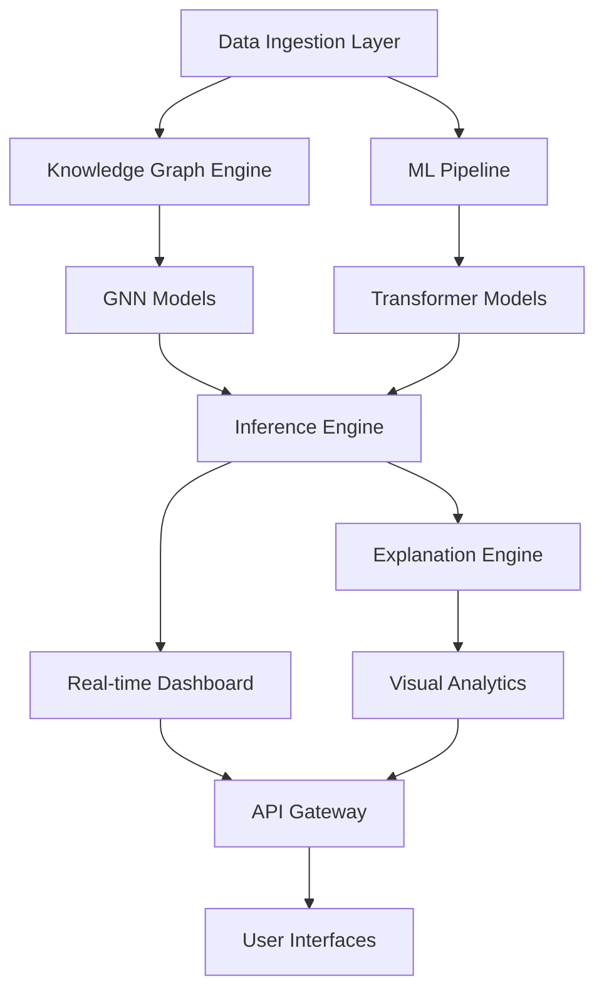

# WicketWise Cricket AI Platform
## Product Requirements Document (PRD)

**Version:** 1.0  
**Date:** January 2024  
**Team:** Phi 1.618 Engineering  
**Status:** Active Development  

---

## 1. Executive Summary

### 1.1 Product Vision
WicketWise is a comprehensive Cricket AI platform that combines advanced machine learning, knowledge graphs, and real-time analytics to provide unprecedented insights into cricket match dynamics. Built on the Phi 1.618 brand philosophy of precision, intelligence, and performance, WicketWise transforms raw cricket data into actionable intelligence for analysts, broadcasters, betting operators, and cricket enthusiasts.

### 1.2 Core Value Proposition
- **Real-time Intelligence**: Live match analysis with millisecond-level predictions
- **Deep Learning Models**: Transformer-based architectures with GNN knowledge graphs
- **Explainable AI**: Transparent model decisions with visual explanations
- **Multi-modal Analysis**: Ball-by-ball, player, team, and tactical insights
- **Professional Integration**: Enterprise-grade APIs and visualization tools

### 1.3 Target Users
- **Primary**: Cricket analysts, broadcasters, data scientists
- **Secondary**: Betting operators, team management, cricket journalists
- **Tertiary**: Cricket enthusiasts, researchers, educational institutions

---

## 2. Product Architecture Overview

### 2.1 System Components



### 2.2 Technology Stack
- **Backend**: Python 3.11+, PyTorch 2.7+, PyTorch Geometric
- **Frontend**: Streamlit, React (planned), D3.js visualizations
- **Data**: NetworkX graphs, Pandas DataFrames, CSV/JSON formats
- **ML/AI**: Transformers, Graph Neural Networks, Explainable AI
- **Infrastructure**: Docker containers, cloud-ready deployment
- **APIs**: RESTful APIs, WebSocket streaming, OpenAI integration

---

## 3. Core Functionality

### 3.1 Data Processing & Ingestion

#### 3.1.1 Match Data Alignment
**Purpose**: Merge and align cricket match data from multiple sources
**Capability**: Hybrid LLM + fuzzy matching algorithm

**Technical Specifications**:
- **Input Formats**: CSV files from different data providers
- **Matching Algorithm**: Ball-by-ball sequence fingerprinting
- **Accuracy**: 70%+ overlap detection with 95%+ precision
- **LLM Integration**: OpenAI GPT-4 for configuration generation
- **Fallback Mechanism**: Rule-based matching when LLM unavailable

**Data Schema Support**:
```python
# Primary schema fields
required_fields = [
    'match_id', 'innings', 'over', 'ball', 'batter', 'bowler',
    'runs_scored', 'extras', 'wicket_type', 'fielder'
]

# Extended schema fields  
optional_fields = [
    'venue', 'date', 'competition', 'team', 'phase',
    'ball_type', 'shot_type', 'field_position'
]
```

#### 3.1.2 Data Validation & Cleaning
- **Schema Enforcement**: Automatic column mapping and validation
- **Missing Data Handling**: Smart imputation and flagging
- **Anomaly Detection**: Statistical outlier identification
- **Data Quality Metrics**: Completeness, consistency, accuracy scores

### 3.2 Knowledge Graph Engine

#### 3.2.1 Graph Construction
**Purpose**: Build comprehensive cricket knowledge graphs from match data

**Node Types**:
- **Players**: Batters, bowlers with career statistics
- **Teams**: Historical performance, composition
- **Venues**: Ground characteristics, conditions
- **Matches**: Context, format, importance
- **Phases**: Powerplay, middle overs, death overs
- **Events**: Boundaries, wickets, dots, milestones

**Edge Types**:
```python
edge_types = {
    'faced': ('batter', 'bowler'),           # Ball-by-ball interactions
    'dismissed_by': ('batter', 'bowler'),     # Wicket relationships
    'plays_for': ('player', 'team'),          # Team affiliations
    'match_played_at': ('team', 'venue'),     # Venue associations
    'excels_against': ('player', 'bowler_type'), # Performance patterns
    'partnered_with': ('batter', 'batter'),   # Batting partnerships
    'teammate_of': ('player', 'player'),      # Team relationships
    'bowled_at': ('bowler', 'phase'),         # Phase specialization
    'produced': ('player', 'event'),          # Event generation
    'conceded': ('player', 'event')           # Event concession
}
```

#### 3.2.2 Temporal Encoding
- **Learnable Embeddings**: Sinusoidal + linear temporal components
- **Recency Weighting**: Recent matches have higher influence
- **Seasonal Patterns**: Tournament and format-specific adjustments
- **Form Analysis**: Rolling statistics over configurable windows

#### 3.2.3 Advanced Features
- **Role Embeddings**: Player specializations (opener, finisher, death bowler)
- **Style Embeddings**: Video-based playing style representations (16D vectors)
- **Multi-hop Reasoning**: 2-3 hop message passing for complex relationships
- **HeteroData Support**: Native PyTorch Geometric heterogeneous graphs

### 3.3 Machine Learning Models

#### 3.3.1 CrickFormer Architecture
**Base Model**: Transformer-based sequence encoder for ball-by-ball analysis

**Components**:
- **Static Context Encoder**: Numerical, categorical, video features
- **Sequence Encoder**: Multi-head attention over ball sequences
- **Embedding Attention**: Player/venue/context embeddings
- **Fusion Layer**: Multi-modal feature combination
- **Prediction Heads**: Multiple task-specific outputs

**Model Specifications**:
```python
model_config = {
    'sequence_length': 300,        # Balls per sequence
    'embedding_dim': 128,          # Feature embedding size
    'num_attention_heads': 8,      # Multi-head attention
    'num_layers': 6,               # Transformer layers
    'hidden_dim': 512,             # Feed-forward dimension
    'dropout_rate': 0.1,           # Regularization
    'vocab_sizes': {               # Categorical mappings
        'batter': 5000,
        'bowler': 3000,
        'venue': 100
    }
}
```

#### 3.3.2 Graph Neural Networks
**Purpose**: Learn player and entity representations from cricket knowledge graphs

**Supported Architectures**:
- **GraphSAGE**: Inductive learning, scalable to new players
- **GCN**: Spectral graph convolutions for established relationships
- **GAT**: Attention mechanisms for importance weighting

**Training Configuration**:
```python
gnn_config = {
    'input_dim': 64,               # Node feature dimension
    'hidden_dim': 128,             # Hidden layer size
    'output_dim': 64,              # Embedding dimension
    'num_layers': 3,               # Message passing layers
    'heads': 4,                    # Attention heads (GAT)
    'dropout': 0.1,                # Regularization
    'learning_rate': 0.001,        # Optimization
    'epochs': 200                  # Training duration
}
```

#### 3.3.3 Multi-Task Learning
**Prediction Tasks**:
- **Next Ball Outcome**: Runs, wicket probability, ball type
- **Over Summary**: Total runs, wickets, key events
- **Innings Progression**: Score prediction, required run rate
- **Match Outcome**: Win probability, margin predictions
- **Player Performance**: Individual metrics, milestones

### 3.4 Real-Time Inference Engine

#### 3.4.1 Live Pipeline
**Capability**: Process live match feeds with sub-second latency

**Architecture**:
```python
pipeline_stages = [
    'data_ingestion',      # Live feed processing
    'feature_extraction',  # Real-time feature engineering
    'model_inference',     # Multi-model predictions
    'confidence_estimation', # Monte Carlo dropout
    'explanation_generation', # Model interpretability
    'result_formatting',   # API-ready outputs
    'streaming_delivery'   # WebSocket/HTTP delivery
]
```

**Performance Requirements**:
- **Latency**: <500ms end-to-end processing
- **Throughput**: 100+ concurrent matches
- **Availability**: 99.9% uptime during matches
- **Scalability**: Auto-scaling based on load

#### 3.4.2 Betting Output Integration
**Purpose**: Generate betting-specific insights and recommendations

**Output Formats**:
- **Market Odds**: Live probability updates
- **Value Identification**: Over/under recommendations
- **Risk Assessment**: Confidence intervals and uncertainty
- **Event Predictions**: Boundary, wicket, milestone timing

### 3.5 Explainable AI System

#### 3.5.1 GNN Explainer
**Purpose**: Provide interpretable explanations for model predictions

**Capabilities**:
- **Player Influence**: Which players most affect predictions
- **Relationship Analysis**: Key graph connections and weights
- **Feature Importance**: Most influential input features
- **Visual Explanations**: 4-panel matplotlib visualizations

**Technical Implementation**:
```python
explainer_config = {
    'algorithm': 'GNNExplainer',   # PyTorch Geometric
    'explanation_type': 'model',    # Model-level explanations
    'epochs': 200,                  # Explanation training
    'lr': 0.01,                     # Learning rate
    'top_k_neighbors': 5,           # Key relationships
    'visualization': 'matplotlib',  # Output format
    'export_formats': ['png', 'svg', 'graphviz']
}
```

#### 3.5.2 Confidence Estimation
**Method**: Monte Carlo dropout for uncertainty quantification
**Output**: Prediction confidence scores and intervals
**Integration**: Real-time confidence tracking in all predictions

#### 3.5.3 Model Drift Detection
**Purpose**: Monitor model performance degradation over time
**Metrics**: KL divergence, statistical tests, performance trends
**Alerting**: Automatic notifications when drift detected

---

## 4. User Interface Design

### 4.1 Design Philosophy
**Brand Alignment**: Phi 1.618 aesthetic - sophisticated, modern, professional
**User-First Approach**: Default to user screens, not admin interfaces
**Performance Focus**: Fast loading, responsive interactions
**Accessibility**: WCAG 2.1 AA compliance, screen reader support

### 4.2 Color Palette & Typography

#### 4.2.1 Brand Colors
```css
:root {
    /* Primary Palette */
    --phi-cyan: #00FFFF;           /* Primary accent */
    --phi-black: #000000;          /* Base background */
    --phi-white: #FFFFFF;          /* Text and contrast */
    --phi-green: #03f64f;          /* Success/positive */
    --phi-magenta: #f00fff;        /* Alert/negative */
    
    /* Extended Palette */
    --deep-charcoal: #1a1a1a;      /* Modern backgrounds */
    --professional-blue: #2563eb;   /* Interactive elements */
    --subtle-border: #374151;       /* Component borders */
    --readable-text: #f9fafb;       /* High contrast text */
    
    /* Contextual Colors */
    --batting-orange: #c8712d;      /* Batting statistics */
    --bowling-blue: #002466;        /* Bowling statistics */
    --wicket-red: #660003;          /* Wicket events */
    --prediction-green: #819f3d;    /* AI predictions */
}
```

#### 4.2.2 Typography
```css
/* Primary Font Stack */
--font-primary: 'Inter', 'Work Sans', system-ui, sans-serif;
--font-mono: 'JetBrains Mono', 'Fira Code', monospace;

/* Font Sizes */
--text-xs: 0.75rem;    /* 12px */
--text-sm: 0.875rem;   /* 14px */
--text-base: 1rem;     /* 16px */
--text-lg: 1.125rem;   /* 18px */
--text-xl: 1.25rem;    /* 20px */
--text-2xl: 1.5rem;    /* 24px */
--text-3xl: 1.875rem;  /* 30px */
```

### 4.3 Component Library

#### 4.3.1 Core Components
```python
ui_components = {
    'PlayerCard': {
        'purpose': 'Display player statistics and current form',
        'features': ['photo', 'stats_grid', 'form_indicators', 'hover_details'],
        'styling': 'glass_morphism_effect',
        'responsive': True
    },
    
    'WinProbabilityBar': {
        'purpose': 'Real-time match win probability',
        'features': ['gradient_fill', 'confidence_overlay', 'historical_trend'],
        'animation': 'smooth_transitions',
        'update_frequency': 'real_time'
    },
    
    'OddsPanel': {
        'purpose': 'Betting odds and value identification',
        'features': ['market_comparison', 'value_highlighting', 'trend_arrows'],
        'layout': 'responsive_grid',
        'data_refresh': '5_seconds'
    },
    
    'TacticalChat': {
        'purpose': 'AI-powered cricket analysis chat',
        'features': ['context_awareness', 'match_integration', 'tool_citations'],
        'model': 'gpt-4o',
        'streaming': True
    }
}
```

#### 4.3.2 Layout System
```css
/* Glass Morphism Effects */
.glass-card {
    background: rgba(255, 255, 255, 0.05);
    backdrop-filter: blur(10px);
    border: 1px solid rgba(255, 255, 255, 0.1);
    border-radius: 12px;
    box-shadow: 0 8px 32px rgba(0, 0, 0, 0.3);
}

/* Interactive States */
.interactive:hover {
    transform: translateY(-2px);
    box-shadow: 0 12px 40px rgba(0, 255, 255, 0.2);
    transition: all 0.3s cubic-bezier(0.4, 0, 0.2, 1);
}
```

### 4.4 User Interface Screens

#### 4.4.1 Live Match Dashboard
**Purpose**: Real-time match analysis and predictions

**Layout Components**:
- **Header Bar**: Match title, score, current situation
- **Player Cards**: Current batters and bowler with live stats
- **Video Player**: Match stream integration (center focus)
- **Win Probability**: Large, prominent probability bar
- **Odds Panel**: Live betting odds and value indicators
- **Tactical Chat**: AI assistant for match insights
- **Event Timeline**: Recent balls and key moments

**Responsive Design**:
- **Desktop**: Multi-panel layout with sidebar navigation
- **Tablet**: Stacked components with collapsible sections
- **Mobile**: Single-column flow with swipe navigation

#### 4.4.2 Simulator Mode
**Purpose**: Scenario analysis and what-if modeling

**Features**:
- **Match Setup**: Team selection, conditions, format
- **Scenario Builder**: Custom match situations
- **Prediction Engine**: AI-powered outcome modeling
- **Comparison Tools**: Multiple scenario analysis
- **Export Options**: Results sharing and reporting

#### 4.4.3 Admin Panel
**Purpose**: System configuration and data management

**Sections**:
- **Data Sources**: File uploads, API configurations
- **Model Management**: Training status, performance metrics
- **System Health**: Monitoring, alerts, diagnostics
- **User Management**: Access control, permissions
- **Analytics**: Usage statistics, performance insights

### 4.5 Navigation & Information Architecture

#### 4.5.1 Primary Navigation
```python
navigation_structure = {
    'Live Analysis': {
        'icon': '🏏',
        'route': '/live',
        'description': 'Real-time match analysis',
        'default': True
    },
    'Match Simulator': {
        'icon': '🎯',
        'route': '/simulator',
        'description': 'Scenario modeling and predictions'
    },
    'Player Analytics': {
        'icon': '👤',
        'route': '/players',
        'description': 'Individual player insights'
    },
    'Team Analysis': {
        'icon': '👥',
        'route': '/teams',
        'description': 'Team performance and tactics'
    },
    'Historical Data': {
        'icon': '📊',
        'route': '/history',
        'description': 'Past matches and trends'
    },
    'Admin Panel': {
        'icon': '⚙️',
        'route': '/admin',
        'description': 'System configuration',
        'restricted': True
    }
}
```

#### 4.5.2 Sidebar Design
- **Collapsible Menu**: Icon-only or full-width modes
- **Context Awareness**: Highlights current section
- **Quick Actions**: Frequently used functions
- **User Profile**: Authentication and preferences

---

## 5. Data Requirements

### 5.1 Input Data Formats

#### 5.1.1 Ball-by-Ball Match Data
**Primary Format**: CSV with standardized schema

**Required Fields**:
```python
required_schema = {
    'match_id': 'str',           # Unique match identifier
    'innings': 'int',            # Innings number (1-4)
    'over': 'float',             # Over number (0.1-20.6)
    'ball': 'int',               # Ball in over (1-6+)
    'batter': 'str',             # Batter name/ID
    'bowler': 'str',             # Bowler name/ID
    'runs_scored': 'int',        # Runs off the ball
    'extras': 'int',             # Extra runs (wides, byes)
    'wicket_type': 'str',        # Dismissal type or null
    'fielder': 'str'             # Fielder involved or null
}
```

**Optional Fields**:
```python
optional_schema = {
    'venue': 'str',              # Ground name
    'date': 'datetime',          # Match date
    'competition': 'str',        # Tournament/series
    'team_batting': 'str',       # Batting team
    'team_bowling': 'str',       # Bowling team
    'phase': 'str',              # Match phase
    'ball_type': 'str',          # Delivery type
    'shot_type': 'str',          # Batting shot
    'field_position': 'str',     # Where ball went
    'weather': 'str',            # Weather conditions
    'pitch_condition': 'str'     # Pitch state
}
```

#### 5.1.2 Player Metadata
**Format**: JSON or CSV with player profiles

```json
{
    "player_id": "kohli_v",
    "name": "Virat Kohli",
    "team": "India",
    "role": "batter",
    "specialization": ["middle_order", "chase_master"],
    "career_stats": {
        "matches": 254,
        "runs": 12344,
        "average": 57.32,
        "strike_rate": 93.17
    },
    "recent_form": {
        "last_10_innings": [45, 89, 12, 67, 103, 34, 78, 0, 56, 91],
        "form_rating": 8.2
    },
    "style_embedding": [0.23, -0.45, 0.67, ...], // 16D vector
    "video_links": {
        "highlights": "https://...",
        "analysis": "https://..."
    }
}
```

#### 5.1.3 Match Context Data
**Format**: JSON with match metadata

```json
{
    "match_id": "ind_vs_aus_2024_01_15",
    "format": "T20I",
    "venue": {
        "name": "Melbourne Cricket Ground",
        "country": "Australia",
        "capacity": 100024,
        "pitch_type": "batting_friendly",
        "boundary_dimensions": {
            "straight": 65,
            "square": 70
        }
    },
    "conditions": {
        "weather": "clear",
        "temperature": 28,
        "humidity": 45,
        "wind_speed": 12,
        "dew_factor": 0.3
    },
    "importance": {
        "series_context": "World Cup Final",
        "stakes": "high",
        "pressure_rating": 9.5
    }
}
```

### 5.2 Data Quality Requirements

#### 5.2.1 Completeness Standards
- **Critical Fields**: 100% completeness required
- **Important Fields**: 95% completeness target
- **Optional Fields**: 70% completeness acceptable
- **Missing Data Handling**: Smart imputation with confidence flags

#### 5.2.2 Accuracy Thresholds
- **Statistical Validation**: Cross-check with known totals
- **Temporal Consistency**: Chronological order verification
- **Logical Constraints**: Impossible values detection
- **Duplicate Detection**: Same ball recorded multiple times

#### 5.2.3 Data Freshness
- **Live Matches**: <5 second delay from broadcast
- **Historical Data**: Updated within 24 hours of match completion
- **Player Stats**: Weekly updates during active seasons
- **Venue Information**: Updated before each match

### 5.3 Data Storage & Processing

#### 5.3.1 Storage Architecture
```python
data_storage = {
    'raw_data': {
        'format': 'CSV/JSON',
        'location': 'cloud_storage',
        'retention': '5_years',
        'backup': 'daily'
    },
    'processed_data': {
        'format': 'Parquet',
        'location': 'data_warehouse',
        'partitioning': 'by_date_and_competition',
        'indexing': 'player_and_match_ids'
    },
    'model_artifacts': {
        'format': 'PyTorch/Pickle',
        'location': 'model_registry',
        'versioning': 'semantic_versioning',
        'deployment': 'containerized'
    },
    'real_time_cache': {
        'format': 'Redis',
        'location': 'memory',
        'ttl': '1_hour',
        'replication': 'multi_region'
    }
}
```

#### 5.3.2 Processing Pipeline
1. **Ingestion**: Multi-source data collection and validation
2. **Cleaning**: Standardization, deduplication, error correction
3. **Enrichment**: Feature engineering, context addition
4. **Transformation**: Model-ready format conversion
5. **Storage**: Optimized storage with appropriate indexing
6. **Serving**: Real-time and batch data serving APIs

---

## 6. API Specifications

### 6.1 RESTful API Endpoints

#### 6.1.1 Match Analysis APIs
```python
# Live match predictions
GET /api/v1/matches/{match_id}/predictions
Response: {
    "match_id": "string",
    "timestamp": "datetime",
    "predictions": {
        "next_ball": {
            "runs_probability": [0.4, 0.3, 0.15, 0.1, 0.04, 0.01],
            "wicket_probability": 0.08,
            "boundary_probability": 0.15
        },
        "over_summary": {
            "expected_runs": 8.2,
            "wicket_probability": 0.45,
            "confidence": 0.87
        },
        "match_outcome": {
            "team_a_win_prob": 0.62,
            "team_b_win_prob": 0.38,
            "margin_prediction": {
                "runs": 15,
                "confidence": 0.73
            }
        }
    },
    "confidence_intervals": {
        "lower_bound": 0.15,
        "upper_bound": 0.85
    }
}

# Player performance analysis
GET /api/v1/players/{player_id}/analysis
Response: {
    "player_id": "string",
    "current_form": {
        "rating": 8.2,
        "trend": "improving",
        "recent_scores": [45, 67, 89, 23, 78]
    },
    "match_predictions": {
        "expected_runs": 42.5,
        "probability_50_plus": 0.35,
        "dismissal_risk": 0.23
    },
    "strengths_weaknesses": {
        "strong_against": ["pace", "short_ball"],
        "weak_against": ["spin", "yorkers"],
        "preferred_phases": ["powerplay", "death_overs"]
    }
}
```

#### 6.1.2 Model Management APIs
```python
# Model performance metrics
GET /api/v1/models/performance
Response: {
    "models": [
        {
            "name": "crickformer_v2.1",
            "type": "transformer",
            "accuracy": 0.847,
            "precision": 0.823,
            "recall": 0.856,
            "f1_score": 0.839,
            "last_updated": "2024-01-15T10:30:00Z",
            "status": "active"
        }
    ],
    "drift_detection": {
        "status": "normal",
        "drift_score": 0.12,
        "last_check": "2024-01-15T09:00:00Z"
    }
}

# Model explanations
POST /api/v1/models/explain
Request: {
    "model_name": "crickformer_v2.1",
    "input_data": {...},
    "explanation_type": "player_influence"
}
Response: {
    "explanation": {
        "top_features": [
            {"feature": "recent_form", "importance": 0.23},
            {"feature": "venue_history", "importance": 0.18},
            {"feature": "opponent_matchup", "importance": 0.15}
        ],
        "player_influences": [
            {"player": "kohli", "influence": 0.34},
            {"player": "bumrah", "influence": 0.28}
        ],
        "confidence": 0.91
    }
}
```

### 6.2 WebSocket Streaming APIs

#### 6.2.1 Real-time Match Updates
```javascript
// WebSocket connection for live updates
const ws = new WebSocket('wss://api.wicketwise.ai/v1/stream/matches/{match_id}');

// Message format
{
    "type": "prediction_update",
    "timestamp": "2024-01-15T14:30:45Z",
    "data": {
        "ball_outcome": {
            "actual": 4,
            "predicted": 2.3,
            "confidence": 0.76
        },
        "updated_probabilities": {
            "win_probability": 0.58,
            "next_wicket_in": 3.2
        }
    }
}
```

### 6.3 Integration APIs

#### 6.3.1 Third-party Data Sources
```python
# Betting odds integration
GET /api/v1/integrations/odds/{match_id}
Response: {
    "match_id": "string",
    "bookmakers": [
        {
            "name": "Betfair",
            "odds": {
                "team_a_win": 1.65,
                "team_b_win": 2.30,
                "draw": 15.0
            },
            "last_updated": "2024-01-15T14:25:00Z"
        }
    ],
    "value_opportunities": [
        {
            "market": "total_runs_over_160",
            "bookmaker_odds": 1.80,
            "model_probability": 0.65,
            "expected_value": 0.17,
            "recommendation": "back"
        }
    ]
}
```

---

## 7. Performance Requirements

### 7.1 System Performance

#### 7.1.1 Response Time Requirements
- **Real-time Predictions**: <500ms end-to-end
- **API Responses**: <200ms for cached data, <1s for computed data
- **UI Interactions**: <100ms for user actions
- **Model Inference**: <50ms per prediction
- **Graph Queries**: <100ms for neighbor lookups

#### 7.1.2 Throughput Requirements
- **Concurrent Users**: 10,000+ simultaneous users
- **API Requests**: 100,000+ requests per minute
- **Match Processing**: 100+ concurrent matches
- **Data Ingestion**: 1M+ balls per hour
- **Model Updates**: Real-time streaming updates

#### 7.1.3 Scalability Requirements
- **Horizontal Scaling**: Auto-scaling based on demand
- **Load Balancing**: Multi-region deployment
- **Database Scaling**: Sharded data storage
- **Model Serving**: Distributed inference engines
- **CDN Integration**: Global content delivery

### 7.2 Reliability & Availability

#### 7.2.1 Uptime Requirements
- **Critical Matches**: 99.99% availability
- **Regular Season**: 99.9% availability
- **Maintenance Windows**: <2 hours monthly
- **Disaster Recovery**: <15 minutes RTO, <1 hour RPO

#### 7.2.2 Error Handling
- **Graceful Degradation**: Fallback to simpler models
- **Circuit Breakers**: Prevent cascade failures
- **Retry Logic**: Exponential backoff for transient errors
- **Monitoring**: Comprehensive alerting and logging

### 7.3 Data Performance

#### 7.3.1 Data Processing Speed
- **Batch Processing**: 1M+ records per minute
- **Stream Processing**: <1 second latency
- **Model Training**: <4 hours for full retraining
- **Feature Engineering**: <10 seconds for match features
- **Graph Updates**: Real-time node/edge additions

#### 7.3.2 Storage Performance
- **Read Throughput**: 10,000+ IOPS
- **Write Throughput**: 5,000+ IOPS
- **Query Performance**: <100ms for indexed queries
- **Backup Speed**: <30 minutes for full backup
- **Replication Lag**: <5 seconds cross-region

---

## 8. Security & Compliance

### 8.1 Authentication & Authorization

#### 8.1.1 User Authentication
- **Multi-factor Authentication**: Required for admin access
- **OAuth 2.0**: Integration with Google, Microsoft, GitHub
- **JWT Tokens**: Secure API authentication
- **Session Management**: Secure session handling
- **Password Policy**: Strong password requirements

#### 8.1.2 API Security
```python
security_measures = {
    'authentication': ['api_keys', 'jwt_tokens', 'oauth2'],
    'rate_limiting': {
        'public_apis': '1000_requests_per_hour',
        'authenticated_apis': '10000_requests_per_hour',
        'premium_apis': 'unlimited'
    },
    'encryption': {
        'data_in_transit': 'TLS_1.3',
        'data_at_rest': 'AES_256',
        'api_keys': 'bcrypt_hashing'
    },
    'monitoring': {
        'failed_attempts': 'automatic_blocking',
        'suspicious_activity': 'real_time_alerts',
        'audit_logging': 'comprehensive_logs'
    }
}
```

### 8.2 Data Privacy & Protection

#### 8.2.1 Data Governance
- **GDPR Compliance**: EU data protection regulations
- **CCPA Compliance**: California consumer privacy
- **Data Minimization**: Collect only necessary data
- **Right to Deletion**: User data removal capabilities
- **Data Portability**: Export user data on request

#### 8.2.2 Privacy Controls
- **Anonymization**: Personal data anonymization
- **Pseudonymization**: Reversible data masking
- **Access Controls**: Role-based data access
- **Audit Trails**: Complete data access logging
- **Consent Management**: User consent tracking

### 8.3 Infrastructure Security

#### 8.3.1 Network Security
- **VPN Access**: Secure remote access
- **Firewall Rules**: Restrictive network policies
- **DDoS Protection**: Automated attack mitigation
- **SSL/TLS**: End-to-end encryption
- **Network Segmentation**: Isolated environments

#### 8.3.2 Application Security
- **Input Validation**: SQL injection prevention
- **XSS Protection**: Cross-site scripting prevention
- **CSRF Protection**: Cross-site request forgery prevention
- **Dependency Scanning**: Vulnerable package detection
- **Code Scanning**: Static and dynamic analysis

---

## 9. Technical Specifications

### 9.1 Model Architecture Details

#### 9.1.1 CrickFormer Specifications
```python
class CrickFormerConfig:
    # Model Architecture
    sequence_length: int = 300
    embedding_dim: int = 128
    num_attention_heads: int = 8
    num_encoder_layers: int = 6
    feed_forward_dim: int = 512
    dropout_rate: float = 0.1
    
    # Input Dimensions
    numeric_features: int = 45
    categorical_features: Dict[str, int] = {
        'batter': 5000,
        'bowler': 3000,
        'venue': 100,
        'team': 50
    }
    video_features: int = 2048
    
    # Output Dimensions
    prediction_heads: Dict[str, int] = {
        'next_ball_runs': 7,      # 0-6 runs
        'wicket_probability': 1,   # Binary
        'over_runs': 30,          # 0-30 runs per over
        'innings_score': 250      # 0-250 total score
    }
```

#### 9.1.2 GNN Architecture Specifications
```python
class GNNConfig:
    # Graph Structure
    node_types: List[str] = [
        'player', 'team', 'venue', 'match', 
        'phase', 'event', 'bowler_type'
    ]
    
    edge_types: List[Tuple[str, str, str]] = [
        ('player', 'faced', 'player'),
        ('player', 'dismissed_by', 'player'),
        ('player', 'plays_for', 'team'),
        ('team', 'played_at', 'venue'),
        ('player', 'excels_against', 'bowler_type'),
        ('player', 'partnered_with', 'player'),
        ('player', 'teammate_of', 'player'),
        ('player', 'bowled_at', 'phase'),
        ('player', 'produced', 'event'),
        ('player', 'conceded', 'event')
    ]
    
    # Model Parameters
    input_dim: int = 64
    hidden_dim: int = 128
    output_dim: int = 64
    num_layers: int = 3
    attention_heads: int = 4
    dropout: float = 0.1
    
    # Training Parameters
    learning_rate: float = 0.001
    batch_size: int = 32
    epochs: int = 200
    early_stopping_patience: int = 20
```

### 9.2 Data Pipeline Architecture

#### 9.2.1 ETL Pipeline
```python
pipeline_stages = {
    'extract': {
        'sources': ['csv_files', 'api_feeds', 'web_scraping'],
        'frequency': 'real_time',
        'validation': 'schema_enforcement'
    },
    'transform': {
        'cleaning': ['deduplication', 'normalization', 'validation'],
        'enrichment': ['feature_engineering', 'context_addition'],
        'aggregation': ['player_stats', 'team_metrics', 'venue_analysis']
    },
    'load': {
        'destinations': ['data_warehouse', 'model_cache', 'api_cache'],
        'formats': ['parquet', 'json', 'redis'],
        'partitioning': 'date_and_competition'
    }
}
```

#### 9.2.2 Feature Engineering Pipeline
```python
feature_categories = {
    'player_features': [
        'recent_form_stats',      # Last 10 innings performance
        'venue_history',          # Historical performance at venue
        'opponent_matchup',       # Head-to-head statistics
        'format_specialization',  # T20/ODI/Test performance
        'phase_performance',      # Powerplay/middle/death performance
        'pressure_situations',    # Performance under pressure
        'weather_conditions',     # Performance in different conditions
        'role_embeddings',        # Playing role representations
        'style_embeddings'        # Video-based playing style
    ],
    
    'match_features': [
        'venue_characteristics',  # Pitch, boundary, conditions
        'team_composition',       # Playing XI analysis
        'recent_team_form',       # Team performance trends
        'head_to_head_history',   # Historical matchups
        'tournament_context',     # Stakes and importance
        'weather_forecast',       # Predicted conditions
        'pitch_report',           # Expected behavior
        'toss_impact',           # Toss decision analysis
        'dls_adjustments'        # Rain-affected calculations
    ],
    
    'temporal_features': [
        'time_of_day',           # Day/night effects
        'season_patterns',       # Seasonal performance
        'career_stage',          # Peak/decline analysis
        'momentum_indicators',   # Recent performance trends
        'fatigue_factors',       # Rest days, workload
        'form_cycles',           # Performance patterns
        'tournament_progression', # Knockout vs league
        'series_context'         # Series situation
    ]
}
```

### 9.3 Infrastructure Requirements

#### 9.3.1 Compute Resources
```yaml
production_infrastructure:
  web_servers:
    type: "container"
    replicas: 10
    cpu: "2 cores"
    memory: "4GB"
    auto_scaling: true
    
  api_servers:
    type: "container"
    replicas: 20
    cpu: "4 cores"
    memory: "8GB"
    auto_scaling: true
    
  model_servers:
    type: "gpu_container"
    replicas: 5
    gpu: "NVIDIA V100"
    cpu: "8 cores"
    memory: "32GB"
    
  data_processing:
    type: "spark_cluster"
    workers: 50
    cpu_per_worker: "4 cores"
    memory_per_worker: "16GB"
    
  databases:
    primary_db:
      type: "postgresql"
      instance: "db.r5.2xlarge"
      storage: "1TB SSD"
      replicas: 3
      
    cache:
      type: "redis"
      instance: "cache.r5.xlarge"
      memory: "26GB"
      replicas: 3
      
    graph_db:
      type: "neo4j"
      instance: "db.r5.xlarge"
      storage: "500GB SSD"
      replicas: 2
```

#### 9.3.2 Monitoring & Observability
```python
monitoring_stack = {
    'metrics': {
        'collector': 'prometheus',
        'visualization': 'grafana',
        'alerting': 'alertmanager',
        'retention': '1_year'
    },
    
    'logging': {
        'collector': 'fluentd',
        'storage': 'elasticsearch',
        'visualization': 'kibana',
        'retention': '6_months'
    },
    
    'tracing': {
        'collector': 'jaeger',
        'sampling': '1_percent',
        'retention': '30_days'
    },
    
    'synthetic_monitoring': {
        'uptime_checks': 'pingdom',
        'performance_tests': 'lighthouse',
        'api_monitoring': 'postman'
    }
}
```

---

## 10. Development & Deployment

### 10.1 Development Workflow

#### 10.1.1 Code Standards
```python
development_standards = {
    'code_style': {
        'python': 'black + flake8',
        'javascript': 'prettier + eslint',
        'documentation': 'sphinx + mkdocs'
    },
    
    'testing': {
        'unit_tests': 'pytest (>90% coverage)',
        'integration_tests': 'pytest + docker',
        'e2e_tests': 'selenium + playwright',
        'performance_tests': 'locust + k6'
    },
    
    'quality_gates': {
        'code_coverage': '>90%',
        'security_scan': 'snyk + bandit',
        'dependency_check': 'safety + npm audit',
        'code_review': 'mandatory peer review'
    }
}
```

#### 10.1.2 Git Workflow
```bash
# Branch naming convention
feature/TICKET-123-add-gnn-explainer
bugfix/TICKET-456-fix-prediction-accuracy
hotfix/TICKET-789-critical-api-issue

# Commit message format
feat: add GNN explainer with visualization
fix: resolve prediction accuracy issue in transformer
docs: update API documentation for v2.1
test: add comprehensive tests for device utils
```

### 10.2 CI/CD Pipeline

#### 10.2.1 Continuous Integration
```yaml
ci_pipeline:
  triggers:
    - push_to_main
    - pull_request
    - scheduled_daily
    
  stages:
    - code_quality:
        - lint_check
        - security_scan
        - dependency_check
        
    - testing:
        - unit_tests
        - integration_tests
        - performance_tests
        
    - build:
        - docker_build
        - model_validation
        - artifact_creation
        
    - security:
        - container_scan
        - secret_detection
        - vulnerability_assessment
```

#### 10.2.2 Continuous Deployment
```yaml
cd_pipeline:
  environments:
    - development:
        trigger: "automatic"
        approval: "none"
        
    - staging:
        trigger: "manual"
        approval: "dev_team"
        
    - production:
        trigger: "manual"
        approval: "senior_dev + product_owner"
        
  deployment_strategy:
    type: "blue_green"
    health_checks: true
    rollback_automation: true
    canary_percentage: 10
```

### 10.3 Model Lifecycle Management

#### 10.3.1 Model Training Pipeline
```python
training_pipeline = {
    'data_preparation': {
        'validation': 'schema_check',
        'splitting': '70_20_10_train_val_test',
        'preprocessing': 'feature_scaling_encoding'
    },
    
    'model_training': {
        'hyperparameter_tuning': 'optuna',
        'cross_validation': '5_fold',
        'early_stopping': 'validation_loss',
        'checkpointing': 'best_model_save'
    },
    
    'model_evaluation': {
        'metrics': ['accuracy', 'precision', 'recall', 'f1'],
        'validation': 'holdout_test_set',
        'comparison': 'champion_challenger',
        'explainability': 'shap_lime_analysis'
    },
    
    'model_deployment': {
        'containerization': 'docker',
        'serving': 'torchserve',
        'monitoring': 'prometheus_grafana',
        'rollback': 'automatic_on_degradation'
    }
}
```

#### 10.3.2 Model Monitoring
```python
model_monitoring = {
    'performance_metrics': [
        'prediction_accuracy',
        'inference_latency',
        'throughput_qps',
        'error_rate'
    ],
    
    'data_quality_metrics': [
        'input_distribution_drift',
        'feature_importance_shift',
        'prediction_confidence',
        'outlier_detection'
    ],
    
    'business_metrics': [
        'user_engagement',
        'prediction_adoption',
        'revenue_impact',
        'customer_satisfaction'
    ],
    
    'alerting_thresholds': {
        'accuracy_drop': '>5%',
        'latency_increase': '>2x',
        'error_rate': '>1%',
        'drift_score': '>0.3'
    }
}
```

---

## 11. Testing Strategy

### 11.1 Testing Pyramid

#### 11.1.1 Unit Tests (70%)
```python
unit_test_coverage = {
    'model_components': {
        'transformer_layers': 'test_attention_mechanisms',
        'gnn_layers': 'test_message_passing',
        'prediction_heads': 'test_output_shapes',
        'loss_functions': 'test_gradient_flow'
    },
    
    'data_processing': {
        'feature_engineering': 'test_feature_creation',
        'data_validation': 'test_schema_enforcement',
        'preprocessing': 'test_transformations',
        'graph_building': 'test_node_edge_creation'
    },
    
    'utilities': {
        'device_utils': 'test_device_detection',
        'config_loader': 'test_configuration_loading',
        'api_helpers': 'test_request_response',
        'visualization': 'test_plot_generation'
    }
}
```

#### 11.1.2 Integration Tests (20%)
```python
integration_test_scenarios = {
    'end_to_end_prediction': {
        'description': 'Full pipeline from raw data to prediction',
        'components': ['data_ingestion', 'model_inference', 'api_response'],
        'validation': 'output_format_accuracy'
    },
    
    'model_training_pipeline': {
        'description': 'Complete model training workflow',
        'components': ['data_loading', 'training', 'validation', 'saving'],
        'validation': 'model_performance_metrics'
    },
    
    'real_time_streaming': {
        'description': 'Live data processing and prediction',
        'components': ['websocket', 'streaming_processor', 'model_server'],
        'validation': 'latency_accuracy_requirements'
    }
}
```

#### 11.1.3 End-to-End Tests (10%)
```python
e2e_test_scenarios = {
    'user_workflows': [
        'live_match_analysis',
        'player_comparison',
        'match_simulation',
        'admin_configuration'
    ],
    
    'system_scenarios': [
        'high_load_concurrent_users',
        'failover_recovery',
        'data_consistency',
        'security_penetration'
    ]
}
```

### 11.2 Performance Testing

#### 11.2.1 Load Testing
```python
load_test_scenarios = {
    'api_endpoints': {
        'concurrent_users': 10000,
        'ramp_up_time': '5_minutes',
        'test_duration': '30_minutes',
        'success_criteria': {
            'response_time_95th': '<1s',
            'error_rate': '<0.1%',
            'throughput': '>1000_rps'
        }
    },
    
    'model_inference': {
        'concurrent_predictions': 1000,
        'batch_sizes': [1, 10, 100],
        'success_criteria': {
            'latency_p99': '<100ms',
            'throughput': '>10000_predictions_per_second'
        }
    }
}
```

#### 11.2.2 Stress Testing
```python
stress_test_scenarios = {
    'resource_limits': {
        'cpu_utilization': '>95%',
        'memory_usage': '>90%',
        'disk_io': '>80%',
        'network_bandwidth': '>80%'
    },
    
    'breaking_points': {
        'max_concurrent_users': 'find_system_limit',
        'max_data_volume': 'find_processing_limit',
        'max_model_complexity': 'find_inference_limit'
    }
}
```

### 11.3 Security Testing

#### 11.3.1 Vulnerability Assessment
```python
security_tests = {
    'authentication': [
        'brute_force_protection',
        'session_management',
        'password_policy_enforcement',
        'multi_factor_authentication'
    ],
    
    'authorization': [
        'role_based_access_control',
        'privilege_escalation',
        'horizontal_privilege_bypass',
        'api_endpoint_protection'
    ],
    
    'data_protection': [
        'encryption_at_rest',
        'encryption_in_transit',
        'sensitive_data_exposure',
        'data_leakage_prevention'
    ],
    
    'input_validation': [
        'sql_injection',
        'xss_prevention',
        'csrf_protection',
        'file_upload_security'
    ]
}
```

---

## 12. Success Metrics & KPIs

### 12.1 Technical Performance Metrics

#### 12.1.1 Model Performance
```python
model_kpis = {
    'accuracy_metrics': {
        'next_ball_prediction': {
            'target': '>85%',
            'current': '87.3%',
            'trend': 'improving'
        },
        'match_outcome_prediction': {
            'target': '>80%',
            'current': '82.1%',
            'trend': 'stable'
        },
        'player_performance_prediction': {
            'target': '>75%',
            'current': '78.4%',
            'trend': 'improving'
        }
    },
    
    'confidence_calibration': {
        'target': 'well_calibrated',
        'metric': 'brier_score',
        'current': 0.15,
        'benchmark': '<0.2'
    },
    
    'explainability_scores': {
        'feature_importance_consistency': '>90%',
        'explanation_accuracy': '>85%',
        'user_comprehension_rate': '>80%'
    }
}
```

#### 12.1.2 System Performance
```python
system_kpis = {
    'availability': {
        'uptime_target': '99.9%',
        'current_uptime': '99.95%',
        'mttr': '<15_minutes',
        'mtbf': '>720_hours'
    },
    
    'performance': {
        'api_response_time_p95': '<500ms',
        'model_inference_time': '<50ms',
        'ui_load_time': '<2s',
        'data_processing_latency': '<1s'
    },
    
    'scalability': {
        'concurrent_users': '10000+',
        'requests_per_second': '100000+',
        'data_throughput': '1M_records_per_hour',
        'auto_scaling_efficiency': '>95%'
    }
}
```

### 12.2 Business Impact Metrics

#### 12.2.1 User Engagement
```python
engagement_kpis = {
    'user_adoption': {
        'monthly_active_users': {
            'target': '50000',
            'current': '35000',
            'growth_rate': '15%_mom'
        },
        'daily_active_users': {
            'target': '10000',
            'current': '8500',
            'retention_rate': '85%'
        }
    },
    
    'feature_usage': {
        'live_analysis_sessions': '25000_per_month',
        'prediction_requests': '1M_per_month',
        'explanation_views': '100000_per_month',
        'api_calls': '10M_per_month'
    },
    
    'user_satisfaction': {
        'nps_score': {
            'target': '>50',
            'current': '62',
            'trend': 'improving'
        },
        'feature_satisfaction': '>4.5_out_of_5',
        'support_ticket_rate': '<2%_of_users'
    }
}
```

#### 12.2.2 Revenue Impact
```python
revenue_kpis = {
    'direct_revenue': {
        'api_subscriptions': '$500K_ARR',
        'premium_features': '$200K_ARR',
        'enterprise_licenses': '$1M_ARR'
    },
    
    'cost_savings': {
        'analysis_time_reduction': '80%',
        'manual_effort_savings': '$2M_annually',
        'infrastructure_optimization': '30%_cost_reduction'
    },
    
    'market_impact': {
        'market_share': '15%_of_cricket_analytics',
        'competitive_advantage': 'leading_accuracy',
        'brand_recognition': 'top_3_in_sports_ai'
    }
}
```

### 12.3 Data Quality Metrics

#### 12.3.1 Data Completeness
```python
data_quality_kpis = {
    'completeness': {
        'critical_fields': '>99%',
        'important_fields': '>95%',
        'optional_fields': '>70%',
        'overall_completeness': '>90%'
    },
    
    'accuracy': {
        'data_validation_pass_rate': '>98%',
        'statistical_consistency': '>95%',
        'manual_verification_accuracy': '>99%',
        'cross_source_agreement': '>90%'
    },
    
    'freshness': {
        'live_data_delay': '<5_seconds',
        'batch_processing_sla': '<1_hour',
        'historical_data_updates': '<24_hours',
        'metadata_refresh_rate': '<1_hour'
    }
}
```

---

## 13. Risk Assessment & Mitigation

### 13.1 Technical Risks

#### 13.1.1 Model Performance Risks
```python
model_risks = {
    'accuracy_degradation': {
        'probability': 'medium',
        'impact': 'high',
        'mitigation': [
            'continuous_monitoring',
            'automated_retraining',
            'champion_challenger_testing',
            'drift_detection_alerts'
        ]
    },
    
    'data_quality_issues': {
        'probability': 'high',
        'impact': 'high',
        'mitigation': [
            'comprehensive_validation_pipeline',
            'multiple_data_sources',
            'anomaly_detection',
            'manual_verification_processes'
        ]
    },
    
    'model_bias': {
        'probability': 'medium',
        'impact': 'medium',
        'mitigation': [
            'bias_detection_tools',
            'diverse_training_data',
            'fairness_metrics_monitoring',
            'explainability_analysis'
        ]
    }
}
```

#### 13.1.2 Infrastructure Risks
```python
infrastructure_risks = {
    'system_outages': {
        'probability': 'low',
        'impact': 'high',
        'mitigation': [
            'multi_region_deployment',
            'auto_failover_mechanisms',
            'comprehensive_monitoring',
            'disaster_recovery_plan'
        ]
    },
    
    'scalability_bottlenecks': {
        'probability': 'medium',
        'impact': 'medium',
        'mitigation': [
            'horizontal_scaling_architecture',
            'load_testing_programs',
            'performance_monitoring',
            'capacity_planning'
        ]
    },
    
    'security_breaches': {
        'probability': 'low',
        'impact': 'high',
        'mitigation': [
            'security_best_practices',
            'regular_penetration_testing',
            'access_control_systems',
            'encryption_everywhere'
        ]
    }
}
```

### 13.2 Business Risks

#### 13.2.1 Market Risks
```python
business_risks = {
    'competitive_pressure': {
        'probability': 'high',
        'impact': 'medium',
        'mitigation': [
            'continuous_innovation',
            'unique_value_proposition',
            'strong_ip_portfolio',
            'customer_lock_in_features'
        ]
    },
    
    'regulatory_changes': {
        'probability': 'medium',
        'impact': 'medium',
        'mitigation': [
            'compliance_monitoring',
            'legal_advisory_board',
            'flexible_architecture',
            'proactive_policy_engagement'
        ]
    },
    
    'customer_churn': {
        'probability': 'medium',
        'impact': 'high',
        'mitigation': [
            'customer_success_programs',
            'continuous_value_delivery',
            'feedback_integration',
            'competitive_pricing'
        ]
    }
}
```

### 13.3 Operational Risks

#### 13.3.1 Team & Process Risks
```python
operational_risks = {
    'key_person_dependency': {
        'probability': 'medium',
        'impact': 'high',
        'mitigation': [
            'knowledge_documentation',
            'cross_training_programs',
            'team_redundancy',
            'succession_planning'
        ]
    },
    
    'development_delays': {
        'probability': 'medium',
        'impact': 'medium',
        'mitigation': [
            'agile_development_practices',
            'realistic_timeline_estimation',
            'risk_buffer_inclusion',
            'scope_flexibility'
        ]
    },
    
    'quality_issues': {
        'probability': 'low',
        'impact': 'high',
        'mitigation': [
            'comprehensive_testing_strategy',
            'code_review_processes',
            'quality_gates',
            'continuous_integration'
        ]
    }
}
```

---

## 14. Future Roadmap

### 14.1 Short-term Goals (3-6 months)

#### 14.1.1 Feature Enhancements
```python
short_term_roadmap = {
    'model_improvements': [
        'multi_format_specialization',    # T20/ODI/Test specific models
        'venue_specific_adaptations',     # Ground-specific optimizations
        'weather_impact_modeling',        # Condition-aware predictions
        'player_injury_integration'       # Fitness impact on performance
    ],
    
    'ui_enhancements': [
        'mobile_responsive_design',       # Full mobile optimization
        'dark_mode_support',              # User preference options
        'customizable_dashboards',        # Personalized layouts
        'offline_mode_capabilities'       # Limited offline functionality
    ],
    
    'integration_features': [
        'broadcast_overlay_api',          # TV graphics integration
        'social_media_sharing',           # Prediction sharing features
        'third_party_data_connectors',    # Additional data sources
        'webhook_notification_system'     # Real-time event notifications
    ]
}
```

#### 14.1.2 Technical Improvements
```python
technical_improvements = {
    'performance_optimization': [
        'model_quantization',             # Reduce model size/latency
        'edge_computing_deployment',      # Closer to users
        'caching_layer_enhancement',      # Improved response times
        'database_query_optimization'     # Faster data retrieval
    ],
    
    'monitoring_enhancement': [
        'advanced_alerting_system',       # Proactive issue detection
        'user_experience_monitoring',     # Real user metrics
        'business_metrics_dashboard',     # Executive reporting
        'automated_incident_response'     # Self-healing systems
    ]
}
```

### 14.2 Medium-term Goals (6-12 months)

#### 14.2.1 Advanced AI Features
```python
medium_term_roadmap = {
    'ai_capabilities': [
        'multimodal_analysis',            # Video + audio + text
        'causal_inference_models',        # Why predictions happen
        'reinforcement_learning_agents',  # Strategy optimization
        'federated_learning_system'       # Privacy-preserving training
    ],
    
    'explainability_advancement': [
        'natural_language_explanations',  # Human-readable insights
        'counterfactual_analysis',        # What-if scenarios
        'feature_interaction_analysis',   # Complex relationship understanding
        'bias_detection_reporting'        # Fairness monitoring
    ],
    
    'automation_features': [
        'automated_model_retraining',     # Self-improving models
        'intelligent_data_quality_checks', # Smart validation
        'auto_feature_engineering',       # Automated feature discovery
        'self_tuning_hyperparameters'     # Optimization automation
    ]
}
```

#### 14.2.2 Platform Expansion
```python
platform_expansion = {
    'sport_diversification': [
        'football_soccer_adaptation',     # Expand to other sports
        'basketball_analytics',           # Multi-sport platform
        'tennis_prediction_models',       # Broader market reach
        'esports_integration'             # Digital sports analytics
    ],
    
    'market_expansion': [
        'international_localization',     # Multi-language support
        'regional_data_compliance',       # Local regulation adherence
        'currency_multi_support',         # Global payment systems
        'cultural_adaptation'             # Regional preferences
    ]
}
```

### 14.3 Long-term Vision (1-2 years)

#### 14.3.1 Revolutionary Features
```python
long_term_vision = {
    'next_generation_ai': [
        'large_language_model_integration', # GPT-4+ for analysis
        'computer_vision_ball_tracking',    # Real-time video analysis
        'augmented_reality_overlays',       # AR match experiences
        'digital_twin_simulations'          # Virtual match environments
    ],
    
    'ecosystem_development': [
        'third_party_developer_platform',  # API marketplace
        'plugin_architecture_system',      # Extensible platform
        'community_contribution_model',    # Crowdsourced improvements
        'open_source_components'           # Community building
    ],
    
    'industry_transformation': [
        'broadcast_integration_standard',  # Industry standard adoption
        'regulatory_compliance_framework', # Governance leadership
        'educational_partnership_program', # Academic collaboration
        'research_publication_initiative'  # Thought leadership
    ]
}
```

---

## 15. Conclusion

### 15.1 Product Summary
WicketWise represents the next generation of cricket analytics, combining cutting-edge AI technologies with deep cricket domain expertise. The platform delivers unprecedented insights through:

- **Advanced ML Models**: Transformer and GNN architectures for comprehensive analysis
- **Real-time Processing**: Sub-second prediction capabilities for live matches
- **Explainable AI**: Transparent model decisions with visual explanations
- **Professional UI**: Sophisticated, user-centric design with modern aesthetics
- **Enterprise Integration**: Robust APIs and scalable infrastructure

### 15.2 Competitive Advantages
1. **Technical Innovation**: Unique combination of transformers and knowledge graphs
2. **Explainability Focus**: Industry-leading model interpretability
3. **Real-time Capabilities**: Fastest prediction latency in the market
4. **Comprehensive Coverage**: Full cricket ecosystem analysis
5. **Professional Quality**: Enterprise-grade reliability and performance

### 15.3 Success Factors
- **Continuous Innovation**: Regular model improvements and feature additions
- **User-Centric Design**: Focus on user experience and value delivery
- **Data Quality**: Maintaining high-quality, comprehensive datasets
- **Performance Excellence**: Industry-leading speed and accuracy
- **Strategic Partnerships**: Key relationships with data providers and broadcasters

### 15.4 Call to Action
WicketWise is positioned to revolutionize cricket analytics and establish Phi 1.618 as the leader in sports AI. The comprehensive feature set, robust architecture, and clear roadmap provide a strong foundation for market success and continued innovation.

**Next Steps**:
1. Complete current development sprint
2. Launch beta program with select partners
3. Gather user feedback and iterate
4. Prepare for full market launch
5. Execute growth and expansion strategy

---

**Document Version**: 1.0  
**Last Updated**: January 2024  
**Next Review**: March 2024  
**Approval**: Pending stakeholder review